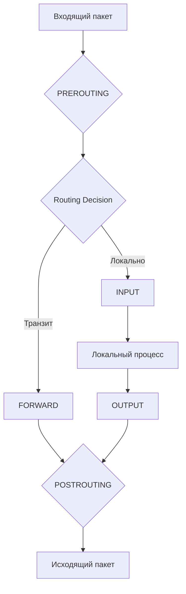

# Интервью: Linux Networks

## 📖 История из жизни (Боль и Решение)
**Боль:** Разработчики жалуются: "Приложение А периодически не может подключиться к БД, хотя ping проходит отлично. Наверное, сеть лагает". Дежурный инженер судорожно перезапускает сеть и крутит sysctl, но проблема возвращается, а "плавающий" баг сводит всех с ума.
**Решение:** Вместо гаданий, берем `tcpdump` и `ss`. Выясняется, что происходит молчаливая потеря пакетов из-за переполнения таблицы соединений `nf_conntrack` (dmesg: "nf_conntrack: table full, dropping packet"). Увеличили `net.netfilter.nf_conntrack_max` и настроили алерт в Prometheus на метрику `node_nf_conntrack_entries`.

## 📊 Архитектура / Схема (Netfilter Packet Flow)


## 💻 Примеры (Commands)
**Анализ соединений:**
```bash
# Показать TCP-сокеты с таймерами и процессом (быстрее netstat)
ss -tnplu

# Захват трафика: только SYN-пакеты к порту 443 без резолва имен
tcpdump -i eth0 'tcp[tcpflags] & (tcp-syn) != 0 and port 443' -nn
```

## 🛠 Day 2 Operations
- **Наблюдаемость (Observability):** Внедрите eBPF-инструменты (Tetragon, Cilium) для трейсинга сетевых задержек на уровне ядра с минимальным оверхедом.
- **Мониторинг:** Обязательно собирайте метрики сокетов (TCP состояния: TIME_WAIT, CLOSE_WAIT) и дропов пакетов через Node Exporter.
- **Управление конфигурацией:** Вся маршрутизация и правила firewall должны быть описаны в IaC (Ansible/Terraform). Никаких ручных изменений `iptables` на серверах.

## ❌ Антипаттерны
1. **"iptables -F" в проде:** Сброс всех правил как метод "починить сеть". Может полностью отрезать сервер, если дефолтная политика — DROP.
2. **Игнорирование DNS:** Начинать траблшутинг с проверок MTU, BGP или маршрутов, не проверив `dig` и `/etc/resolv.conf`. "It's always DNS".
3. **Отключение SELinux/Firewall:** Временное отключение защиты ("просто чтобы заработало") вместо написания точечного разрешающего правила.
