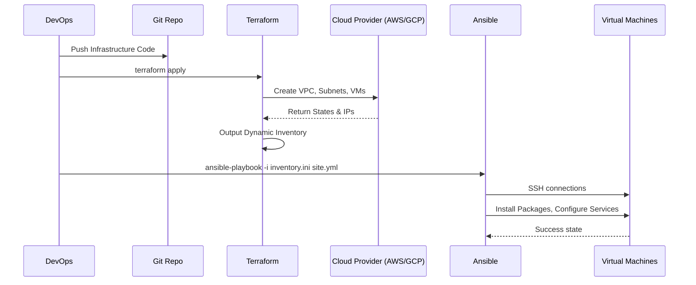

# Terraform и Ansible: Инфраструктура как код и Управление конфигурацией

## DevOps История (Боль и Решение)

**Боль:** В проекте было 50+ серверов. Инфраструктура поднималась руками через веб-консоль провайдера, а пакеты ставились bash-скриптами. Когда пришел новый клиент, потребовалось развернуть точную копию окружения. Процесс занял 2 недели, сопровождался десятками ошибок человеческого фактора ("забыли открыть порт", "не та версия пакета", "перепутали подсети").

**Решение:** Внедрение связки Terraform + Ansible. Terraform взял на себя декларативное создание ресурсов (ВМ, сети, балансировщики), а Ansible — идемпотентную настройку ОС (установка Nginx, Docker, копирование конфигов). Время развертывания нового окружения сократилось до 15 минут, а процесс стал полностью воспроизводимым.

## Архитектура взаимодействия (Mermaid)



## Примеры кода

### Terraform (main.tf - создание ресурса)
```hcl
resource "aws_instance" "web" {
  ami           = "ami-0c55b159cbfafe1f0"
  instance_type = "t3.micro"

  tags = {
    Name = "WebServer"
    Role = "web"
  }
}

output "instance_ip" {
  value = aws_instance.web.public_ip
}
```

### Ansible (playbook.yml - настройка)
```yaml
---
- name: Setup Web Servers
  hosts: web
  become: yes
  tasks:
    - name: Install Nginx
      apt:
        name: nginx
        state: present
        update_cache: yes

    - name: Ensure Nginx is running
      service:
        name: nginx
        state: started
        enabled: yes
```

## Day 2 Operations (Жизнь после релиза)

1. **Управление State-файлом:** Храните `terraform.tfstate` в удаленном backend (например, S3) с блокировками (DynamoDB), чтобы избежать состояния "гонки" при одновременной работе инженеров в команде.
2. **Ansible Roles & Collections:** Дробите большие плейбуки на роли (Roles) и используйте Ansible Galaxy для переиспользования кода.
3. **Dynamic Inventory:** Вместо статического файла инвентаризации используйте плагины (например, `aws_ec2` или скрипты на базе `terraform output`), чтобы Ansible автоматически подхватывал новые серверы при масштабировании.
4. **Секреты:** Не храните пароли в открытом виде. Используйте Ansible Vault для плейбуков и интеграцию с HashiCorp Vault или AWS Secrets Manager для Terraform.

## Антипаттерны

- **God-модули в Terraform:** Попытка описать всю инфраструктуру в одном огромном State. *Решение:* Разделять на логические компоненты (сеть, базы данных, приложения) через отдельные стейты.
- **Использование Ansible для Provisioning:** Попытки создавать облачные ресурсы через модули Ansible. Хотя это возможно, Ansible не управляет жизненным циклом и зависимостями графа состояний так хорошо, как Terraform.
- **Неидемпотентные таски в Ansible:** Использование `command` или `shell` для действий, которые можно сделать специализированными модулями, что приводит к ошибкам при повторном запуске плейбука.
- **Изменения руками (ClickOps):** Изменение настроек серверов по SSH вручную. При следующем запуске Terraform или Ansible эти изменения будут затерты или вызовут конфликт.
