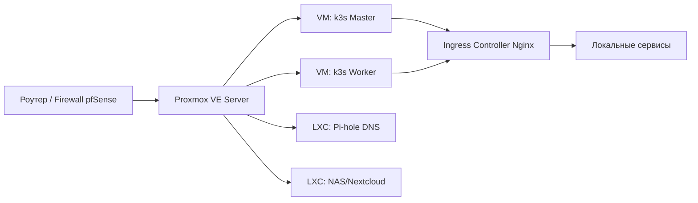

# Домашние лаборатории (Home Labs)

## История DevOps: Боль и Решение
**Боль:** Инженер боится сломать Production или не имеет доступа к облачным провайдерам из-за высоких цен. Эксперименты с сетями, кластерами и системами хранения негде проводить.
**Решение:** Создание локальной домашней лаборатории (Home Lab) на базе старого ПК, Raspberry Pi или недорогого VPS, предоставляющей безопасную песочницу "ломай-чини" для изучения Proxmox, Kubernetes, сетей и автоматизации.

## Архитектура Домашней Лаборатории


## Примеры

### 1. Быстрый старт Kubernetes (k3s)
```bash
# Установка легковесного K8s на ноду
curl -sfL https://get.k3s.io | sh -
# Проверка нод
kubectl get nodes
```

### 2. Запуск локального DNS и AdBlocker (Pi-hole) через Docker Compose
```yaml
version: "3"
services:
  pihole:
    container_name: pihole
    image: pihole/pihole:latest
    ports:
      - "53:53/tcp"
      - "53:53/udp"
      - "80:80/tcp"
    environment:
      TZ: 'Europe/Moscow'
      WEBPASSWORD: 'securepassword'
    volumes:
      - './etc-pihole:/etc/pihole'
      - './etc-dnsmasq.d:/etc/dnsmasq.d'
    restart: unless-stopped
```

## Советы Day 2 Operations
- **Инфраструктура как код (IaC):** Описывайте виртуальные машины и контейнеры с помощью Terraform (Proxmox provider) или Ansible. Это позволит быстро восстановить лабу после краша.
- **GitOps для дома:** Используйте ArgoCD или Flux для автоматического развертывания ваших локальных приложений из Git-репозитория.
- **Мониторинг железа:** Настройте мониторинг температуры CPU и дисков (Prometheus Node Exporter), чтобы избежать аппаратных сбоев.
- **Документация:** Ведите локальную Wiki (например, BookStack или Obsidian), описывая IP-адреса, порты и нестандартные настройки.

## Антипаттерны
- **"Снежинки" (Snowflake Servers):** Настройка серверов полностью вручную без автоматизации. В случае сбоя диска вы не вспомните, как это было настроено.
- **Открытые порты в интернет:** Проброс портов административных интерфейсов (SSH, Proxmox, БД) наружу без VPN (WireGuard/Tailscale).
- **Единая точка отказа:** Хранение единственной копии важных данных на старом диске без RAID или бэкапа в облако.
- **Игнорирование обновлений:** Работа на устаревших версиях гипервизоров и ОС из-за страха "сломать то, что работает".
