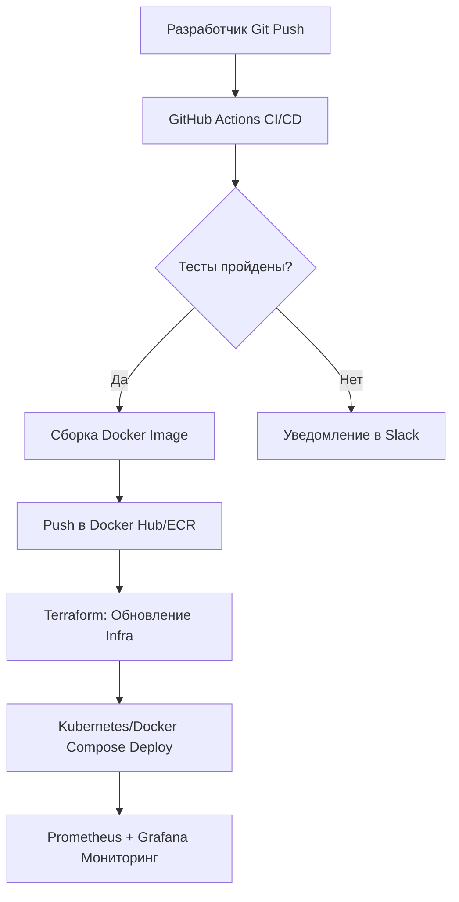

# Практические задачи и Pet Projects

## История DevOps: Боль и Решение
**Боль:** Кандидат приходит на собеседование со знанием теории из курсов, но без понимания, как инструменты работают вместе в реальном мире. Сборка ломается, секреты текут в репозиторий, а деплой требует ручного вмешательства.
**Решение:** Построение комплексных Pet Projects, которые решают реальные инженерные задачи (например, автоматизация полного цикла CI/CD для микросервиса), демонстрируя понимание инфраструктуры как кода (IaC), пайплайнов и мониторинга.

## Архитектура типового Pet-проекта


## Примеры

### 1. CI/CD Pipeline (GitHub Actions)
```yaml
name: Node.js CI/CD
on:
  push:
    branches: [ "main" ]
jobs:
  build-and-deploy:
    runs-on: ubuntu-latest
    steps:
    - uses: actions/checkout@v3
    - name: Use Node.js
      uses: actions/setup-node@v3
      with:
        node-version: '18.x'
    - run: npm ci
    - run: npm test
    - name: Build and Push Docker image
      run: |
        docker build -t myapp:${{ github.sha }} .
        # docker push myapp:${{ github.sha }}
```

### 2. Infrastructure as Code (Terraform)
```hcl
provider "aws" {
  region = "eu-central-1"
}

resource "aws_instance" "app_server" {
  ami           = "ami-0123456789abcdef0"
  instance_type = "t2.micro"
  tags = {
    Name = "PetProject-AppServer"
  }
}
```

## Советы Day 2 Operations
- **Ротация секретов:** Регулярно обновляйте токены и пароли в Vault или GitHub Secrets.
- **Бэкапы:** Настройте автоматическое резервное копирование баз данных даже для Pet-проекта.
- **Оптимизация затрат:** Настройте автоостановку ресурсов в облаке (например, выключение EC2 на ночь), чтобы не получать неожиданные счета.
- **Алертинг:** Настройте базовые оповещения о падении сервиса (например, через UptimeRobot или Alertmanager).

## Антипаттерны
- **Всё в одном:** Запуск базы данных, бэкенда и мониторинга в одном Docker-контейнере.
- **Захардкоженные секреты:** Хранение паролей и API-ключей прямо в коде или Dockerfile.
- **Отсутствие идемпотентности:** Скрипты развертывания, которые ломаются при повторном запуске (например, `mkdir` без `-p`).
- **Overengineering:** Использование Kubernetes для статического сайта из трех HTML-страниц.
