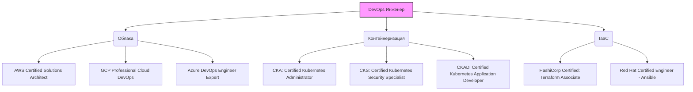

# Сертификации в DevOps

## История из жизни (Боль и Решение)
**Боль:** В команде каждый инженер настраивал кластеры Kubernetes и пайплайны по-своему. Из-за отсутствия единого стандарта качества возникали постоянные проблемы при передаче дежурств: никто не знал, как работает инфраструктура коллеги. На собеседованиях кандидаты заявляли о знании AWS и K8s, но на деле не могли написать простой Ingress или IAM-политику.

**Решение:** Внедрение требований к базовым сертификациям (CKA/CKS, AWS SAA, Terraform Associate) как внутреннего стандарта. Сертификация стала не просто "лычкой", а подтверждением того, что инженер понимает best practices и говорит с командой на одном языке. Это резко снизило time-to-market новых фичей и количество инцидентов из-за мисконфигурации.

## Архитектура знаний (Mermaid)



## Практика: Примеры для подготовки (CKA/Terraform)

### YAML: K8s Network Policy (Частый вопрос на CKA/CKS)
```yaml
apiVersion: networking.k8s.io/v1
kind: NetworkPolicy
metadata:
  name: deny-all-except-frontend
  namespace: prod
spec:
  podSelector:
    matchLabels:
      app: backend
  policyTypes:
  - Ingress
  ingress:
  - from:
    - podSelector:
        matchLabels:
          app: frontend
    ports:
    - protocol: TCP
      port: 8080
```

### Bash: Быстрый траблшутинг (Полезно для CKA)
```bash
# Быстро проверить, какие поды потребляют больше всего CPU
kubectl top pods -n kube-system | sort --reverse --key 3 --numeric | head -n 5

# Тест связности внутри кластера
kubectl run tmp-shell --rm -i --tty --image nicolaka/netshoot -- /bin/bash
```

## Day 2 Operations: Жизнь после получения сертификата

1. **Continuous Learning:** Облачные провайдеры обновляют сервисы ежедневно. Сертификат устаревает через 2-3 года. Настройте RSS-ленту на AWS What's New или Kubernetes Changelog.
2. **Hands-on Practice:** Теория без практики мертва. Используйте песочницы (например, A Cloud Guru, KodeKloud) или разверните локальный кластер (Minikube/Kind) для тестирования гипотез перед применением их в проде.
3. **Менторство:** Лучший способ закрепить знания — подготовить коллегу к сдаче экзамена.

## Антипаттерны

- **"Paper Tiger" (Бумажный тигр):** Сдача экзамена по дампам (готовым ответам) без реального понимания технологии. На первом же инциденте в проде такой сертификат обесценивается.
- **Коллекционирование бейджей:** Попытка сдать все возможные сертификации подряд вместо углубления в стек, который реально используется в вашей компании.
- **Игнорирование основ:** Попытка сдать CKA без понимания базового Linux networking (iptables, namespaces, cgroups) или AWS SAA без знания фундаментальных концепций сетей (VPC, CIDR, DNS).
