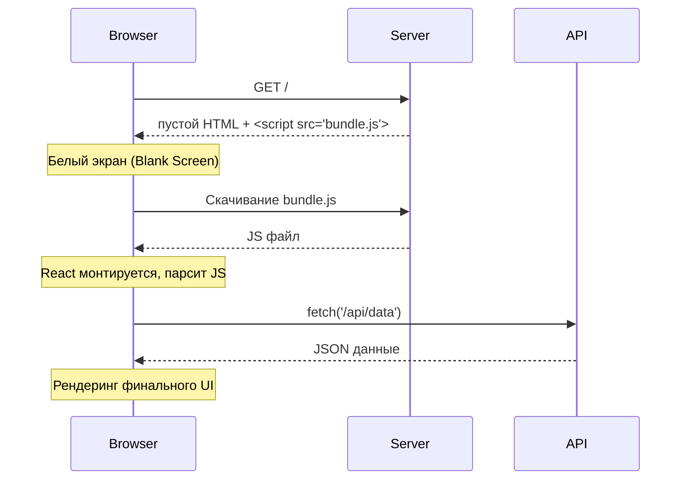

## Инженерная история
Традиционные сайты генерировали HTML на сервере при каждом клике. С появлением SPA (Single Page Applications) появилась модель CSR. Сервер отдает "пустой" HTML с тегом `<div id="root"></div>` и огромный JS-бандл. Вся логика, роутинг и рендеринг UI происходят в браузере. Боль: мы перенесли нагрузку с наших серверов на устройства пользователей.

## Визуализация


## Пример кода

### React (Vite / CRA)
Типичный входной файл `main.tsx`:
```tsx
import React from 'react'
import ReactDOM from 'react-dom/client'
import App from './App'

// В HTML лежит пустой <div id="root"></div>
const rootElement = document.getElementById('root')!

// Вся генерация DOM узлов происходит здесь, на клиенте
ReactDOM.createRoot(rootElement).render(
  <React.StrictMode>
    <App />
  </React.StrictMode>
)
```

### Vue 3 (Vite / Nuxt SPA)
Типичный входной файл `main.ts` (Vite + Vue 3):
```typescript
import { createApp } from 'vue'
import App from './App.vue'

// В HTML лежит пустой <div id="app"></div>
// Vue создает реактивное дерево и монтирует его в клиентский DOM
createApp(App).mount('#app')
```

В **Nuxt 3** вы можете полностью переключить весь проект или конкретные маршруты в режим CSR (SPA) через `nuxt.config.ts`:
```typescript
export default defineNuxtConfig({
  // Выключает SSR глобально (чистое SPA-приложение)
  ssr: false,
  // Или гибридно только для конкретных путей:
  routeRules: {
    '/admin/**': { ssr: false }
  }
})
```

## Неочевидные нюансы
- **Плюсы:** 
  - Разгрузка сервера (дешевый хостинг статики через CDN).
  - Очень быстрые переходы между страницами после первоначальной загрузки (без перезагрузки окна).
- **Минусы (Overhead & Трейдоффы):**
  - **Огромный TTI (Time to Interactive):** Пользователь видит белый экран, пока качается и парсится JS-бандл. На слабых мобильных устройствах парсинг 2MB JS может занять секунды.
  - **SEO (Search Engine Optimization):** Хотя Googlebot научился выполнять JS, другие поисковики, парсеры соцсетей (OpenGraph) и мессенджеров (Telegram, Slack) увидят только пустой `div`.
  - **Waterfall запросов:** Браузер не начнет скачивать данные (API fetch), пока не скачает JS, не распарсит его и не дойдет до хука `useEffect` компонента.
- **Границы применимости:** Идеально для B2B админок, SaaS-платформ за логином, сложных интерактивных веб-приложений (Figma, Notion), где SEO неважно, а сессия пользователя долгая.

---

## Альтернативное объяснение (для начинающих)

CSR, или Client Side Rendering, — это подход к рендерингу веб-страниц, при котором основная работа по отрисовке интерфейса веб-приложения выполняется на стороне клиента (браузера пользователя).

В CSR, когда пользователь запрашивает страницу, браузер отправляет запрос на сервер для получения HTML-файла, который содержит только структуру страницы и ссылки на необходимые скрипты и стили. Затем браузер загружает и выполняет JavaScript-код, который отвечает за динамическое обновление и отрисовку контента на странице.

### Принцип работы на примере React

React — это JavaScript-библиотека, а это значит, что код может быть исполнен в среде Node.js или в браузере. Если выключить JS в браузере, то мы увидим только пустую страницу, потому что дерево рисуется скриптом.

Принцип работы React:

1. При открытии сайта браузер отправляет запрос на сервер.
2. Сервер возвращает пустую страницу `index.html`, в которой нет разметки, кроме блока `div` с уникальным идентификатором (`id`).
3. В блоке `head` есть тег `script`, в котором подключается React-приложение.
4. Браузер парсит страничку, и когда доходит до тега `</script>`, загружает файл со скриптом и исполняет его.
5. Библиотека ReactDOM встраивает приложение в блок `div` c идентификатором `root`, и после этого мы увидим наше приложение в браузере.
6. Будет сделан API-запрос на получение данных.
7. React отобразит данные, полученные в ответе от сервера, на странице.

![[csr.png]]

Приложения, сделанные с таким подходом, легки в разработке и весят меньше в размере. Когда у вас ограниченные ресурсы на хостинге или ваше приложение закрыто для всех (например, панель администрирования), то CSR вам отлично подойдет.

> **SEO:** Если сайт публичный и важна настройка SEO-аналитики, то здесь отлично подойдет SSG.
