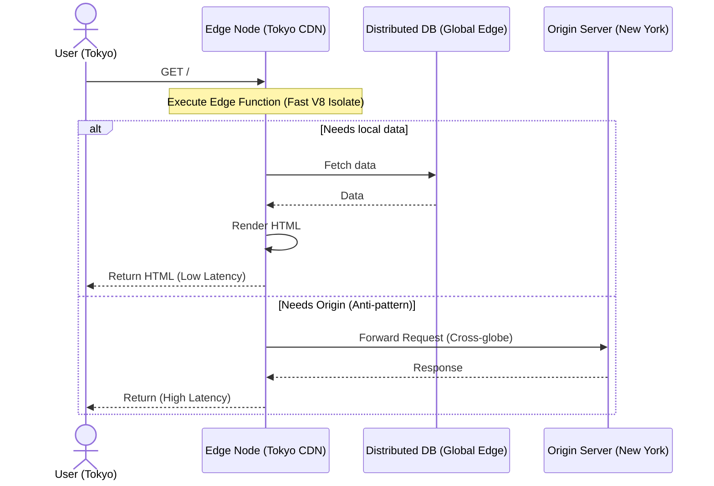

# Edge Rendering

## Инженерная история
**Что это:** Выполнение серверного рендеринга (SSR) или логики роутинга (Middleware) не на центральном сервере (origin), а на граничных узлах CDN (Edge nodes), расположенных физически близко к пользователю.
**Какую боль решаем:** Физическая задержка сети (latency). Если ваш сервер в Нью-Йорке, а пользователь в Токио, каждый запрос проходит полмира (~150-200ms только на сеть). Edge Rendering переносит код в дата-центр в Токио, снижая сетевую задержку до <20ms.
**Где применимо:** A/B тестирование, персонализация контента на лету (показ разных цен/языков по IP), защита от ботов, легковесный SSR без тяжелой базы данных.
**Где ломается:** Если вашему коду на Edge нужно сходить в базу данных, которая находится на Origin-сервере в Нью-Йорке. Вы не только не сэкономите время, но и добавите лишнее звено. 

## Архитектура работы



## Пример кода (Next.js Middleware / Edge Runtime)

```typescript
// Паттерн: A/B тестирование или редирект на границе
import { NextResponse } from 'next/server'
import type { NextRequest } from 'next/server'

// Этот код выполнится на Edge-узле рядом с пользователем
export const config = { runtime: 'edge' };

export function middleware(request: NextRequest) {
  const country = request.geo?.country || 'US';
  
  // Мгновенный локализованный редирект без нагрузки на Origin
  if (country === 'JP' && !request.nextUrl.pathname.startsWith('/jp')) {
    return NextResponse.redirect(new URL('/jp', request.url));
  }

  // A/B тестирование
  const bucket = Math.random() < 0.5 ? 'variant-a' : 'variant-b';
  const response = NextResponse.rewrite(new URL(`/${bucket}`, request.url));
  response.cookies.set('ab-test', bucket);
  
  return response;
}
```

## Неочевидные нюансы

1. **Ограничения Runtime (Isolates):** Edge функции работают не в полноценном Node.js, а в V8 Isolates (например, Cloudflare Workers). У вас **нет доступа** к `fs`, `child_process`, и большинству npm-пакетов, зависящих от бинарников Node.js (например, классические драйверы БД).
2. **Проблема базы данных:** Edge Rendering имеет смысл только с Edge-friendly базами данных (PlanetScale, DynamoDB Global Tables, Redis via HTTP). Запрос из Edge в классический Postgres на Origin уничтожит все преимущества Edge.
3. **Ограничения по размеру и времени:** Edge функции обычно жестко лимитированы. Например, бандл < 1-5MB, время выполнения до 10-50ms CPU времени. Нельзя рендерить тяжелые PDF или обрабатывать изображения на Edge.
4. **Холодные старты:** Хотя Isolates стартуют мгновенно (в отличие от Serverless контейнеров типа AWS Lambda), на непопулярных узлах CDN скрипт все равно может выгружаться из памяти, добавляя небольшую задержку при первом обращении.
