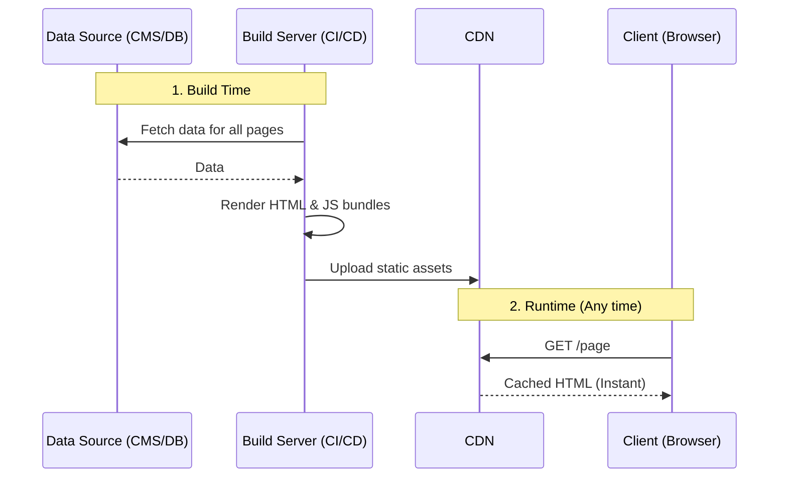

# Static Site Generation (SSG)

## Инженерная история
**Что это:** Стратегия рендеринга, при которой HTML-страницы генерируются один раз на этапе сборки (build time) и затем раздаются как статические файлы.
**Какую боль решаем:** Классический SSR требует серверных вычислений на каждый запрос, что дорого и медленно при высоких нагрузках. SPA (Client-Side Rendering) отдает пустой HTML, заставляя клиента качать мегабайты JS, ухудшая SEO и First Contentful Paint (FCP). SSG решает обе проблемы: мы получаем готовый HTML мгновенно.
**Где применимо:** Блоги, документация, маркетинговые лендинги, e-commerce каталоги (где цены меняются редко).
**Где ломается:** На проектах с высокой частотой обновления данных (соцсети, биржевые сводки) или с персонализированным контентом (дашборды). Если у вас миллион страниц, сборка проекта может занять часы.

## Архитектура работы



## Пример кода (Паттерн Next.js)

```javascript
// Паттерн: Предварительная генерация путей и данных
export async function getStaticPaths() {
  const posts = await fetch('https://api.example.com/posts').then(r => r.json());
  const paths = posts.map(post => ({ params: { id: post.id.toString() } }));
  
  return { paths, fallback: false }; // fallback: false значит отдавать 404 для неизвестных путей
}

export async function getStaticProps({ params }) {
  const post = await fetch(`https://api.example.com/posts/${params.id}`).then(r => r.json());
  
  return {
    props: { post },
  };
}

export default function Post({ post }) {
  return (
    <article>
      <h1>{post.title}</h1>
      <p>{post.content}</p>
    </article>
  );
}
```

## Неочевидные нюансы

1. **Проблема O(n) времени сборки:** Время сборки SSG линейно зависит от количества страниц. 100 страниц соберутся за секунды, 1 000 000 страниц заблокируют CI/CD пайплайн на часы.
2. **"Мертвый" контент:** Как только сборка завершена, данные устаревают. Чтобы обновить опечатку в статье, нужно пересобрать весь сайт (или использовать ISR).
3. **Безопасность:** SSG невероятно безопасен. Нет сервера, исполняющего код в рантайме — нечего взламывать, кроме CDN.
4. **Гидратация:** Несмотря на то, что HTML статический, если вы используете React/Vue, клиенту все равно нужно скачать JS-бандл и "гидратировать" страницу, чтобы она стала интерактивной. Это накладывает оверхед на Time to Interactive (TTI).

---

## Альтернативное объяснение (для начинающих)

**Static Site Generation — подход, когда содержимое сайта генерируется в HTML-файлы.**

Это метод создания веб-сайтов, при котором весь контент преобразуется в статические файлы (HTML, CSS, JavaScript) на этапе сборки или генерации. Эти файлы затем могут быть размещены на любом статическом хостинге, таком как GitHub Pages, Netlify, или Vercel.

В SSG весь контент, включая HTML, CSS, JavaScript и любые другие ресурсы, преобразуется в статические файлы во время сборки. Это означает, что каждый URL веб-сайта соответствует отдельному файлу. Когда пользователь запрашивает страницу, браузер просто загружает соответствующий статический файл.

![[ssg.png]]

![[ssg_2.webp]]

Единственное отличие от CSR — в том что с сервера возвращается сформированная страница.

В случае с CSR и SSG данные с сервера грузятся после получения HTML-страницы клиентом — показывается спиннер загрузки и делается запрос данных с сервера. А что если мы хотим получать данные сразу, без отображения индикатора загрузки? Для этого существует SSR.

### Преимущества

1. **Производительность**: Статические файлы обычно загружаются гораздо быстрее, чем динамические страницы.
2. **Масштабируемость**: Статические файлы могут быть легко кэшированы и распределены по всему миру.
3. **Безопасность**: Статические файлы не подвержены уязвимостям, связанным с серверным кодом.
4. **Простота**: Статические файлы проще развертывать и обслуживать.

### Недостатки

1. **Необходимость регенерации**: Если контент меняется часто, то для обновления сайта необходимо будет выполнять регенерацию статических файлов.
2. **Ограниченность динамического контента**: SSG подходит для статических сайтов, где контент не меняется или меняется редко.
