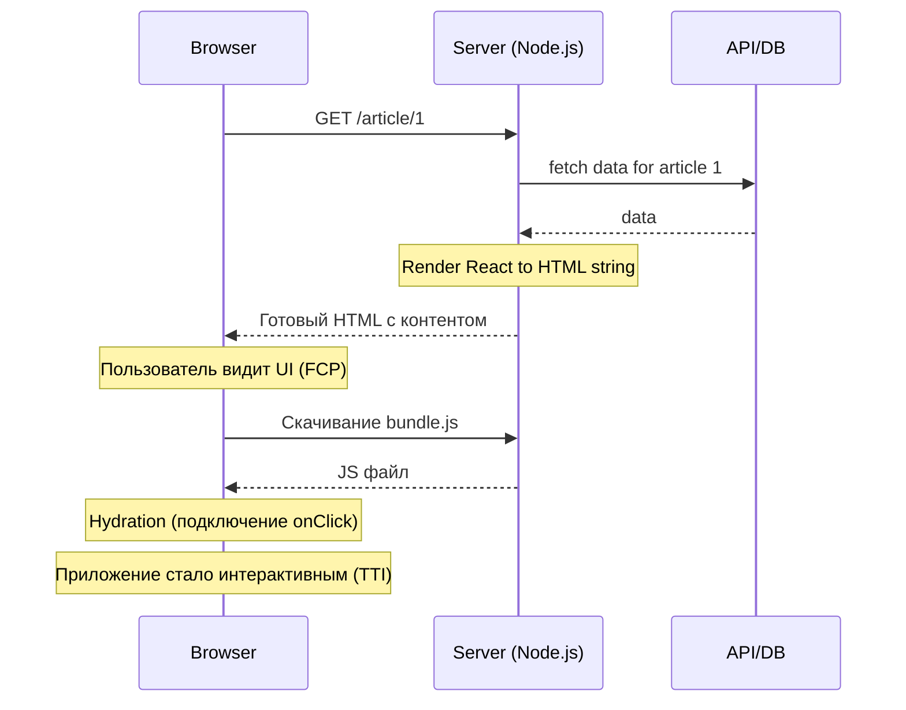

# SSR (Server-Side Rendering)

## Инженерная история
Чтобы решить проблемы CSR (белый экран и плохое SEO), придумали SSR. При каждом запросе сервер запускает React (или другой фреймворк), запрашивает нужные данные, генерирует готовый HTML и отправляет его в браузер. Пользователь мгновенно видит контент (Fast FCP). Затем браузер скачивает JS и "привязывает" обработчики событий к этому HTML — этот процесс называется **Гидратацией** (Hydration).

## Визуализация


## Пример кода

### Next.js / React

**Концепт SSR гидратации на клиенте (`hydrateRoot`):**
```tsx
import React from 'react'
import ReactDOM from 'react-dom/client'
import App from './App'

// Вместо createRoot используем hydrateRoot.
// React ожидает, что DOM уже содержит HTML, сгенерированный сервером.
ReactDOM.hydrateRoot(
  document.getElementById('root')!,
  <App />
)
```

**Next.js (Pages Router Server-Side):**
```tsx
export async function getServerSideProps(context) {
  // Выполняется только на Node.js сервере
  const res = await fetch(`https://api.example.com/data/${context.params.id}`);
  const data = await res.json();

  return { props: { data } }; // Передается в React компонент для рендера
}
```

### Nuxt 3 / Vue 3

**Гидратация на клиенте (Vue 3 SSR):**
```typescript
import { createSSRApp } from 'vue'
import App from './App.vue'

// createSSRApp настравает Vue для ожидания существующей разметки от сервера
const app = createSSRApp(App)
app.mount('#app')
```

**Nuxt 3 (Universal SSR Rendering):**
В Nuxt 3 SSR включен по умолчанию. Загрузка данных на сервере и автоматическая передача состояния на клиент (payload hydration) достигаются с помощью `useFetch` / `useAsyncData`:
```vue
<!-- pages/article/[id].vue -->
<script setup lang="ts">
const route = useRoute()

// useFetch исполняется на сервере во время SSR запроса,
// а результат сериализуется в payload и отправляется на клиент без повторного fetch!
const { data: article, pending, error } = await useFetch(
  `https://api.example.com/data/${route.params.id}`
)
</script>

<template>
  <div v-if="article">
    <h1>{{ article.title }}</h1>
    <p>{{ article.content }}</p>
  </div>
</template>
```

## Неочевидные нюансы
- **Hydration Mismatch:** Если HTML с сервера и HTML, который пытается отрендерить клиент на основе начального стейта, не совпадают (например, сервер отрендерил время UTC, а клиент локальное), React выбросит ошибку Hydration Mismatch и часто полностью перерисует дерево, убив все плюсы SSR.
- **Uncanny Valley (Зловещая долина):** Есть окно времени между отрисовкой HTML и завершением гидратации. В этот момент пользователь видит кнопку, кликает на нее, но ничего не происходит (JS еще не загрузился и не привязал обработчик событий).
- **Оверхед на сервере:** Рендеринг React в строку на Node.js — ресурсоемкая синхронная операция. Под высокой нагрузкой (DDoS или скачок трафика) сервер может лечь, если не использовать мощное кэширование на уровне CDN.
- **Границы применимости:** E-commerce, блоги, новостные сайты, лендинги — везде, где важны SEO, мета-теги для соцсетей и быстрая первая отрисовка.

---

## Альтернативное объяснение (для начинающих)

**SSR — Server Side Rendering, способ генерации HTML на стороне сервера.**

В CSR и SSG сервер возвращает готовую статическую страницу. В случае серверного рендеринга, после запроса клиентом странички, сервер на своей стороне выполняет API-запросы, а затем формирует HTML-страницу.

![[ssr.png]]

Когда разбирали пример с клиентским рендерингом, говорили о том что клиент получает пустую страничку и браузер исполняет JavaScript-код и рендерит приложение. В случае же с SSR, для рендеринга React-компонент используется Node.js сервер, а для его хостинга потребуются дополнительные ресурсы. **Если у вас ограниченные ресурсы на сервере, то вам не сильно подойдет выбор SSR.**

Дополнительная нагрузка ложится на сервер, за счет того, что асинхронные запросы выполняются на стороне сервера. Для таких случаев существует подход комбинирования запросов: часть выполняют на стороне сервера (как в примере c SSR), а часть на стороне клиента (SSG/CSR).

> Как [пишет Google](https://web.dev/rendering-on-the-web/) относительно SSR: _"A rehydration problem: one app for the price of two"_.

### Преимущества SSR

1. **Пользовательский интерфейс быстрее становится интерактивным**: Поскольку страница уже отрисована на сервере, пользователь может начать взаимодействовать с ней мгновенно.
2. **Улучшение SEO**: Поисковые системы лучше индексируют содержимое, отрисованное на сервере, так как оно доступно для считывания без выполнения JavaScript.
3. **Более простое развертывание и обслуживание**: На сервере нет необходимости выполнять JavaScript-код для отрисовки страницы.

### Недостатки SSR

1. **Задержка в загрузке страницы**: При каждом запросе пользователь должен ждать, пока сервер отрисует новую страницу.
2. **Высокие требования к ресурсам сервера**: Большое количество запросов может потребовать больших ресурсов сервера.
3. **Сложность реализации**: Реализация SSR может быть сложной, особенно если приложение уже реализовано с использованием других подходов к рендерингу.
