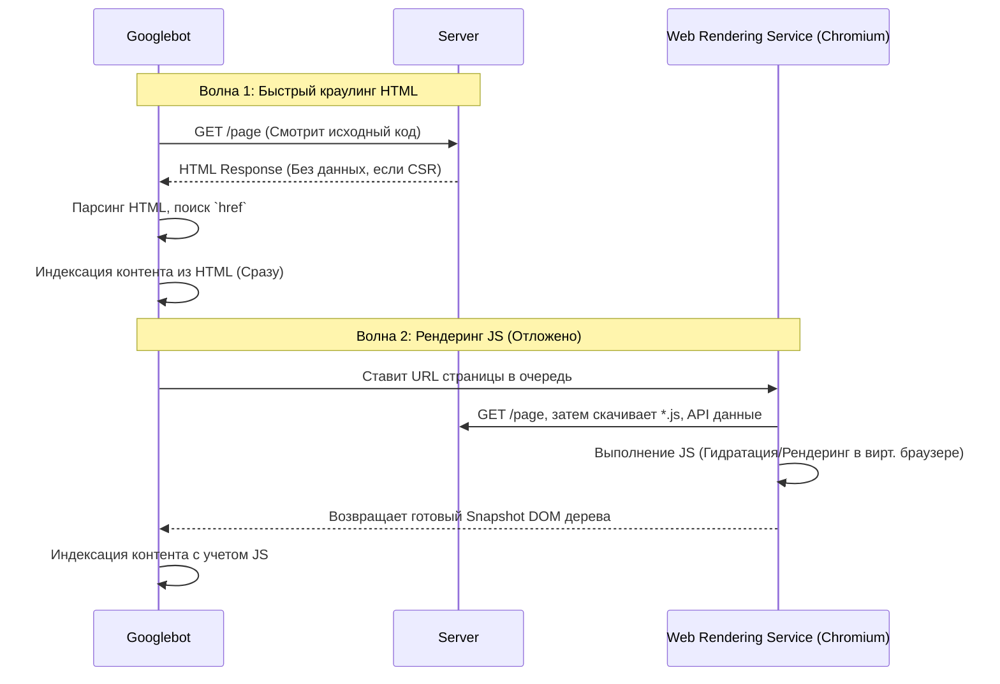

# SEO и Rendering: Как роботы видят ваш UI

## Что это и какую боль решает
Поисковые роботы (Googlebot, Yandexbot) постоянно сканируют сеть, чтобы проиндексировать контент сайтов. 
**Боль:** Выполнение JavaScript — дорогой и долгий процесс для серверов поисковиков. Если ваш сайт полностью отрисовывается на клиенте (CSR SPA), в исходном HTML коде робот увидит только `<div id="root"></div>`. Поисковики умеют рендерить JS, но делают это во "вторую волну" индексации, что может занять от нескольких дней до недель. Для новостного портала или магазина это неприемлемо.

## Как работает краулинг JS сайтов (WRS)

Google использует Web Rendering Service (WRS) — специальную headless-версию Chromium.



## Примеры кода и подходы

### React / Next.js

**Антипаттерн: Управление мета-тегами на клиенте (CSR)**
```jsx
// React SPA: Плохо для соцсетей и парсеров
function ProductPage() {
  useEffect(() => {
    // Выполнится только после загрузки JS. 
    // Роботы Telegram/Twitter не исполняют JS вообще! Они увидят дефолтный <title>.
    document.title = "Купить iPhone 15 Pro";
    document.querySelector('meta[name="description"]')
            .setAttribute("content", "Цена 999$");
  }, []);
  return <div>...</div>;
}
```

**Паттерн: Dynamic Rendering на уровне Edge / Middleware**
Если переписать старое большое SPA на SSR слишком дорого, используют паттерн динамического рендеринга. Людям отдают статику SPA, а ботов перехватывают и отдают пререндер (через Puppeteer или сервисы типа Prerender.io).
```javascript
// Cloudflare Worker Middleware (Пример)
addEventListener('fetch', event => {
  const userAgent = event.request.headers.get('User-Agent') || '';
  const isBot = /googlebot|bingbot|yandex|baiduspider|twitterbot|facebookexternalhit/i.test(userAgent);

  if (isBot) {
    event.respondWith(fetch(`https://service.prerender.io/${event.request.url}`));
  } else {
    event.respondWith(fetch(event.request));
  }
});
```

### Nuxt 3 / Vue 3 (Серверные мета-теги через `useSeoMeta`)

В Nuxt 3 мета-теги генерируются на сервере в момент SSR вызова и сразу встраиваются в открывающий тег `<head>` исходного HTML-документа:

```vue
<!-- pages/products/[id].vue -->
<script setup lang="ts">
const route = useRoute()
const { data: product } = await useFetch(`/api/products/${route.params.id}`)

// useSeoMeta полностью типизирован и рендерится на сервере для SEO-ботов и соцсетей:
useSeoMeta({
  title: () => product.value?.title || 'Товар не найден',
  ogTitle: () => product.value?.title,
  description: () => product.value?.description,
  ogDescription: () => product.value?.description,
  ogImage: () => product.value?.imageUrl,
  twitterCard: 'summary_large_image',
})

// Если ресурс не найден, на сервере выставляется реальный 404 HTTP-статус:
if (!product.value) {
  showError({ statusCode: 404, statusMessage: 'Product Not Found' })
}
</script>

<template>
  <div v-if="product">
    <h1>{{ product.title }}</h1>
  </div>
</template>
```

## Неочевидные нюансы и границы применимости
- **TTFB vs FCP для SEO:** Поисковики учитывают Core Web Vitals (метрики скорости) при ранжировании. SSR гарантирует контент в исходном HTML (отличный FCP), но если бэкенд долго собирает данные, ухудшается TTFB (Time to First Byte). Сервер Googlebot-а может посчитать сайт "медленным" из-за долгого ответа базы данных при SSR. Идеальное решение для SEO — SSG/ISR с кэшированием на CDN.
- **Ошибки гидратации и CLS (Cumulative Layout Shift):** Если сервер (SSR) отрендерил один HTML, а клиентский JS сразу после загрузки решил его изменить (например, из-за разницы во времени `Date.now()`, локали браузера или проверки `window.innerWidth`), интерфейс "дернется". Это сильно бьет по метрике CLS, что пессимизирует позиции в выдаче.
- **Soft 404 (Мягкие 404 ошибки):** В чистом CSR приложении, если ресурс не найден (юзер зашел на удаленный пост), роутер на клиенте рисует компонент `<NotFound />`. Но веб-сервер при изначальном запросе `/post/deleted-id` отдаст HTTP статус `200 OK`. Поисковик с радостью проиндексирует страницу с текстом "Ничего не найдено". При использовании SSR критически важно возвращать настоящий HTTP статус `404` в заголовках.
