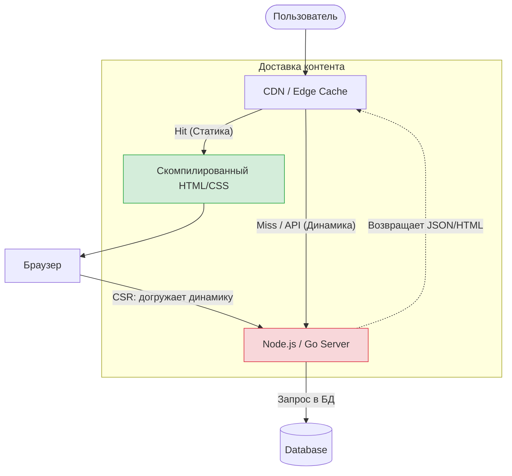

# Динамический и Статический Контент

Разделение контента на статический и динамический — это фундаментальный архитектурный водораздел в веб-разработке. От того, как мы классифицируем данные, зависит выбор инфраструктуры (CDN или Application Server) и стратегии рендеринга (SSG или SSR/CSR). 

## Суть концепции

*   **Статический контент** — одинаков для всех пользователей в определенный момент времени. Это маркетинговые страницы, статьи в блоге, публичный каталог товаров. Его можно (и нужно) сгенерировать заранее и положить в кэш или на CDN.
*   **Динамический контент** — уникален для пользователя или меняется слишком часто (каждую секунду). Это корзина покупок, персонализированная лента, дашборд с аналитикой, чат.

Боль разработки заключается в том, что современные страницы почти никогда не бывают на 100% статическими или динамическими. У нас есть статичная статья, но в углу висит аватарка залогиненного пользователя (динамика), а под статьей — блок комментариев (динамика).

## Архитектура сосуществования



## Как это работает на практике

Проблема: если из-за одной маленькой динамической детали (аватарки) мы делаем всю страницу динамической (SSR), мы теряем все преимущества CDN. Сервер начинает пыхтеть над каждым запросом, TTFB (Time to First Byte) растет.

**Антипаттерн: SSR для всего ради одного элемента**
```javascript
// Next.js (Плохо: рендерим всю тяжелую страницу на сервере для каждого запроса)
export async function getServerSideProps({ req }) {
  const user = await getUserFromSession(req); // Динамика
  const article = await getArticleData(); // Статика (меняется редко)
  
  return { props: { user, article } };
}
```

**Правильное решение: Статический скелет + Клиентская динамика (CSR)**
Рендерим основную часть страницы статически (SSG), а аватарку и комментарии подтягиваем на клиенте через JavaScript (SWR/React Query).
```javascript
// Next.js (Хорошо: страница в CDN, динамика грузится позже)
export async function getStaticProps() {
  const article = await getArticleData(); 
  return { props: { article }, revalidate: 3600 }; // Кэшируем на час
}

export default function Page({ article }) {
  // Динамические данные грузятся в браузере (не блокируют TTFB)
  const { data: user } = useQuery('user', fetchUser);
  
  return (
    <div>
      <Header user={user} /> {/* Показывает скелетон, пока грузится user */}
      <ArticleContent data={article} /> {/* Отдается моментально из CDN */}
    </div>
  );
}
```

## Неочевидные нюансы: Границы применимости

1. **SEO-парадокс**: Если вы подтягиваете важный контент динамически (CSR), поисковые роботы могут его не дождаться. Динамический контент, *критичный для SEO* (например, цены на товары), нельзя откладывать до клиентского рендеринга. Здесь на сцену выходит ISR (Incremental Static Regeneration) или Edge-рендеринг.
2. **Оверхед на клиенте**: Чем больше "дырок" в статике вы заполняете динамически на клиенте, тем больше API-запросов делает браузер при старте, создавая эффект "пляшущего" интерфейса (Layout Shift) и нагружая сеть.
3. **Islands Architecture (Astro) и React Server Components**: Современный ответ на эту проблему. Они позволяют отправлять с сервера готовый HTML со статикой, перемешанной с отрендеренной динамикой, но доставлять JavaScript *только* для интерактивных островков, не заставляя клиента скачивать код статических частей.
