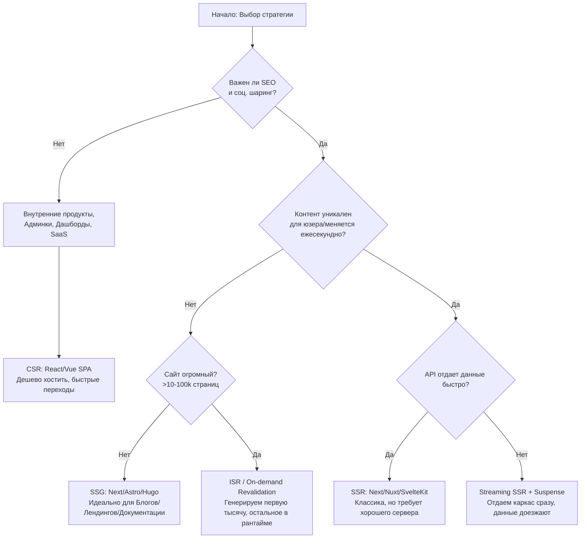

# Rendering Strategy Selection: Как выбрать подходящий подход

## Что это и какую боль решает
Выбор стратегии рендеринга определяет, **где** и **когда** генерируется HTML код вашего приложения: в браузере пользователя, на сервере во время ответа на запрос, или на сервере заранее во время сборки. 
**Боль:** Неправильный выбор ведет к фатальным последствиям. Выберете CSR — получите пустой белый экран при загрузке и мертвый SEO. Выберете чистый SSR для блога — получите огромные счета за серверы и медленный TTFB. Выберете SSG для миллиона товаров — билд проекта будет идти 40 часов.

## Основные стратегии
1. **CSR (Client-Side Rendering):** Браузер скачивает пустой `index.html`, большой JS бандл, и строит UI на клиенте.
2. **SSR (Server-Side Rendering):** Сервер генерирует полноценный HTML "на лету" на каждый входящий HTTP запрос.
3. **SSG (Static Site Generation):** HTML генерируется один раз при билде приложения и раздается супер-быстро через CDN.
4. **ISR (Incremental Static Regeneration):** Симбиоз SSG и SSR. HTML генерируется при билде, но сервер пересобирает конкретные страницы в фоне по таймеру или хуку.
5. **Streaming SSR:** Сервер отдает HTML чанками (кусками) по мере готовности данных, не дожидаясь ответа от самых медленных API.

## Дерево принятия решений



## Примеры / Антипаттерны

**Антипаттерн: SSG для пользовательской ленты / огромного каталога**
```javascript
// Next.js: Пытаемся пререндерить миллион комбинаций URL
export async function getStaticPaths() {
  const allProducts = await db.getAllProducts(1000000);
  // Это вызовет ООМ (Out of Memory) или сборку на несколько дней
  return { 
      paths: allProducts.map(p => ({ params: { id: p.id } })), 
      fallback: false 
  }; 
}
```

**Паттерн: Streaming SSR для медленных зависимостей**
```jsx
// React Server Components (Next.js App Router)
// Позволяет не блокировать отправку HTML из-за одного медленного запроса
export default function Dashboard() {
  return (
    <div>
      <FastNavigationHeader />
      <Suspense fallback={<Spinner text="Грузим вашу персональную аналитику..." />}>
        <SlowHeavyAnalyticsWidget />
      </Suspense>
    </div>
  )
}
```

## Неочевидные нюансы и границы применимости
- **Устаревание кэша (ISR Cache Invalidation):** ISR работает отлично до тех пор, пока данные не связаны сложной реляционной логикой. Например, изменение названия категории в CMS должно обновить тысячи товаров в этой категории. Управление тегами кэша (Cache-Tags, On-demand Revalidation) становится невероятно сложным архитектурным вызовом.
- **SSR Scalability (Масштабируемость):** SSR переносит нагрузку с процессора смартфона пользователя на ваш сервер. При резком наплыве трафика (успешная реклама или DDoS) SSR-сервер может упасть из-за CPU-bound задач (например, `renderToString` в React блокирует Event Loop Node.js). SSG/CDN сайт такую нагрузку даже не заметит.
- **CSR Penalty (Штраф за клиентский рендеринг):** CSR крайне дешево хостить (просто файлы на S3). Но метрики INP (Interaction to Next Paint) и LCP (Largest Contentful Paint) будут сильно страдать у мобильных пользователей со слабыми процессорами, так как парсинг и выполнение сотен килобайт JS блокирует UI-поток браузера.
