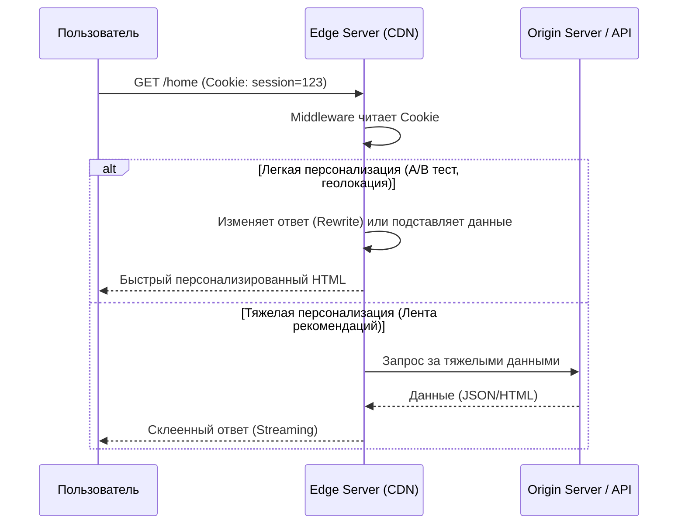

# Персонализация (Personalization)

Персонализация — это процесс адаптации интерфейса, контента и функционала приложения под конкретного пользователя. Будь то рекомендательная лента в интернет-магазине, локализация цен в нужной валюте или просто плашка "С возвращением, Алексей!" на главной странице. 

В контексте веб-архитектуры и рендеринга, персонализация — это главный враг кэширования. Как только ответ сервера зависит от `Cookie` или `Authorization` заголовка, вы больше не можете отдавать один и тот же HTML всем подряд.

## Суть проблемы: Борьба CDN и Уникальности

Исторически было два пути:
1. **Полный SSR**: Сервер смотрит куку, идет в базу, рендерит страницу лично под пользователя. *Боль:* Долго, дорого, сервер ложится в Черную Пятницу, нельзя использовать глобальный CDN.
2. **Полный CSR**: Сервер (или CDN) отдает всем одинаковый "пустой" HTML с лоадером. Браузер сам парсит JS, идет за токеном, делает запросы к API и рисует UI. *Боль:* Медленный старт страницы, пользователь смотрит на спиннеры.

Современная инженерия ищет баланс, позволяя отдавать персонализированный контент так же быстро, как статику.

## Архитектура персонализации на Edge



## Как это работает на практике: Edge Middleware

### Next.js / React (Edge Middleware)

**Антипаттерн: Мигание контента (Layout Shift) на клиенте**
```javascript
function Header() {
  // Плохо: при загрузке state пустой, потом резко меняется
  const [user, setUser] = useState(null);
  useEffect(() => { fetchUser().then(setUser) }, []);

  return <div>{user ? `Привет, ${user.name}` : 'Войти'}</div>;
}
```

**Правильное решение: Персонализация через Edge Middleware + Rewrite**
```typescript
// Next.js middleware.ts (выполняется на Edge, за миллисекунды)
import { NextResponse } from 'next/server'
import type { NextRequest } from 'next/server'

export function middleware(request: NextRequest) {
  const hasSession = request.cookies.has('auth_token')
  
  if (hasSession && request.nextUrl.pathname === '/') {
    return NextResponse.rewrite(new URL('/dashboard', request.url))
  }
  
  return NextResponse.next()
}
```

### Nuxt 3 / Vue 3 (Server Middleware & `useCookie`)

В Nuxt 3 серверное middleware (`server/middleware/*.ts`) выполняется перед SSR рендерингом страниц и может быть развернуто на Edge:

```typescript
// server/middleware/auth.ts
export default defineEventHandler((event) => {
  const authToken = getCookie(event, 'auth_token')
  const url = getRequestURL(event)

  // Если юзер авторизован и заходит на главную, прозрачно направляем на персонализированный дашборд
  if (authToken && url.pathname === '/') {
    return sendRedirect(event, '/dashboard', 302)
  }
})
```

Внутри компонентов Vue 3 безопасное чтение кук без расхождений гидратации (Hydration Mismatch):
```vue
<!-- components/Header.vue -->
<script setup lang="ts">
// useCookie в Nuxt 3 синхронизирует состояние между сервером (SSR) и клиентом
const authToken = useCookie('auth_token')
const { data: user } = await useFetch('/api/me', {
  headers: { authorization: `Bearer ${authToken.value}` }
})
</script>

<template>
  <header>
    <!-- Отдельный серверный HTML сразу содержит имя юзера без CLS и дерганий -->
    <div v-if="user">Привет, {{ user.name }}</div>
    <NuxtLink v-else to="/login">Войти</NuxtLink>
  </header>
</template>
```

## Неочевидные нюансы: Трейдоффы персонализации

1. **Vary Cache Header Overhead**: Если вы кэшируете персонализированный SSR на уровне CDN через заголовок `Vary: Cookie`, вы плодите миллионы уникальных копий страницы в кэше. Это называется *Cache Fragmentation*. Эффективность CDN падает почти до нуля (Cache Hit Rate < 5%).
2. **Streaming SSR и Suspense**: Если персонализированные данные (корзина) грузятся долго, современный подход — отдать статическую "оболочку" страницы моментально в виде первого чанка HTML, а персонализированную корзину стримить (Streaming) туда же чуть позже. Это позволяет сохранить быстрый TTFB и не показывать пустую страницу.
3. **Безопасность**: При гибридных подходах (SSG + CSR) очень легко случайно зашить чужие персональные данные в статический билд или закэшировать страницу администратора и отдать ее обычному пользователю. Ключевое правило: никогда не используйте глобальные переменные сервера для хранения сессий.
