# Performance и Rendering: Борьба за микросекунды

## Что это и какую боль решает
Архитектура рендеринга напрямую влияет на производительность и метрики Core Web Vitals (LCP, FID, INP). 
**Боль:** Самая критичная проблема современных фреймворков (React, Vue) при использовании SSR — это **"Долина смерти" гидратации (Uncanny Valley of Hydration)**. Сервер быстро отдает готовый HTML, пользователь видит интерфейс (кнопки, ссылки), но пока браузер не скачает, распарсит и выполнит мегабайты JavaScript для привязки event-лиснеров, страница визуально готова, но абсолютно не реагирует на действия пользователя.

## Эволюция подходов к гидратации

Развитие frontend-перформанса идет по пути радикального уменьшения объема JS и расщепления процесса гидратации:

1. **Standard Hydration (Классика):** Загрузить весь JS бандл -> Запустить рантайм фреймворка -> Построить Virtual DOM для всей страницы -> Сравнить с пришедшим HTML -> Навесить события. (Блокирует главный поток, медленно).
2. **Progressive/Partial Hydration (Astro/Islands):** Гидратировать не всё приложение корнем, а независимые "острова", начиная с тех, что видимы во вьюпорте.
3. **Streaming HTML + Suspense (Next.js/React 18):** Параллельная загрузка кода и данных.
4. **Resumability (Qwik):** Сериализация состояния на сервере прямо в HTML-атрибуты. Клиенту вообще не нужно выполнять гидратацию при загрузке.

```mermaid
gantt
    title Сравнение моделей рендеринга и метрик
    dateFormat X
    axisFormat %s
    
    section CSR SPA
    Download HTML: 0, 1
    Download JS: 1, 3
    Execute JS & Render: 3, 5
    FCP & Interactive: milestone, 5, 0
    
    section Classic SSR (React)
    Server Gen HTML: 0, 2
    Download HTML: 2, 3
    FCP (Visible, Unresponsive!): milestone, 3, 0
    Download JS: 3, 4
    Hydration (Blocks Main Thread): 4, 6
    Interactive (TTI): milestone, 6, 0
    
    section Resumability (Qwik)
    Server Gen HTML: 0, 2
    Download HTML: 2, 3
    FCP & Interactive (Ready): milestone, 3, 0
    Lazy Download JS exactly on Event: 5, 6
```



## Примеры кода и подходы

### Антипаттерны и базовые техники

**Антипаттерн: Синхронная блокировка рендера скриптами**
```html
<head>
  <!-- Заблокирует парсинг HTML браузером, пока тяжелый скрипт 
       не скачается по сети и не выполнится. Пользователь видит белый экран. -->
  <script src="/heavy-bundle-with-analytics.js"></script>
</head>
```

### Qwik (Resumability без гидратации)

```javascript
import { component$, $, useSignal } from '@builder.io/qwik';

export const Counter = component$(() => {
  const count = useSignal(0);
  const increment = $(() => count.value++);
  return <button onClick$={increment}>Кликнули: {count.value}</button>;
});
```

### Nuxt 3 / Vue 3 (Payload Extraction & Intent Prefetching)

В Nuxt 3 оптимизация производительности гидратации и переходов достигается извлекаемыми JSON-пейлоадами и гибкой предзагрузкой (`prefetch` / `no-prefetch`):

```typescript
// nuxt.config.ts
export default defineNuxtConfig({
  experimental: {
    // Извлекает начальный стейт SSR в отдельный легкий JSON-файл, 
    // позволяя кэшировать payload на CDN отдельно от HTML!
    payloadExtraction: true
  }
})
```

В шаблонах Vue 3:
```vue
<template>
  <nav>
    <!-- Предзагрузка бандла следующей страницы ТОЛЬКО когда ссылка попадает в зону видимости -->
    <NuxtLink to="/catalog" prefetch>Каталог</NuxtLink>

    <!-- Загружать код страницы только при наведении (Intent-based), сохраняя трафик -->
    <NuxtLink to="/heavy-dashboard" :prefetch="false" @mouseenter="prefetchRoutes('/heavy-dashboard')">
      Дашборд
    </NuxtLink>
  </nav>
</template>
```

## Неочевидные нюансы и трейдоффы
- **Стриминг и Инфраструктурные проблемы:** Streaming SSR (передача HTML чанками через Transfer-Encoding: chunked) отлично решает проблему долгого TTFB. Но этот стриминг часто ломается об инфраструктуру: старые Load Balancers, настройки Nginx (proxy_buffering) или правила CDN могут буферизировать поток и ждать его полного окончания, превращая продвинутый стриминг обратно в медленный классический SSR ответ.
- **Cost of Hydration и INP (Interaction to Next Paint):** Даже если вы отложили загрузку JS бандла через `defer` или разбили на чанки, сам процесс гидратации (когда React строит VDOM и синхронизирует его) занимает главный поток на сотни миллисекунд. Любой клик пользователя в это "окно" будет иметь огромную задержку (плохой INP).
- **Prefetching Overhead:** Чтобы SPA казалось быстрым, фреймворки (Next.js) префетчат (предзагружают) JS бандлы для всех ссылок `<Link>`, появившихся на экране. На страницах-каталогах со 100 ссылками это может вызвать сетевой шторм, забить канал мобильного телефона и посадить батарею. Для перформанса часто лучше применять *intent-based prefetching* — загружать код следующей страницы только при наведении мыши (hover) или касании (touchstart).
