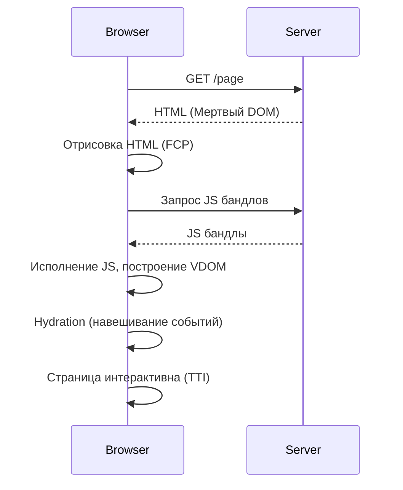

# Hydration (Гидратация)

## Что это и какую боль решаем
При Server-Side Rendering (SSR) клиент получает готовую HTML-разметку. Это отлично для SEO и First Contentful Paint (FCP), но эта разметка "мертва" — в ней нет JavaScript-обработчиков событий, стейта и интерактивности. 
**Hydration** (гидратация) — это процесс "оживления" статического HTML. Фреймворк загружает JS-бандл, строит виртуальный DOM, сравнивает его с реальным DOM и навешивает обработчики событий без полной перерисовки страницы.

## Как это работает
1. Сервер рендерит HTML и сериализует начальный стейт (например, в `<script>` теге).
2. Браузер быстро показывает HTML.
3. Скачивается и выполняется JavaScript.
4. Фреймворк (React/Vue/Angular) инициализируется, восстанавливает стейт и привязывает (bind) события к существующим DOM-узлам.



## Пример кода

### React

```tsx
// Server (Node.js)
import { renderToString } from 'react-dom/server';
const html = renderToString(<App state={initialState} />);
// Отправляем html + initialState клиенту

// Client (Browser)
import { hydrateRoot } from 'react-dom/client';
// React оживляет существующий контейнер вместо замены (render)
hydrateRoot(document.getElementById('root'), <App state={window.__INITIAL_STATE__} />);
```

### Vue 3 / Nuxt 3

```typescript
// Server (Node.js)
import { createSSRApp } from 'vue'
import { renderToString } from '@vue/server-renderer'

const app = createSSRApp(App, { state: initialState })
const html = await renderToString(app)
// Отправляем html клиенту

// Client (Browser)
import { createSSRApp } from 'vue'
const clientApp = createSSRApp(App, { state: window.__INITIAL_STATE__ })
// Vue монтируется и гидрирует существующий контейнер без пересоздания DOM узлов
clientApp.mount('#app')
```

В **Nuxt 3** для компонентов, вызывающих проблемы с гидратацией (например, работающих только в браузере или с разным временем на сервере и клиенте), используется обертка `<ClientOnly>`:
```vue
<template>
  <div>
    <h1>Постоянный контент (SSR)</h1>
    
    <!-- Гидрируется и рендерится исключительно на клиенте без Hydration Mismatch -->
    <ClientOnly placeholder="Загрузка списка...">
      <UserBrowserProfile />
    </ClientOnly>
  </div>
</template>
```

## Неочевидные нюансы и трейдоффы
- **Hydration Mismatch:** Если отрендеренный на сервере HTML отличается от того, что генерирует JS на клиенте (например, использование `Date.now()` или `window.innerWidth`), гидратация сломается. Фреймворк будет вынужден удалить серверный DOM и отрендерить всё с нуля.
- **Двойная работа:** Компонент фактически рендерится дважды — сначала на сервере (в строку), затем на клиенте (для инициализации стейта и сравнения с DOM).
- **Time to Interactive (TTI) bottleneck:** JS бандл должен загрузиться, распарситься и выполниться. В это время пользователь видит кнопки, но клики по ним не работают (Uncanny Valley).
- **Эволюция:** Для решения проблем классической гидратации появились *Progressive Hydration*, *Partial Hydration* (Astro Islands) и *Resumability* (Qwik), которые позволяют не гидрировать страницу целиком, а только нужные интерактивные части.
