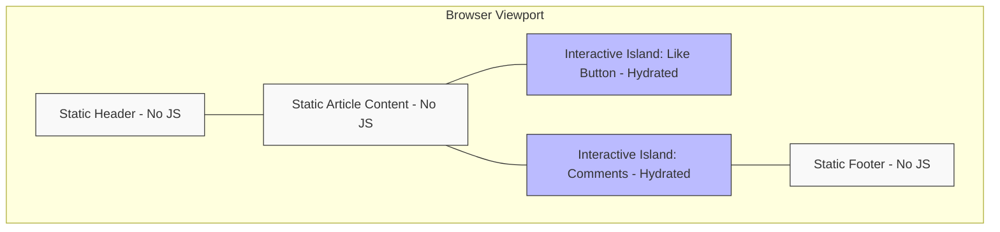

# Islands Architecture (Островная архитектура)

## Что это и какую боль решаем?
Островная архитектура — это парадигма рендеринга, при которой страница в основном состоит из статического HTML, а интерактивность добавляется только в изолированных зонах («островах»).
**Боль:** Традиционные фреймворки (Next.js, Nuxt) тянут огромный бандл JavaScript даже для сайтов, где 90% контента — это текст (блоги, e-commerce витрины, лендинги). Весь этот код нужно скачать, распарсить и выполнить (Hydration), что убивает метрику TTI (Time to Interactive).

## Как это работает?
Сервер рендерит всю страницу в HTML. Клиенту отдается только этот HTML и крошечные JS-бандлы исключительно для интерактивных компонентов (карусели, корзины, меню). Остальная часть страницы никогда не гидрируется. Популярный представитель: **Astro**.

## Архитектура


## Примеры кода

### Astro (с Vue 3 и React островами)

```astro
---
import Header from '../components/Header.astro'; // Статический HTML (0 JS)
import VueCartWidget from '../components/VueCartWidget.vue'; // Vue 3 компонент
import ReactComments from '../components/ReactComments.jsx'; // React компонент
---
<html>
  <body>
    <Header />
    <main>
      <!-- Vue остров: гидрируется сразу при загрузке страницы -->
      <VueCartWidget client:load />
      
      <!-- React остров: JS загрузится и гидрирует компонент только при скролле -->
      <ReactComments client:visible />
    </main>
  </body>
</html>
```

### Nuxt 3 (Nuxt Islands / `<NuxtIsland>`)

В Nuxt 3 есть экспериментальная нативная поддержка островной архитектуры (`experimental.componentIslands`). Остров рендерится исключительно на сервере и возвращает статический HTML без JS-гидратации:

```vue
<!-- components/ServerWidget.island.vue -->
<script setup lang="ts">
// Выполняется ТОЛЬКО на сервере. Текст и логика рендерятся в статический HTML
const stats = await $fetch('/api/stats')
</script>

<template>
  <div>
    <h3>Статистика (0 байт JS на клиенте): {{ stats.total }}</h3>
  </div>
</template>
```

Использование острова в обычном Nuxt-компоненте:
```vue
<template>
  <div>
    <h1>Главная страница</h1>
    <!-- Остров не тянет JS в клиентский бандл -->
    <NuxtIsland name="ServerWidget" />
  </div>
</template>
```

## Неочевидные нюансы и трейдоффы
- **Обмен состоянием:** Острова изолированы. Чтобы передать данные из React-острова в Svelte-остров, нужен внешний стейт-менеджер (например, Nanostores или Signals), который работает вне контекста фреймворков.
- **Микрофронтенд в миниатюре:** Острова могут привести к загрузке нескольких рантаймов (React + Vue на одной странице), что убьет весь профит. Нужно следить за зоопарком технологий.
- **Не подходит для SPA:** Если ваше приложение — это сложный дашборд с глубокими переходами и общим контекстом, Islands Architecture создаст больше проблем, чем решит.
