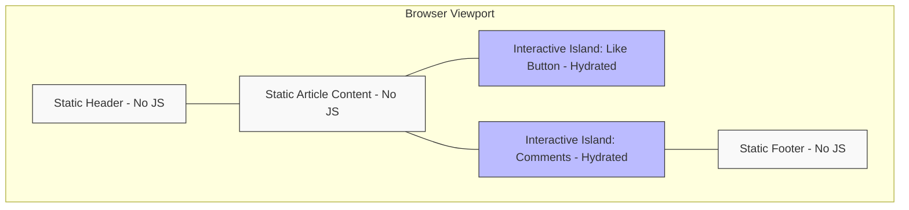

# Islands Architecture (Островная архитектура)

## Что это и какую боль решаем?
Островная архитектура — это парадигма рендеринга, при которой страница в основном состоит из статического HTML, а интерактивность добавляется только в изолированных зонах («островах»).
**Боль:** Традиционные фреймворки (Next.js, Nuxt) тянут огромный бандл JavaScript даже для сайтов, где 90% контента — это текст (блоги, e-commerce витрины, лендинги). Весь этот код нужно скачать, распарсить и выполнить (Hydration), что убивает метрику TTI (Time to Interactive).

## Как это работает?
Сервер рендерит всю страницу в HTML. Клиенту отдается только этот HTML и крошечные JS-бандлы исключительно для интерактивных компонентов (карусели, корзины, меню). Остальная часть страницы никогда не гидрируется. Популярный представитель: **Astro**.

## Архитектура


## Примеры кода
**Паттерн: Определение островов (Astro)**
```astro
---
import Header from '../components/Header.astro'; // Статика
import InteractiveCounter from '../components/Counter.jsx'; // React-компонент
import HeavyWidget from '../components/Widget.svelte'; // Svelte-компонент
---
<html>
  <body>
    <Header />
    <main>
      <!-- Загрузится и гидрируется сразу -->
      <InteractiveCounter client:load />
      
      <!-- Загрузится только когда попадет в зону видимости -->
      <HeavyWidget client:visible />
    </main>
  </body>
</html>
```

## Неочевидные нюансы и трейдоффы
- **Обмен состоянием:** Острова изолированы. Чтобы передать данные из React-острова в Svelte-остров, нужен внешний стейт-менеджер (например, Nanostores или Signals), который работает вне контекста фреймворков.
- **Микрофронтенд в миниатюре:** Острова могут привести к загрузке нескольких рантаймов (React + Vue на одной странице), что убьет весь профит. Нужно следить за зоопарком технологий.
- **Не подходит для SPA:** Если ваше приложение — это сложный дашборд с глубокими переходами и общим контекстом, Islands Architecture создаст больше проблем, чем решит.
