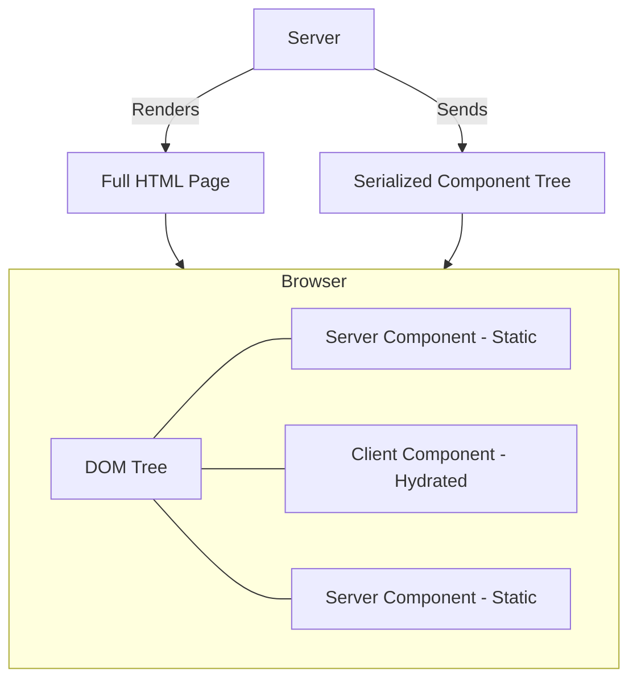

# Partial Hydration

## Что это и какую боль решаем?
Частичная гидратация (Partial Hydration) — это техника, при которой гидрируется не всё DOM-дерево целиком, а только его отдельные части. 
**Боль:** В традиционном SSR (Server-Side Rendering) происходит "Hydration mismatch" или "Uncanny Valley" — страница выглядит готовой, но кнопки не нажимаются, пока весь гигантский JS-бандл не скачается и не пройдется по всему виртуальному DOM. Это дорого и бессмысленно для статических частей страницы.

## Как это работает?
Фреймворк разделяет компоненты на те, которые нуждаются в клиентом JS, и те, которые остаются серверными навсегда (например, React Server Components). Сервер отдает статику, в которой "проделаны дыры" для клиентских компонентов. Гидратация происходит только внутри этих дыр. (Островная архитектура — это частный случай частичной гидратации).

## Архитектура


## Примеры кода
**Паттерн: React Server Components (Next.js App Router)**
```tsx
// app/page.tsx (По умолчанию Server Component)
import { db } from './db';
import InteractiveLike from './InteractiveLike';

export default async function ArticlePage() {
  const article = await db.getArticle(); // Прямой запрос к БД
  
  return (
    <article>
      <h1>{article.title}</h1>
      <p>{article.content}</p> {/* 100kb текста не попадут в VDOM на клиенте */}
      
      {/* Только этот компонент поедет на клиент и будет гидрироваться */}
      <InteractiveLike initialLikes={article.likes} id={article.id} />
    </article>
  );
}
```

## Неочевидные нюансы и трейдоффы
- **Граница сериализации:** Вы не можете передать функции (callbacks) или несериализуемые объекты из Server Component в Client Component через props. Только JSON-совместимые данные.
- **Контекст (Context):** React Context не работает в серверных компонентах. Глобальное состояние приходится прокидывать через пропсы или использовать клиентские провайдеры на самом верху дерева клиентских компонентов.
- **Оверхед на RSC Payload:** Помимо HTML, сервер отправляет специальное текстовое представление дерева компонентов, что увеличивает размер документа.
