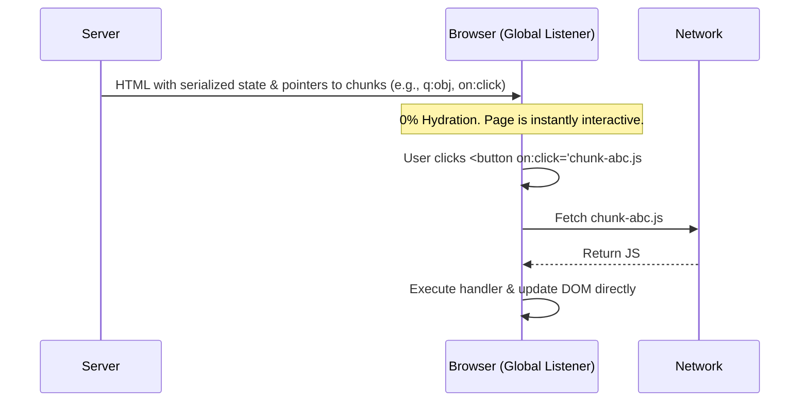

# Resumability (Возобновляемость)

## Что это и какую боль решаем?
Возобновляемость — это радикально новый подход к доставке JS, при котором приложение не "гидрируется", а "снимается с паузы" в браузере ровно в том состоянии, в котором оно было остановлено на сервере.
**Боль:** Гидратация — это чистый оверхед (Hydration is pure overhead). Чтобы сделать кнопку интерактивной в React/Vue, фреймворк должен скачать шаблон, скачать данные, выполнить функцию компонента на клиенте, построить VDOM и сравнить его с реальным DOM. При Resumability этот этап полностью отсутствует.

## Как это работает?
Сервер рендерит HTML, но вместе с ним сериализует все замыкания, состояния и обработчики событий прямо в HTML (через специальные атрибуты). Клиент загружает крошечный скрипт (около 1kb), который слушает глобальные события (клик, скролл). Когда происходит событие, этот скрипт парсит атрибут элемента, динамически загружает *только тот чанк JS*, который нужен для этого обработчика, и выполняет его. Главный представитель: **Qwik**.

## Архитектура


## Примеры кода

### Qwik (Флагманская реализация Resumability)

```tsx
import { component$, useSignal } from '@builder.io/qwik';

// Знак $ означает границу ленивой загрузки. 
// Фреймворк разобьет этот код на отдельные файлы при сборке.
export const Counter = component$(() => {
  const count = useSignal(0);

  return (
    <button 
      // Обработчик onClick$ будет вырезан в отдельный файл.
      // Он не загрузится, пока пользователь не кликнет на кнопку.
      onClick$={() => count.value++}
    >
      Clicks: {count.value}
    </button>
  );
});
```

### Vue 3 и отклики индустрии (Vapor Mode & Signals)

Классический Vue 3 и React зависят от гидратации виртуального DOM. Однако экосистема Vue двигается в сторону оптимизации гидратации через **Vue Vapor Mode**:
- **Vapor Mode** — не использует Virtual DOM, а компилирует Vue-компоненты в чистые манипуляции с реальным DOM (аналогично Svelte/Solid).
- В сочетании с Fine-Grained Reactivity (Сигналами `ref`/`computed`) это снижает оверхед гидратации почти до нуля, хотя и не отказывается от нее полностью, как Qwik.

## Неочевидные нюансы и трейдоффы
- **Водопад сетевых запросов:** Тонкая нарезка на чанки означает, что один клик может вызвать загрузку нескольких мелких файлов. Без HTTP/2 (или HTTP/3) и агрессивного prefetching (Service Workers) это убьет UX на медленном интернете (задержка перед реакцией на клик).
- **Специфичный синтаксис и ментальная модель:** Разработчик должен явно расставлять знаки `$` и понимать, какие переменные можно захватывать в замыканиях (все захваченные переменные должны быть сериализуемыми, иначе ошибка на этапе сборки).
- **Сложность экосистемы:** Библиотеки, написанные для React/Vue, не работают напрямую, так как требуют гидратации. Нужны специальные обертки или переписывание.
