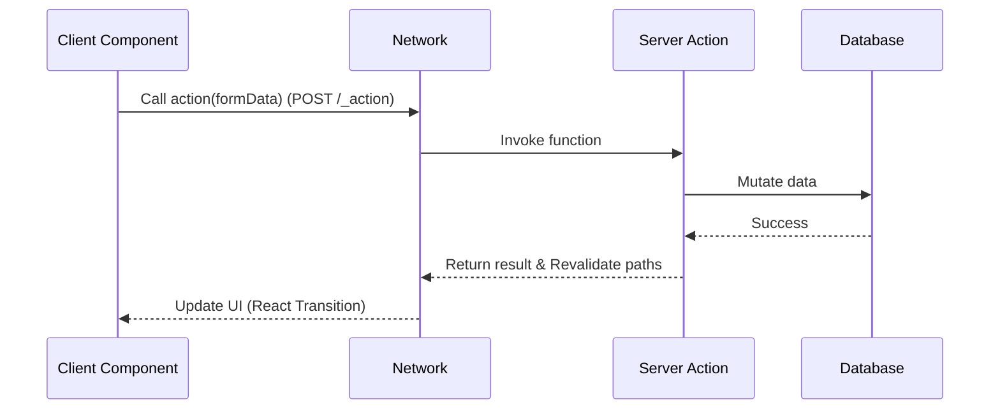

# Server Actions

## Что это и какую боль решаем?
Server Actions — это функции, которые выполняются исключительно на сервере, но могут быть вызваны напрямую из клиентских компонентов. 
**Боль:** В классических SPA для мутации данных (отправка формы, лайк) нужно создавать отдельный API-эндпоинт, писать логику отправки fetch-запроса, обрабатывать состояния загрузки и ошибки. Server Actions убирают слой API, позволяя вызывать серверный код как обычные функции.

## Как это работает?
Под капотом фреймворк (например, Next.js) создает скрытый RPC-эндпоинт. Когда клиент вызывает действие, отправляется POST-запрос с аргументами. Результат возвращается обратно, и UI может быть автоматически обновлен (через инвалидацию кэша).

## Архитектура


## Примеры кода

### Next.js / React ('use server')

```tsx
// app/actions.ts
'use server'
import { db } from './db';

export async function createPost(formData: FormData) {
  const title = formData.get('title');
  // Проверка авторизации ОБЯЗАТЕЛЬНА!
  await db.posts.insert({ title: title as string });
}

// app/page.tsx
import { createPost } from './actions';

export default function Page() {
  return (
    <form action={createPost}>
      <input name="title" type="text" />
      <button type="submit">Создать</button>
    </form>
  );
}
```

### Nuxt 3 / Vue 3 (Nitro Server Routes & `$fetch`)

В Nuxt 3 вызовы серверных мутаций реализуются через строгие и прозрачные серверные эндпоинты (`server/api/*.ts` или `server/routes/*.ts`) с автозаполнением типов через `$fetch`:

```typescript
// server/api/posts.post.ts
export default defineEventHandler(async (event) => {
  const body = await readBody(event)
  
  // Проверка авторизации внутри серверного хэндлера:
  const session = await getUserSession(event)
  if (!session) throw createError({ statusCode: 401, message: 'Unauthorized' })

  const post = await db.posts.insert({ title: body.title })
  return { success: true, post }
})
```

Вызов из Vue-компонента (`pages/create.vue`):
```vue
<script setup lang="ts">
const title = ref('')

const handleSubmit = async () => {
  // $fetch типизирован и обращается напрямую к обработчику server/api/posts.post.ts
  await $fetch('/api/posts', {
    method: 'POST',
    body: { title: title.value }
  })
  // Очистка или ревалидация стейта страницы
  refreshNuxtData()
}
</script>

<template>
  <form @submit.prevent="handleSubmit">
    <input v-model="title" type="text" />
    <button type="submit">Создать</button>
  </form>
</template>
```

## Неочевидные нюансы и трейдоффы
- **Безопасность (ОЧЕНЬ ВАЖНО):** Server Actions имеют публичные URL. Их может вызвать кто угодно с помощью `curl`. Вы *обязаны* проверять авторизацию и валидировать входные данные внутри каждой action.
- **Границы сериализации:** Аргументы, передаваемые из клиента в action, должны быть сериализуемыми (React использует кастомный формат, поддерживающий FormData, Date, Map, но не функции).
- **Очередь выполнения:** В некоторых реализациях вызовы Server Actions могут блокировать друг друга (выполняться последовательно), что может ударить по UX при частых мутациях.
