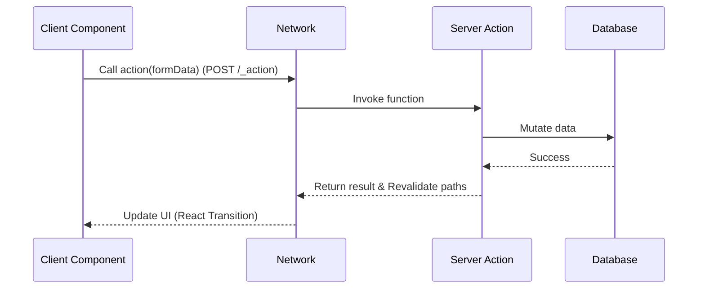

# Server Actions

## Что это и какую боль решаем?
Server Actions — это функции, которые выполняются исключительно на сервере, но могут быть вызваны напрямую из клиентских компонентов. 
**Боль:** В классических SPA для мутации данных (отправка формы, лайк) нужно создавать отдельный API-эндпоинт, писать логику отправки fetch-запроса, обрабатывать состояния загрузки и ошибки. Server Actions убирают слой API, позволяя вызывать серверный код как обычные функции.

## Как это работает?
Под капотом фреймворк (например, Next.js) создает скрытый RPC-эндпоинт. Когда клиент вызывает действие, отправляется POST-запрос с аргументами. Результат возвращается обратно, и UI может быть автоматически обновлен (через инвалидацию кэша).

## Архитектура


## Примеры кода
**Паттерн: Использование в форме (без JS на клиенте работает!)**
```tsx
// app/actions.ts
'use server'
import { db } from './db';

export async function createPost(formData: FormData) {
  const title = formData.get('title');
  // Проверка авторизации ОБЯЗАТЕЛЬНА!
  await db.posts.insert({ title });
}

// app/page.tsx
import { createPost } from './actions';

export default function Page() {
  return (
    <form action={createPost}>
      <input name="title" type="text" />
      <button type="submit">Создать</button>
    </form>
  );
}
```

## Неочевидные нюансы и трейдоффы
- **Безопасность (ОЧЕНЬ ВАЖНО):** Server Actions имеют публичные URL. Их может вызвать кто угодно с помощью `curl`. Вы *обязаны* проверять авторизацию и валидировать входные данные внутри каждой action.
- **Границы сериализации:** Аргументы, передаваемые из клиента в action, должны быть сериализуемыми (React использует кастомный формат, поддерживающий FormData, Date, Map, но не функции).
- **Очередь выполнения:** В некоторых реализациях вызовы Server Actions могут блокировать друг друга (выполняться последовательно), что может ударить по UX при частых мутациях.
