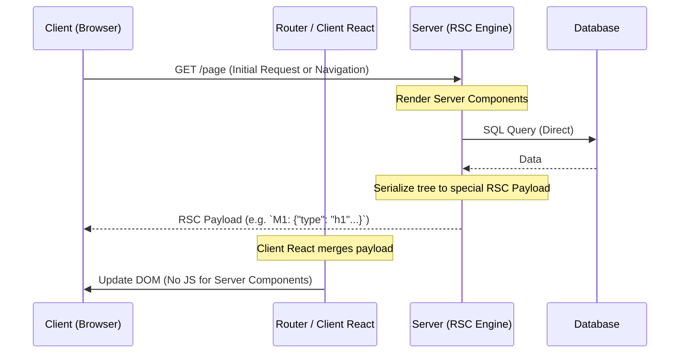

# React Server Components (RSC)

## Инженерная история
**Что это:** Новая архитектурная парадигма React, где компоненты рендерятся *исключительно* на сервере и никогда не отправляются клиенту в виде JavaScript. Клиент получает уже готовый сериализованный UI-дерево.
**Какую боль решаем:** Постоянный рост JS-бандла. В классическом SSR/SPA клиент должен скачать JS-код каждого компонента, даже если он статический (например, тяжелая библиотека парсинга Markdown). RSC позволяет оставить тяжелые зависимости (и прямой доступ к БД) только на сервере, доставляя на клиент 0 байт JS.
**Где применимо:** Приложения с большим объемом статики, сложные контентные сайты, где нужен безопасный прямой доступ к backend-ресурсам без создания промежуточного API (BFF).
**Где ломается:** Интерактивные компоненты с состоянием (useState) или браузерными API (useEffect) не могут быть серверными. Плохо продуманные границы (Client/Server boundaries) приводят к дублированию кода или сетевым "водопадам" (waterfalls).

## Архитектура работы



## Пример кода

### Next.js / React (React Server Components)

```jsx
// 1. Server Component (По умолчанию)
// Выполняется ТОЛЬКО на сервере. Код marked не попадет в бандл клиента!
import { marked } from 'marked'; 
import InteractiveButton from './InteractiveButton';

export default async function BlogPost({ id }) {
  // Прямой доступ к БД внутри компонента!
  const post = await db.query(`SELECT * FROM posts WHERE id = ${id}`);
  const htmlContent = marked.parse(post.content);

  return (
    <article>
      <h1>{post.title}</h1>
      <div dangerouslySetInnerHTML={{ __html: htmlContent }} />
      {/* Передача пропсов в клиентский компонент */}
      <InteractiveButton postId={post.id} />
    </article>
  );
}

// 2. Client Component (Должен быть явно помечен)
'use client'; 
import { useState } from 'react';

export default function InteractiveButton({ postId }) {
  const [likes, setLikes] = useState(0);
  // Этот код пойдет в клиентский JS бандл
  return <button onClick={() => setLikes(l => l + 1)}>Like {likes}</button>;
}
```

### Nuxt 3 / Vue 3 (Nuxt Server Components `.server.vue`)

Nuxt 3 поддерживает протокол Server Components с помощью файла с суффиксом `.server.vue`. Тяжелые библиотеки и логика взаимодействия с БД остаются на сервере:

```vue
<!-- components/BlogPost.server.vue -->
<script setup lang="ts">
import { marked } from 'marked' // Код marked НЕ ПОПАДЕТ в клиентский бандл!

const props = defineProps<{ id: string }>()

// Прямой доступ к серверу/БД во время рендеринга компонента на сервере
const post = await $fetch(`/api/posts/${props.id}`)
const htmlContent = marked.parse(post.content)
</script>

<template>
  <article>
    <h1>{{ post.title }}</h1>
    <div v-html="htmlContent" />
    <!-- Интерактивный клиентский компонент передается внутрь -->
    <InteractiveButton :post-id="post.id" />
  </article>
</template>
```

Клиентский компонент (`components/InteractiveButton.client.vue` или обычный):
```vue
<script setup lang="ts">
const props = defineProps<{ postId: string }>()
const likes = ref(0)
</script>

<template>
  <button @click="likes++">Like {{ likes }}</button>
</template>
```

## Неочевидные нюансы

1. **Network Waterfalls:** Если внутри Server Component вызывается другой Server Component, и оба делают асинхронные запросы (fetch/db), они будут выполняться последовательно (пока не отрендерится родитель, ребенок не вызовется). Это требует использования `Promise.all` на верхнем уровне.
2. **Сериализация пропсов:** Вы **не можете** передать функции (`onClick`), классы или несериализуемые объекты из Server Component в Client Component. Пропсы, пересекающие границу, должны быть сериализуемы (строки, числа, простые объекты).
3. **Ошибки композиции:** Server Component **не может** быть дочерним элементом Client Component напрямую, если он импортирован внутри него. Он может быть передан только как `children` (через пропсы), чтобы React знал, где проходит граница.
4. **Увеличение размера ответа:** RSC Payload — это не просто HTML, это специальный JSON-подобный формат. Для тяжелых DOM-деревьев размер этого пейлоада может оказаться больше, чем вес сэкономленного JS-бандла, увеличивая затраты на сеть.
