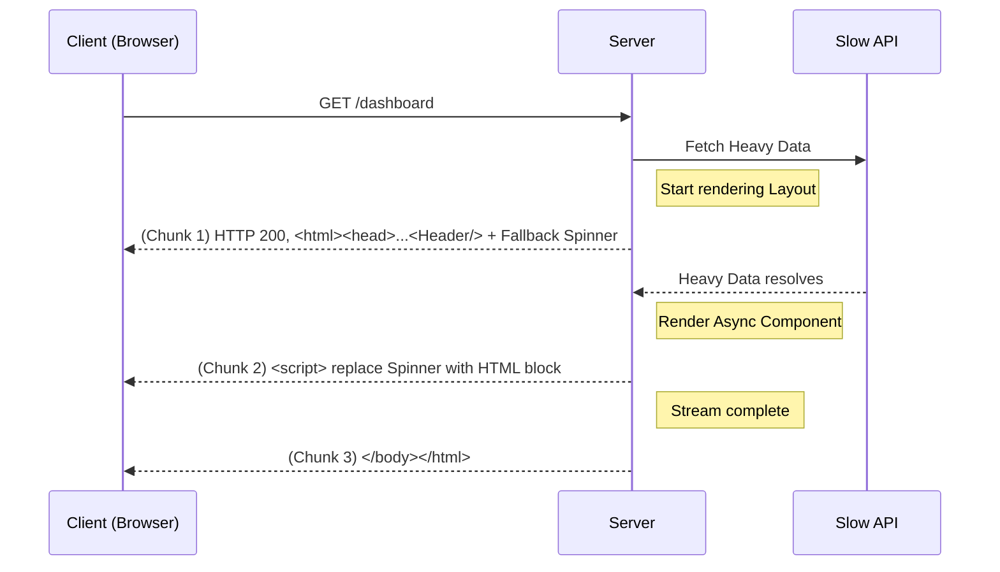

# Streaming SSR

## Инженерная история
**Что это:** Оптимизация классического Server-Side Rendering (SSR). Вместо того чтобы ждать окончания загрузки всех данных и рендеринга всей страницы на сервере, сервер отправляет HTML чанками (кусочками) по мере их готовности через HTTP-соединение с `Transfer-Encoding: chunked`.
**Какую боль решаем:** В классическом SSR метрика TTFB (Time To First Byte) очень плохая, если какой-то API запрос тормозит. Пользователь видит белый экран, пока сервер не скачает *все* данные. Streaming решает это, моментально отдавая "скелет" страницы (header, footer), а тяжелые компоненты досылая позже.
**Где применимо:** Дашборды, сложные страницы с независимыми блоками данных, микрофронтенды, приложения с персонализированным, но медленным API.
**Где ломается:** SEO-боты без поддержки JS (или старые боты), которые могут не дождаться окончания стрима или не умеют парсить подгружаемые чанки. 

## Архитектура работы



## Пример кода

### React 18 / Next.js

```javascript
// Паттерн: Использование Suspense для границ стриминга
import { Suspense } from 'react';

// Сервер начнет отдавать HTML немедленно.
// На месте HeavyDataComponent в начальный HTML будет вставлен <Spinner />.
// Как только данные загрузятся, сервер дошлет <script>, который вставит результат.
export default function Dashboard() {
  return (
    <html>
      <body>
        <LayoutHeader />
        
        <main>
          <h1>Dashboard</h1>
          
          <Suspense fallback={<Spinner />}>
            <HeavyDataComponent />
          </Suspense>
        </main>
        
        <LayoutFooter />
      </body>
    </html>
  );
}

// На сервере используется renderToPipeableStream:
// import { renderToPipeableStream } from 'react-dom/server';
// const { pipe } = renderToPipeableStream(<Dashboard />, { ... });
// pipe(res);
```

### Vue 3 / Nuxt 3

**Низкоуровневый Vue 3 Stream (`@vue/server-renderer`):**
```typescript
import { createSSRApp } from 'vue'
import { pipeToNodeWritable } from '@vue/server-renderer'

// Потоковый рендеринг Vue 3 приложения прямо в HTTP-ответ Node.js res
const app = createSSRApp(App)
pipeToNodeWritable(app, {}, res)
```

**Nuxt 3 (Suspense + HTML Streaming):**
В компонентах Nuxt 3 асинхронные блоки оборачиваются в `<Suspense>`. Сервер отправляет первый HTML-чанк со скелетоном, не блокируя время первого байта (TTFB):

```vue
<!-- pages/dashboard.vue -->
<template>
  <div>
    <Header />

    <!-- В начальный HTML сервер вставит #fallback -->
    <!-- Как только асинхронный компонент разрулится, потоком дойдет готовый разметка -->
    <Suspense>
      <template #default>
        <AsyncHeavyAnalytics />
      </template>
      <template #fallback>
        <div class="skeleton-loader">Загрузка аналитики...</div>
      </template>
    </Suspense>
  </div>
</template>
```

## Неочевидные нюансы

1. **Статус-коды HTTP:** HTTP-заголовок отправляется с *первым* чанком. Это значит, что вы ответите `200 OK` до того, как `HeavyDataComponent` попытается загрузить данные. Если `HeavyDataComponent` упадет с ошибкой (например, база недоступна), вы **уже не сможете** изменить статус на `500` или сделать редирект на сервере. Ошибку придется обрабатывать на клиенте.
2. **Архитектура сети:** Некоторые прокси (устаревшие Nginx-конфигурации или корпоративные фаерволы) могут буферизировать HTTP-ответы, ломая всю концепцию стриминга — клиент получит все данные целиком в конце, с огромной задержкой.
3. **Порядок подключения:** Стриминг HTML подразумевает, что скрипты для инъекции чанков должны выполниться. Если пользователь отключает JS, он навсегда останется смотреть на Spinner.
4. **Hydration Mismatch:** Если серверный стрим и клиентский код не синхронизированы, React может не справиться с гидратацией потокового контента.
