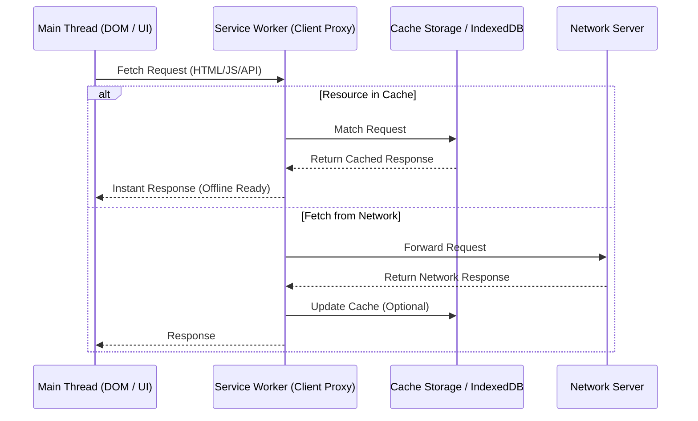
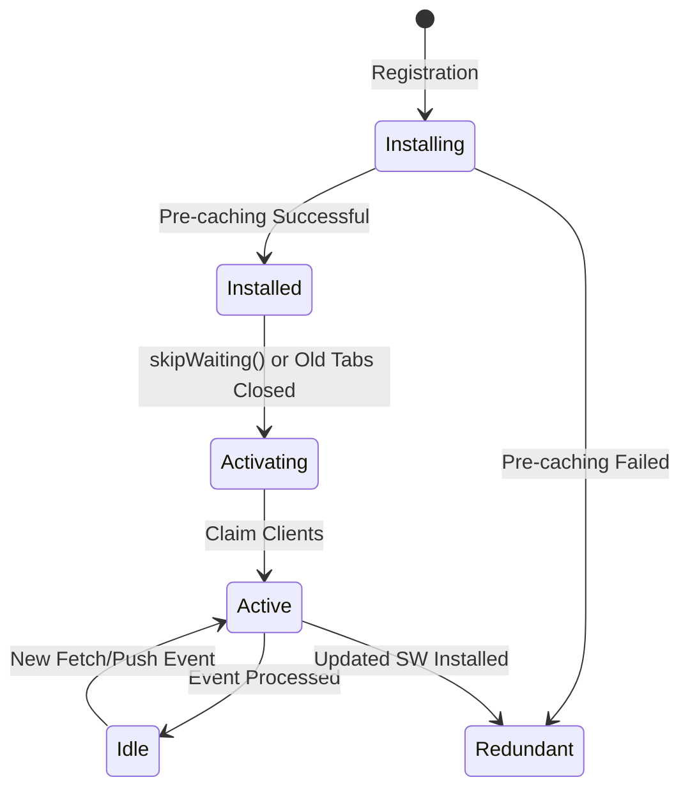
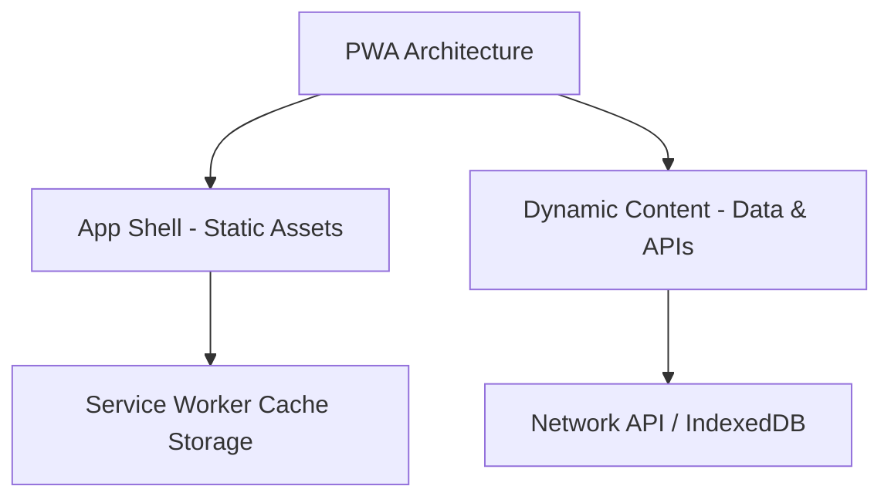

# Service Workers в архитектуре клиентских приложений

> [!info] Ссылка и контекст
> Смотрите также:
> - [[Service Workers (Конкурентность и фоновые задачи)]] — подробная спецификация API, методы и события JS.
> - [[Service Worker: кэширование и offline]] — механизмы работы со сториджами и кэшированием.
> 
> В этой заметке Service Worker рассматривается как **архитектурный слой клиентского приложения**: прокси-мидлвар между клиентом и сетью, фундамент оффлайн-архитектуры (Offline-First), стратегии работы с памятью и управление фоновыми процессами.

---

## 1. Архитектурная роль: Client-Side Proxy / Middleware

В классической клиент-серверной архитектуре веб-приложение делает запросы напрямую в сеть. Если сеть недоступна, приложение ломается.

**Service Worker (SW)** вводит новый архитектурный слой — **программируемый сетевой прокси прямо на стороне клиента**:

### Ключевые архитектурные свойства:
1. **Изолированный рабочий поток**: Выполняется в отдельном потоке (Worker Context). У него нет прямого доступа к DOM, объектам `window` или `document`.
2. **Перехватчик сетевых вызовов**: Прослушивает событие `fetch` и контролирует 100% входящего и исходящего HTTP-трафика своего домена/области видимости (`scope`).
3. **Event-driven специфика**: SW не висит постоянно в памяти. Браузер поднимает его процесс при поступлении события (`fetch`, `push`, `sync`) и гасит его при простое, что сохраняет ресурсы смартфона/ПК.

---

## 2. Жизненный цикл Service Worker и управление версиями

Жизненный цикл Service Worker гарантирует, что новая версия приложения не нарушит работу текущей открытой вкладки пользователя.

### Фазы жизненного цикла:

1. **Регистрация (Registration)**:
   Приложение вызывает `navigator.serviceWorker.register('/sw.js')`. Браузер скачивает и анализирует файл SW.

2. **Установка (Installation / `install` event)**:
   - Идеальный момент для **предкэширования ядра приложения (App Shell Pre-caching)**: закружаются ключевые HTML, CSS, JS и иконки.
   - Если хоть один ресурс из вызова `cache.addAll()` не загрузился, фаза установки помечается как ошибка, и SW переходит в состояние `redundant` (неактивен).

3. **Ожидание / Активация (Activation / `activate` event)**:
   - Если на домене уже работает предыдущая версия SW, новый SW встает в состояние ожидания (`waiting`).
   - При вызове `skipWaiting()` или закрытии всех старых вкладок новый SW активируется.
   - В событии `activate` производится **очистка устаревших кешей** (Cache Invalidation & Cleanup).
   - Вызов `clients.claim()` позволяет новому SW сразу взять под контроль все открытые вкладки без необходимости их перезагрузки.

---

## 3. Архитектура App Shell и Стратегии Кэширования

### Модель App Shell (Каркас приложения)
Архитектурный паттерн **App Shell** разделяет приложение на две части:
- **Shell (Оболочка)**: Статический минимальный UI (шапка, меню, каркас, стили, бандлы). Кэшируется намертво при установке SW и загружается за миллисекунды.
- **Dynamic Content (Данные)**: Запрашиваются асинхронно через API (GraphQL/REST) или из оффлайн-базы данных (IndexedDB).

---

### Архитектурные Стратегии Кэширования

| Стратегия | Механика | Область применения |
| :--- | :--- | :--- |
| **Cache First** *(Cache, fallback to Network)* | Сначала ищется в кэше. Если нет — иди в сеть и сохраняй в кэш. | Статические хэшированные бандлы (`app.a8f9c.js`), шрифты, картинки. |
| **Network First** *(Network, fallback to Cache)* | Сначала запрос в сеть. При сбое сети или таймауте — выдавай кэшированную копию. | Динамические данные, профиль пользователя, свежие ленты новостей. |
| **Stale-While-Revalidate** | Мгновенно отдавай stale-копию из кэша, параллельно делай фоновый запрос в сеть и обновляй кэш к следующему визиту. | Аватары, списки категорий, контент, не требующий строгой синхронности. |
| **Cache Only** | Отдача строго из кэша. | Оффлайн-версии документации, статические конфигураторы. |
| **Network Only** | Отдача только из сети без кэширования. | Транзакции оплаты, аналитика, сокеты, одноразовые токены. |

---

## 4. Коммуникация между Service Worker и UI-потоком

Так как Service Worker не имеет доступа к DOM, обход информации и управление состоянием происходит через протоколы обмена сообщениями:

1. **`postMessage` API**:
   - Главная страница отправляет команду в SW: `navigator.serviceWorker.controller.postMessage({ type: 'CLEAN_CACHE' })`.
   - SW отвечает клиенту через `event.source.postMessage(...)`.

2. **Broadcast Channel API**:
   - Создается общий канал `const channel = new BroadcastChannel('app_events')`.
   - Позволяет SW рассылать сообщения **всем открытым вкладкам одновременно** (например: *"Вышло обновление PWA, перезагрузите страницу"* или *"Потеряно интернет-соединение"*).

---

## 5. Экосистема Фоновых API (Background Capabilities)

Service Worker является фундаментом для фоновых возможностей веб-платформы:

- **Background Sync API**:
  Позволяет отложить сетевые действия (например, отправка формы или сообщения в чат) до момента появления сети. Пользователь нажимает "Отправить" без интернета $\to$ данные сохраняются в IndexedDB $\to$ SW регистрирует sync $\to$ как только появится сеть, SW проснется и отправит запрос на сервер.
- **Web Push & Notifications API**:
  SW принимает Push-уведомления от сервера даже при полностью закрытом браузере и отображает системное уведомление ОС.
- **Background Fetch API**:
  Управляет фоновой скачкой крупных файлов (видео, аудиокниги, игры) с отображением системного прогресс-бара.

---

## 6. Ограничения и Подводные Камни Архитектуры

1. **Безопасность (HTTPS Only)**: SW работает только по HTTPS (исключение — `localhost` для разработки).
2. **Ограничения области видимости (Scope)**: SW с путем `/app/sw.js` по умолчанию может перехватывать запросы только внутри `/app/*`. Для охвата всего сайта файл SW должен лежать в корне домена (`/sw.js`).
3. **Ловушка Кэширования SW файла (Stale SW Trap)**:
   Если сам файл `sw.js` закэшируется браузером через HTTP-заголовки `Cache-Control: max-age=31536000`, вы не сможете обновить приложение! **Всегда отдавайте файл Service Worker с заголовком `Cache-Control: no-cache`**.

---

## 7. Связанные заметки

- [[Web App Manifest]] — конфигурация манифеста PWA и критерии установки.
- [[Service Workers (Конкурентность и фоновые задачи)]] — полная техническая спецификация методов и интерфейсов.
- [[Service Worker: кэширование и offline]] — практическое применение Cache Storage API.
- [[Cache Storage API]] — интерфейс хранения ответов `Response`.
- [[Stale While Revalidate]] — подробный разбор популярной стратегии кэширования.
- [[Cache First]] — стратегия приоритета кэша.
- [[Network First]] — стратегия приоритета сети.
- [[PWA Architecture]] — общая архитектура Progressive Web Applications.
- [[Offline First (Архитектура)]] — проектирование веб-систем с приоритетом оффлайн-работы.

