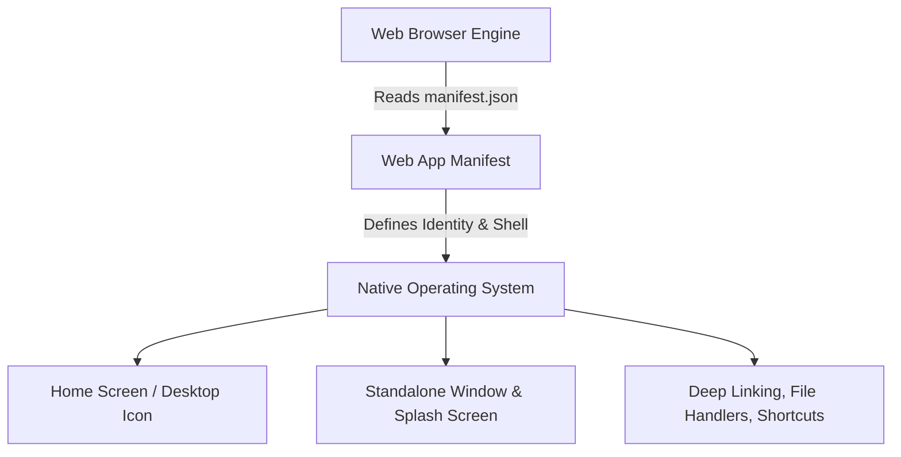

# Web App Manifest (Архитектура PWA)

> [!info] Контекст
> Web App Manifest (`manifest.json` или `.webmanifest`) — ключевой компонент архитектуры Progressive Web Applications (PWA). Это JSON-конфигурационный файл, предоставляющий метаданные для интеграции веб-приложения с операционной системой пользователя (Android, iOS, Windows, macOS, ChromeOS).

---

## 1. Архитектурная роль манифеста

В архитектуре PWA Web App Manifest выступает связующим звеном между веб-технологиями и нативным окружением ОС:



1. **Трансформация вкладки в приложение**: Превращает сайт из содержимого браузерной вкладки в автономное window-приложение без элементов интерфейса браузера (адресная строка, вкладки).
2. **Обеспечение Installability**: Содержит обязательный набор критериев для запуска системного диалога установки (Install Prompt).
3. **Глубокая интеграция с ОС**: Позволяет веб-приложению быть зарегистрированным в качестве обработчика файлов, протоколов, быстрых действий (Shortcuts) и получателя контентачерез системную кнопку "Поделиться" (Share Target).

---

## 2. Способы подключения и MIME-тип

Манифест объявляется в `<head>` секции HTML-документа:

```html
<link rel="manifest" href="/manifest.webmanifest">
```

- **Стандартное расширение**: `.webmanifest` (также допускается `.json`).
- **MIME-тип заголовка Content-Type**: `application/manifest+json`.
- **Атрибут `crossorigin="use-credentials"`**: Добавляется, если файл манифеста размещен на другом домене и требует передачи куки или токенов аутентификации.

---

## 3. Полный разбор полей спецификации W3C Manifest

### 3.1. Идентификация и именование

```json
{
  "name": "TaskFlow Pro",
  "short_name": "TaskFlow",
  "id": "/?app_id=taskflow_v1",
  "description": "Профессиональный менеджер задач и оффлайн-заметок."
}
```

- **`name`**: Полное наименование приложения (отображается в диалоге установки, менеджере приложений ОС и сплэш-скрине).
- **`short_name`**: Сокращенное имя для подписи под иконкой на рабочем столе смартфона (обычно не более 12 символов).
- **`id`**: Уникальный архитектурный идентификатор PWA в системе. Если поле опущено, браузер использует в качестве ID значение `start_url`. Задание четкого `id` позволяет изменять `start_url` в будущем без потери привязки данных приложения в ОС.
- **`description`**: Краткое резюме возможностей приложения.

---

### 3.2. Навигация и Границы Приложения (Scope)

```json
{
  "start_url": "/dashboard?utm_source=pwa",
  "scope": "/app/"
}
```

- **`start_url`**: Начальный URL-адрес, загружаемый при запуске приложения с иконки. Часто содержит аналитические параметры (например, `?utm_source=pwa`), позволяющие отделять пользователей PWA от пользователей веб-сайта.
- **`scope`**: Навигационный периметр (область видимости PWA). 
  - Любой переход по ссылкам внутри `scope` происходит внутри standalone-окна PWA.
  - Переход по ссылкам за пределы `scope` автоматически открывается в обычном окне внешнего браузера.

---

### 3.3. Отображение и Системная Оболочка (Display & Shell)

```json
{
  "display": "standalone",
  "display_override": ["window-controls-overlay", "standalone"],
  "orientation": "portrait",
  "theme_color": "#0f172a",
  "background_color": "#ffffff"
}
```

#### Режимы `display`:
1. **`standalone`** *(Рекомендуемый)*: Смотрится как нативное приложение. Адресная строка и кнопки браузера скрыты, но системная строка состояния (Status Bar) сохраняется.
2. **`fullscreen`**: Занимает 100% экрана, полностью скрывая элементы ОС (подходит для мобильных игр и медиаплееров).
3. **`minimal-ui`**: Показывает минимальную верхнюю панель с кнопками "Назад", "Перезагрузить" и теущим доменным именем.
4. **`browser`**: Стандартный вид обычной вкладки браузера.

- **`display_override`**: Позволяет задать цепочку приоритетов режимов отображения. Например, `"window-controls-overlay"` скрывает стандартный заголовок окна на ПК и дает приложению возможность отрисовывать свой UI прямо в области заголовка окна.
- **`theme_color`**: Задает цвет строки состояния (Status Bar) операционной системы и верхней панели окна.
- **`background_color`**: Цвет фона заставки (Splash Screen), показываемой во время первой инициализации PWA и загрузки скриптов.

---

### 3.4. Иконки и Медиа-ресурсы (Assets)

```json
{
  "icons": [
    {
      "src": "/icons/icon-192x192.png",
      "sizes": "192x192",
      "type": "image/png",
      "purpose": "any"
    },
    {
      "src": "/icons/icon-512x512.png",
      "sizes": "512x512",
      "type": "image/png",
      "purpose": "maskable"
    }
  ],
  "screenshots": [
    {
      "src": "/screenshots/desktop.png",
      "sizes": "1920x1080",
      "type": "image/png",
      "form_factor": "wide",
      "label": "Главная панель управления"
    }
  ]
}
```

- **`icons`**: Набор иконок разных размеров (`192x192` обязателен для Android, `512x512` — для сочных сплэш-скринов и маркетплейсов).
  - **`purpose: "maskable"`**: Важнейшее свойство для Android PWA. Обеспечивает адаптацию иконки под любую системную форму (круг, скругленный квадрат, капля) без появления некрасивых белых полей по краям.
- **`screenshots`**: Скриншоты интерфейса. Позволяют браузерам (Chrome, Edge) отображать нативное окно установки с галереей скриншотов (Rich Install Dialog).

---

### 3.5. Расширенная интеграция с операционной системой

```json
{
  "shortcuts": [
    {
      "name": "Новая задача",
      "short_name": "Создать",
      "url": "/app/new-task",
      "icons": [{ "src": "/icons/new-task.png", "sizes": "192x192" }]
    }
  ],
  "share_target": {
    "action": "/app/share",
    "method": "POST",
    "enctype": "multipart/form-data",
    "params": {
      "title": "title",
      "text": "text",
      "url": "url",
      "files": [{ "name": "media", "accept": ["image/*", "application/pdf"] }]
    }
  },
  "file_handlers": [
    {
      "action": "/app/open-file",
      "accept": {
        "text/plain": [".txt", ".md"]
      }
    }
  ]
}
```

- **`shortcuts`**: Контекстное меню быстрого доступа, вызываемое при долгой удерживании иконки приложения на Android/iOS или клике правой кнопкой мыши в Windows.
- **`share_target`**: Регистрирует PWA в диалоге "Поделиться" операционной системы. Позволяет принимать тексты, ссылки и файлы из других нативных приложений.
- **`file_handlers`**: Регистрирует PWA как обработчик определенный расширений файлов в файловой системе ПК или смартфона.

---

## 4. Критерии Устанавливаемости (PWA Installability Criteria)

Чтобы браузер выставил событие `beforeinstallprompt` и предложил пользователю установить PWA, приложение должно удовлетворять следующим требованиям:

1. **Протокол HTTPS**: Сайт доступен по защищенному соединению (за исключением `localhost`).
2. **Валидный Manifest**:
   - Наличие полей `name` или `short_name`.
   - Наличие полей `start_url` и `display` (`standalone`, `fullscreen` или `minimal-ui`).
   - Наличие иконок размером минимум `192x192` и `512x512` пикселей.
3. **Зарегистрированный Service Worker**:
   - Наличие работающего Service Worker с зарегистрированным событием `fetch` для поддержки оффлайн-режима или кэширования статики.

---

## 5. Связанные заметки

- [[PWA]] — общий обзор философии Progressive Web Apps.
- [[Service Workers]] — архитектура проксирования, оффлайн-кэширования и фоновых задач.
- [[Offline First (Архитектура)]] — проектирование клиентских приложений, работающих без подключения к сети.

