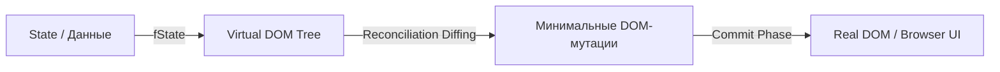
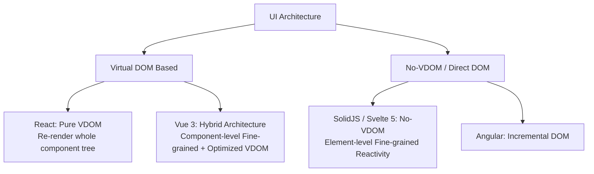

# Virtual DOM в UI-архитектуре

> [!info] Ссылка и контекст
> Базовая заметка о механике рендеринга: [[Virtual DOM]] (раздел 02. Рендеринг браузера).
> В данной заметке Virtual DOM рассматривается в контексте **архитектуры клиентских приложений**: назначение абстракции, декларативная модель $UI = f(State)$, процессы Reconciliation и Patching, производительность, компромиссы и альтернативные подходы (Fine-grained reactivity, Incremental DOM, Compiler-driven UI).

---

## 1. Концепция $UI = f(State)$ и роль Virtual DOM

В классическом веб-разработке манипуляции с интерфейсом выполнялись императивно: разработчик напрямую вызывал DOM API (`document.createElement`, `element.appendChild`, `element.setAttribute`, `element.textContent = ...`). Со ростом сложности приложений такой подход приводит к спагетти-коду, рассинхронизации состояния с отображением и трудновоспроизводимым багам.

Современная UI-архитектура опирается на **декларативную парадигму**:

$$UI = f(State)$$

Пользовательский интерфейс описывается как чистая функция от текущего состояния приложения. Каждое изменение состояния требует получения нового представления UI. 

Прямая пересоздание реального DOM-дерева при каждом изменении состояния катастрофически медленна из-за тяжести DOM-элементов и вызовов Layout/Reflow браузера. **Virtual DOM (VDOM)** выступает в качестве промежуточного архитектурного слоя (абстракции в оперативной памяти), который делает концепцию $UI = f(State)$ производительной и жизнеспособной.



---

## 2. Архитектурный цикл: Render $\to$ Reconcile $\to$ Commit

Процесс обновления UI с использованием Virtual DOM делится на три ключевых фазы:

### 1. Фаза рендеринга (Render Phase)
При изменении состояния компонента выполняется его функция рендеринга (или JSX/шаблон транслируется в JS). В результате создается новое виртуальное дерево элементов — узел **VNode (Virtual Node)**. 
- Эта фаза является **чистой (pure)** и не имеет побочных эффектов.
- VNode представляется простым JavaScript-объектом.

### 2. Фаза сопоставления (Reconciliation / Diffing Phase)
Алгоритм согласования (Reconciler) сравнивает текущее виртуальное дерево со следующим (полученным на шаге рендеринга).
- Сравнение двух произвольных деревьев в общем виде имеет сложность $O(n^3)$.
- Фреймворки (React, Vue) используют **эвристический алгоритм с производительностью $O(n)$**, основанный на двух предположениях:
  1. Два элемента разного типа (например, `<div>` и `<span>`) создадут разные деревья, поэтому старое дерево полностью уничтожается и монтируется новое.
  2. Разработчик помогает алгоритму с помощью уникальных ключей (`key`), чтобы отслеживать перемещение элементов в списках без их пересоздания.

### 3. Фаза применения (Commit / Patch Phase)
Найденные различия (diff) превращаются в минимальный список инструкций для реального DOM-дерева (`appendChild`, `removeChild`, `replaceChild`, `setAttribute`).
- Все изменения группируются и применяются пакетно (batching), сводя к минимуму количество вызовов Layout и Repaint браузера.

---

## 3. Легковесность VNode vs Реальный DOM Element

Архитектурная эффективность Virtual DOM базируется на фундаментальной разнице в ресурсоемкости между объектом JavaScript и объектом браузерного DOM.

| Параметр | VNode (Virtual Node) | Real DOM Element |
| :--- | :--- | :--- |
| **Природа** | Простой JS-объект в памяти | C++ объект браузерного движка с JS-оберткой |
| **Количество свойств** | ~5–15 полей (`type`, `props`, `children`, `key`, `ref`) | 200+ полей и методов (прототипная цепь `HTMLElement`) |
| **Связь с браузером** | Отсутствует | Включен в систему рендеринга, Layout, CSSOM и событиный слой |
| **Стоимость создания** | Дешевая операция в JS heap | Дорогая операция с выделением памяти движка браузера |

```javascript
// Пример структуры VNode
const vNode = {
  type: 'button',
  props: {
    className: 'btn btn-primary',
    onClick: handleClick
  },
  children: ['Нажать'],
  key: null
};
```

---

## 4. Архитектурные преимущества и компромиссы (Trade-offs)

### Преимущества (Pros)

1. **Декларативность и изолированность**: Разработчик описывает целевой вид UI для любого состояния, не заботясь о ручном добавлении/удалении узлов.
2. **Кроссплатформенность и разделение ответственности**:
   - VDOM разделяет **описание UI** и **конкретный целевой рендерер**.
   - Один и тот же алгоритм реконсиляции (например, React Reconciler) может работать с разным транспортом: `ReactDOM` (веб), `React Native` (мобильные ОС), `Three.js` (3D/WebGL), `SSR` (генерация HTML-строк на сервере).
3. **Автоматическое пакетное обновление (Batching)**: Несколько синхронных изменений состояния объединяются в один проход рендеринга и единый патч DOM.

### Недостатки и накладные расходы (Cons)

1. **Расход памяти (Memory Overhead)**:
   - Приложению необходимо постоянно удерживать в памяти минимум два полных дерева виртуальных узлов (старое и новое) для проведения diffing.
2. **Давление на сборщик мусора (Garbage Collector Pressure)**:
   - При частых перерендерах (например, анимация, скролл, ввод текста) создаются тысячи одноразовых VNode-объектов, которые затем удаляются, вызовя паузы GC (Garbage Collection pauses).
3. **Избыточные вычисления (CPU Overhead)**:
   - Даже если в компоненте изменилась одна цифра, фреймворк выполняет вызов функций рендеринга всех дочерних компонентов и их diffing, если не применены явные оптимизации (`React.memo`, `shouldComponentUpdate`, `useMemo`).

---

## 5. Альтернативные UI-архитектуры и гибридные подходы

В современных фреймворках граница между Virtual DOM и Fine-Grained реактивностью стирается. Важно различать **уровень гранулярности реактивности** (компонентный vs элементарный) и **наличие Virtual DOM**.



### 1. Гибридная архитектура Vue 3 (Component-level Fine-Grained + Optimized VDOM)

В **Vue 3** используется точечная (Fine-Grained) система реактивности на основе `Proxy` (`ref`, `reactive`, `computed`), но **рендеринг по-прежнему опирается на Virtual DOM**.

* **Уровень гранулярности (Component-Level)**: Каждый компонент имеет свой `effect`-ранер рендеринга. Vue точно знает, какие именно компоненты зависят от изменившегося `ref`. При изменении состояния **перерендеривается только конкретный компонент**, а не всё дерево дочерних компонентов (в отличие от React по умолчанию).
* **Компиляторные оптимизации VDOM (Compiler-informed VDOM)**:
  * **Patch Flags**: Компилятор помечает битовыми флагами только динамические части шаблона (например, `TEXT`, `CLASS`). Во время diffing Vue сравнивает *только* эти поля, игнорируя статические атрибуты.
  * **Block Tree**: Динамические узлы собираются в плоский массив (Block Array). Сравнение VDOM происходит за $O(k)$, где $k$ — количество динамических узлов, а не общее число элементов в дереве.
  * **Static Hoisting**: Статические VNode-узлы выносятся за пределы функции рендера и создаются ровно один раз.

### 2. Element-level Fine-Grained Reactivity без VDOM (SolidJS, Svelte 5)

В отличие от Vue 3, такие решения как **SolidJS** или **Svelte 5 (Runes)** используют **элементарную гранулярность без Virtual DOM**:

* **Отсутствие VDOM**: Функция компонента выполняется **ровно один раз** при его создании (setup phase). Компонент как функция больше никогда не перевызывается при изменении состояния.
* **Прямые подписки (Node-level Bindings)**: Сигналы связываются напрямую с инструкциями обновления DOM-узла (`effect(() => textNode.data = signal())`).
* **Результат**: При изменении сигнала обновляется только конкретная DOM-нода, минуя сопоставление виртуальных деревьев и вызов функций компонентов.

### 3. Incremental DOM (Angular / Google Closure)
* **Принцип**: Инструкции шаблона мутируют реальный DOM "на месте" по мере обхода, без создания промежуточного дерева VNode в heap. Это дает минимальный расход памяти на мобильных устройствах.

### 4. Block-based Virtual DOM / BlockDOM (Million.js)
* **Принцип**: Разделение шаблона на **статические блоки** (статический HTML) и **динамические слоты**, сводя diffing к $O(1)$.


---

## 6. Связанные заметки

- [[Virtual DOM]] — механика и реализация простейшего VDOM на JS (раздел 02. Рендеринг браузера).
- [[Компонентная архитектура]] — принципы декомпозиции и композиции компонентов.
- [[Состояние приложения]] — архитектура данных клиентского приложения.
- [[Управление состоянием]] — паттерны управления состоянием (Flux, Redux, Atomic, Signals).
- [[Hydration]] — процесс оживления статически сгенерированного HTML на клиенте.
- [[Resumability]] — альтернативный подход к мгновенному старту приложений без полного рендеринга и гидрации.

---

## Источники и материалы
- [React Docs: Reconciliation](https://react.dev/learn/preserving-and-resetting-state)
- [Rich Harris: Virtual DOM is pure overhead](https://svelte.dev/blog/virtual-dom-is-pure-overhead)
- [Million.js Architecture & Block Virtual DOM](https://million.dev/)

