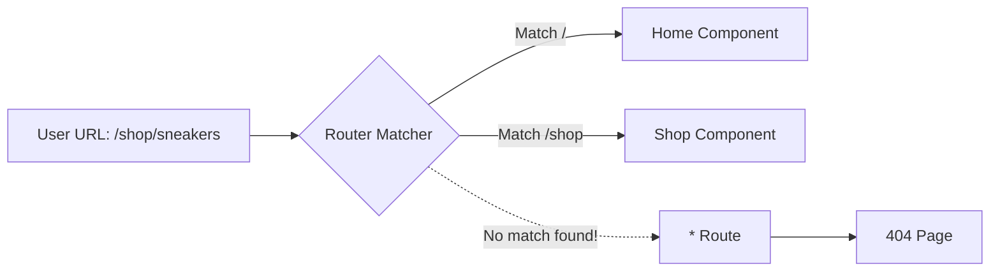

# 404 Routes (Not Found)

## Инженерная история
Пользователи часто ошибаются при вводе URL, или переходят по битым ссылкам (например, сохраненным в закладках старым товарам). Если роутер не знает, что делать с неизвестным путем, он может просто ничего не отрендерить (белый экран). Для этого используются "Catch-all" (сплат) маршруты, которые перехватывают любой несовпавший URL и рендерят страницу 404.

## Визуализация


## Пример кода
**React Router v6:**
```tsx
import { Routes, Route, Link } from "react-router-dom";

function NotFound() {
  return (
    <div>
      <h1>404 - Страница не найдена</h1>
      <p>Кажется, вы потерялись.</p>
      <Link to="/">Вернуться на главную</Link>
    </div>
  );
}

function App() {
  return (
    <Routes>
      <Route path="/" element={<Home />} />
      <Route path="/about" element={<About />} />
      {/* Catch-all роут (звездочка) ВСЕГДА должен быть в самом конце списка */}
      <Route path="*" element={<NotFound />} />
    </Routes>
  );
}
```

## Неочевидные нюансы
- **Missing Route vs Missing Resource:** 404-й маршрут (в примере выше) срабатывает только когда не найден *сам URL*. Но что если URL правильный (`/users/123`), а пользователя с ID 123 в БД нет? Это "Missing Resource". В таком случае компонент `/users/:id` должен сам выбросить ошибку (throw 404), которую поймает Error Route.
- **Статус-коды при CSR:** При чистом CSR сервер (например, Nginx) всегда возвращает `index.html` с HTTP-кодом 200, даже если URL мусорный. Поисковик увидит 200 OK и проиндексирует вашу страницу 404. Чтобы этого избежать, нужен либо SSR (который вернет реальный заголовок 404), либо мета-тег `<meta name="robots" content="noindex">` на странице 404.
- **UX паттерны:** На странице 404 недостаточно написать "Ой". Обязательно добавьте строку поиска по сайту, навигацию и ссылки на популярные разделы, чтобы удержать пользователя.
