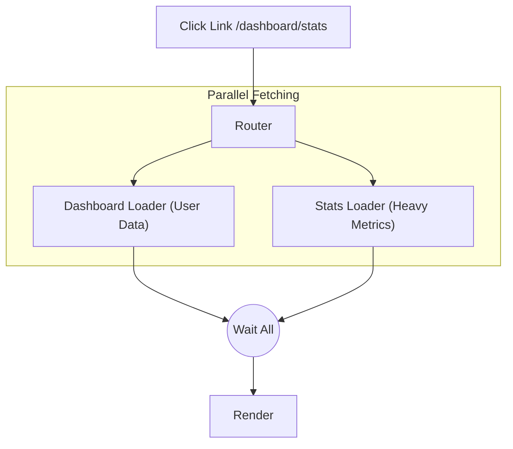

# Загрузчики данных (Data Loaders)

## Инженерная история
Исторически в SPA данные загружались так: компонент рендерится -> срабатывает `useEffect`/`mounted` -> показывается спиннер -> приходят данные -> рендер контента (**Fetch-on-render**).
**Какую боль решаем:** Waterfall (каскадная загрузка). Если страница состоит из родителя и ребенка, ребенок не начнет грузить свои данные, пока не отрендерится, а отрендерится он только после загрузки данных родителя. **Data Loaders** выносят загрузку данных на уровень роутера (**Fetch-before-render**).
**Как работает:** При клике на ссылку роутер анализирует, какие компоненты будут отрендерены, параллельно запускает их функции `loader`, ждет разрешения всех промисов, и только потом переключает UI, сразу передавая данные в компоненты.

**Где применимо:** Современные SSR фреймворки (Remix, Next.js App Router) и SPA роутеры нового поколения (React Router v6+, TanStack Router).
**Где ломается:** Если один из лоадеров на тяжелой странице работает 5 секунд, весь переход блокируется на 5 секунд.

## Визуализация



## Примеры кода

**Паттерн: React Router v6**
```tsx
// Определение лоадера параллельно компоненту
export async function teamLoader({ params }) {
  // Вызывается до рендера компонента
  const team = await fetchTeam(params.teamId);
  return json(team);
}

// Компонент
export function Team() {
  const team = useLoaderData(); // Данные уже здесь, без useEffect и спиннеров!
  return <h1>{team.name}</h1>;
}
```

**Антипаттерн: Возврат к водопадам в лоадерах**
```tsx
export async function badLoader() {
  const user = await fetchUser(); // Ждем 1 сек
  const config = await fetchConfig(); // Ждем еще 1 сек
  return { user, config }; // Итого 2 сек
}
// Надо: Promise.all([fetchUser(), fetchConfig()])
```

## Неочевидные нюансы (Трейдоффы)
1. **Блокировка перехода (Stale UI):** Пока данные грузятся, пользователь видит старую страницу. Требуется глобальный индикатор (например, NProgress), иначе кажется, что клик не сработал.
2. **Deferred Data (Streaming):** Чтобы решить проблему медленных лоадеров, современные роутеры позволяют возвращать не разрешенные промисы (deferred). Тогда роутер делает переход сразу с критическими данными, а второстепенные рендерятся через `Suspense` по мере готовности (например, `defer()` в Remix).
3. **Кэширование:** Loaders не всегда имеют встроенный кэш. Переход "туда-обратно" по страницам может заново триггерить сетевые запросы, если не скрестить роутер с инструментами типа React Query или SWR.
