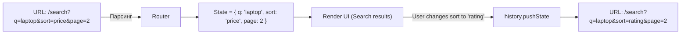

# Глубокие ссылки (Deep Linking)

## Инженерная история
В классических многостраничных сайтах любой URL однозначно описывал страницу. В эпоху SPA состояние приложения часто оседало в памяти JS (например, открытая модалка, активная вкладка табов, примененные фильтры в таблице).
**Какую боль решаем:** "Проблема сломанной кнопки Поделиться". Пользователь настраивает сложные фильтры товаров, кидает ссылку другу, а друг видит пустую страницу по умолчанию. **Deep Linking** заставляет хранить критически важное UI-состояние не в `useState`, а прямо в URL (в Path, Query Params или Hash). URL становится единым источником истины (Single Source of Truth).

**Где применимо:** Поиск, фильтры, сортировки, пагинация, шаги многошаговых форм, ID открытых сущностей (модалок).
**Где ломается:** Когда состояние слишком большое для URL (ограничение длины ~2000 символов), или когда оно содержит приватные данные (токены), которые утекают в историю браузера и логи серверов.

## Визуализация



## Примеры кода

**Паттерн: Хранение фильтров в URL (React Router)**
```tsx
import { useSearchParams } from 'react-router-dom';

function ProductList() {
  const [searchParams, setSearchParams] = useSearchParams();
  const activeTab = searchParams.get('tab') || 'overview'; // Default state
  
  const changeTab = (tabName) => {
    // Обновляем стейт, обновляя URL. UI перерендерится автоматически.
    setSearchParams({ tab: tabName });
  };

  return (
    <div>
      <Tabs active={activeTab} onChange={changeTab} />
      <Content tab={activeTab} />
    </div>
  );
}
```

## Неочевидные нюансы (Трейдоффы)
1. **Push vs Replace:** При обновлении URL-состояния (например, при вводе текста в поиск посимвольно) нельзя делать `pushState` на каждый символ, иначе пользователь не сможет вернуться назад кнопкой "Back" (история будет забита миллионом стейтов). В таких случаях нужно использовать `replaceState` или дебаунс.
2. **Сериализация:** URL поддерживает только строки. Сложные объекты, массивы дат и булевы значения нужно аккуратно сериализовать/десериализовать. Например, `?filters=color:red,blue;size:M`.
3. **Замусоривание кэша:** Если параметры влияют только на визуал (например, `?theme=dark`), и это уходит на сервер при SSR, вы можете получить плохой Cache Hit Rate (CDN закэширует кучу копий одной страницы). Визуальный стейт лучше хранить в LocalStorage.
