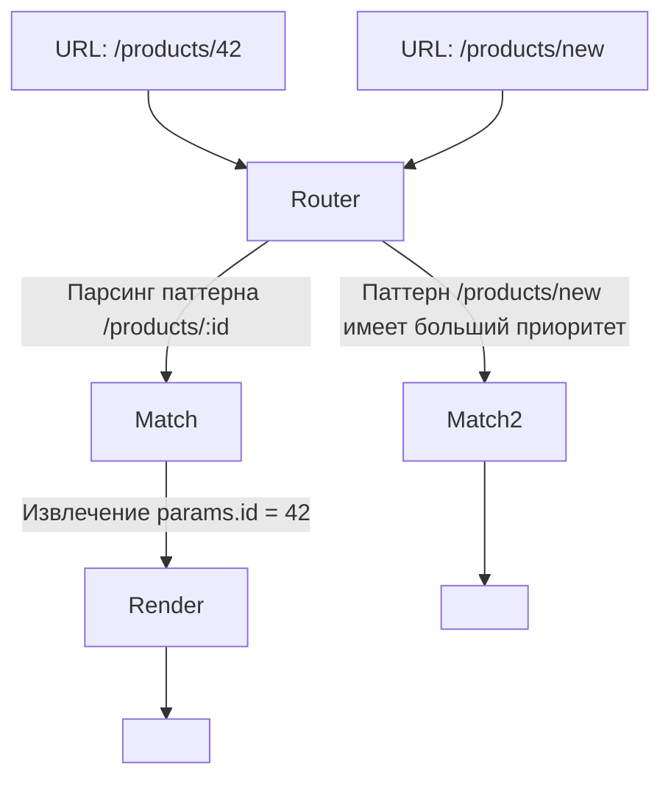

# Динамический Роутинг (Dynamic Routes)

## Инженерная история
В классических приложениях каждый URL соответствовал физическому файлу. В современных SPA и SSR-фреймворках маршруты стали виртуальными. **Динамический роутинг** решает проблему масштабирования навигации: вместо хардкода тысяч маршрутов (например, для каждого товара в магазине) мы объявляем паттерны с переменными (параметрами). 
**Как работает:** Роутер парсит текущий URL, сопоставляет его с зарегистрированными паттернами (часто используя Radix Tree или регулярные выражения) и извлекает значения (например, из `/users/123` достает `id: 123`), передавая их в компонент.

**Где применимо:** E-commerce (карточки товаров), блоги (статьи), дашборды (профили пользователей).
**Где ломается:** При слишком сложной иерархии маршрутов возникают конфликты специфичности (какой маршрут приоритетнее: `/users/new` или `/users/:id`?), а также проблемы с кэшированием CDN.

## Визуализация



## Примеры кода

**Паттерн: React Router / Next.js**
```tsx
// React Router v6
<Route path="/users/:userId" element={<UserProfile />} />

function UserProfile() {
  const { userId } = useParams(); // '123'
  return <div>User: {userId}</div>;
}

// Next.js (App Router) - app/users/[userId]/page.tsx
export default function Page({ params }: { params: { userId: string } }) {
  return <div>User: {params.userId}</div>;
}
```

**Антипаттерн: Конфликты маршрутов без строгой типизации/валидации**
```tsx
// Порядок объявления или алгоритм роутера может сыграть злую шутку
<Route path="/:category/:id" element={<Item />} />
<Route path="/about/team" element={<Team />} /> 
// Если алгоритм простой, /about/team может сматчиться как category="about", id="team"
```

## Неочевидные нюансы (Трейдоффы)
1. **Сложность сопоставления (Routing Specificity):** Продвинутые роутеры умеют вычислять "вес" маршрута и отдавать приоритет статическим сегментам (`/users/new` бьет `/users/:id`). В старых роутерах порядок объявления имеет значение.
2. **Перерисовки при смене параметров:** В SPA переход от `/users/1` к `/users/2` может не размонтировать компонент, а лишь обновить пропсы. Если вы не сбросите локальный стейт (или не отследите изменение `id` в `useEffect`), пользователь увидит старые данные.
3. **Безопасность:** Параметры URL — это пользовательский ввод. Не доверяйте им. Всегда валидируйте `id` (например, что это число, а не попытка инъекции).
