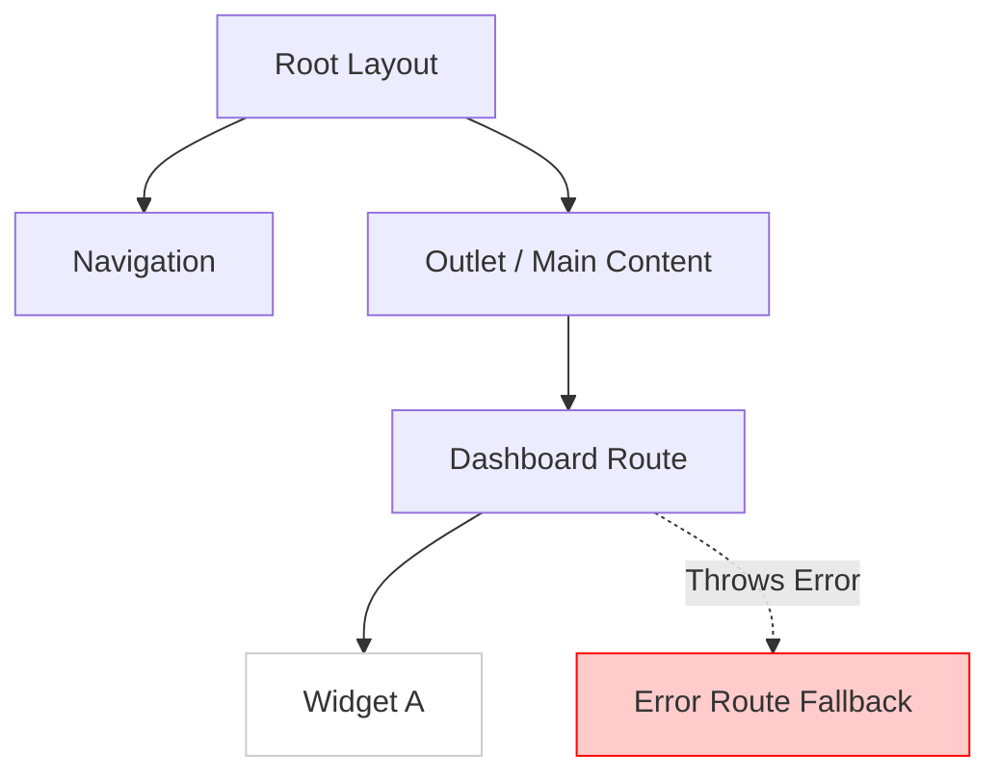

# Error Routes (Обработка ошибок маршрутизации)

## Инженерная история
Любое приложение подвержено ошибкам: может упасть запрос за данными, произойти ошибка рендеринга компонента или TypeError из-за "undefined is not a function". Если ошибку не перехватить, React размонтирует всё дерево, и пользователь увидит белый экран. Error Routes и Error Boundaries изолируют сбой в пределах одной ветви маршрута, оставляя навигацию (хедер, сайдбар) работоспособной, чтобы юзер мог спастись.

## Визуализация


## Пример кода
**Современный React Router v6 (Data Router):**
```tsx
import { createBrowserRouter, useRouteError } from "react-router-dom";

function ErrorBoundary() {
  const error = useRouteError();
  // Отправка в Sentry
  // Sentry.captureException(error);
  
  return (
    <div className="error-page">
      <h1>Что-то пошло не так 😭</h1>
      <p>{error.statusText || error.message}</p>
    </div>
  );
}

const router = createBrowserRouter([
  {
    path: "/",
    element: <Root />,
    errorElement: <ErrorBoundary />, // Поймает ошибки всех дочерних роутов
    children: [
      {
        path: "dashboard",
        element: <Dashboard />,
        loader: async () => { throw new Error("API Dead"); } // Ошибка загрузки
      }
    ]
  }
]);
```

## Неочевидные нюансы
- **Изоляция сбоев:** Не делайте один глобальный `errorElement` на всё приложение. Лучше иметь "локальные" Error Routes для тяжелых виджетов/страниц, чтобы при падении списка транзакций, баланс и меню оставались интерактивными.
- **Восстановление состояния:** Предоставьте пользователю кнопку "Попробовать снова" (перезапуск loader-а или `window.location.reload()`), так как ошибка часто бывает временной (мигнула сеть).
- **SSR vs CSR:** Если ошибка происходит на сервере (при SSR), вы не сможете отрендерить красивый клиентский Error Boundary без передачи HTTP статус-кода 500. Клиентский роутер подхватит уже статический fallback.
