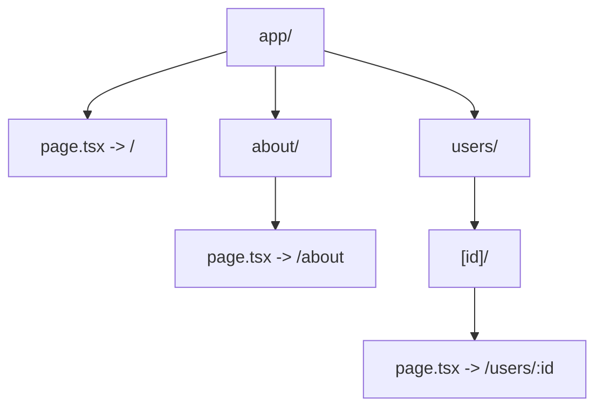

# File Based Routing (Роутинг на основе файловой системы)

## Что это и какую боль решаем?
Исторически конфигурация маршрутов писалась вручную в гигантских JSON-объектах или массивах. По мере роста проекта эти файлы становились нечитаемыми, возникали конфликты при слиянии (merge conflicts), а разработчикам приходилось постоянно прыгать между папкой с компонентами и файлом конфигурации. File Based Routing (популяризированный Next.js, Nuxt, Remix) решает эту боль: **структура папок и файлов автоматически становится структурой URL**.

## Как это работает
Сборщик (Webpack, Vite, Turbopack) сканирует определенную директорию (обычно `pages/` или `app/`) и генерирует конфигурацию роутинга на лету. Имена файлов транслируются в пути URL, а квадратные скобки `[param]` становятся динамическими параметрами.



## Показательные примеры

**Паттерн: Структура файлов в Next.js (App Router)**
```text
app/
 ├── layout.tsx         # Общий Layout для всех страниц
 ├── page.tsx           # Маршрут: /
 ├── blog/
 │    └── [slug]/
 │         └── page.tsx # Маршрут: /blog/hello-world
```

**Антипаттерн: Размещение вспомогательного кода рядом со страницами (в старых Pages Router)**
```javascript
// В старых системах (Next.js Pages) ЛЮБОЙ файл становился роутом
pages/
 ├── index.js      // /
 ├── utils.js      // Случайно стал доступен по /utils! (Антипаттерн)
 └── profile.js    // /profile
```
*Решение: в современных системах (App Router) только файлы с именем `page.tsx` или `route.ts` становятся публичными эндпоинтами.*

## Неочевидные нюансы
1. **Рефакторинг**: Переименование папки меняет URL и может сломать SEO, если не настроить редиректы. "Перетаскивание" файлов сложнее, чем изменение строки в конфигурации.
2. **"Магия" под капотом**: Разработчик не видит явного конфига. При возникновении конфликтов маршрутов (например, `[id].tsx` vs `new.tsx`) нужно знать специфичные правила приоритета фреймворка.
3. **Программный контроль**: Динамически генерировать маршруты из базы данных без явного создания файлов (например, Wildcard роуты) в File-based системах требует использования "Catch-all" сегментов (`[...slug].tsx`), внутри которых приходится писать сложную логику распределения.
