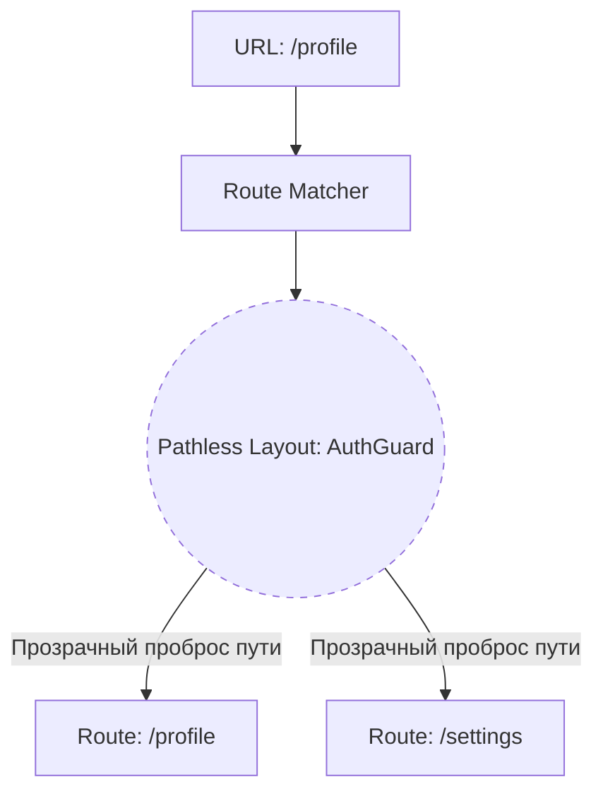

# Layout Routes (Маршруты без пути / Pathless Routes)

## Что это и какую боль решаем?
Иногда нам нужно обернуть группу страниц в общий UI-компонент (Layout) или применить к ним общую логику (например, проверку авторизации), но **без добавления сегмента в URL**. 
Если мы хотим, чтобы `/profile` и `/settings` имели общий `AuthLayout`, мы не хотим менять их URL на `/auth/profile` и `/auth/settings`. Layout Routes (или Pathless Routes) решают эту боль, создавая "невидимый" узел в графе маршрутов.

## Как это работает
В графе маршрутизации создается узел, который имеет компонент (Layout), но не имеет свойства `path` (или его `path` является невидимым сегментом, вроде `_auth`). При сопоставлении URL роутер проходит через этот узел, рендерит его компонент (который должен содержать `Outlet`/`children`), и прозрачно передает URL дочерним маршрутам.



## Показательные примеры

**Паттерн: Pathless Route в React Router v6**
```javascript
const router = createBrowserRouter([
  {
    // Обратите внимание: НЕТ свойства path!
    element: <RequireAuthLayout />, 
    children: [
      { path: "/profile", element: <Profile /> },
      { path: "/settings", element: <Settings /> }
    ],
  },
  {
    path: "/public",
    element: <PublicPage />
  }
]);

function RequireAuthLayout() {
  const isAuth = useAuth();
  if (!isAuth) return <Navigate to="/login" />;
  return (
    <div className="auth-shell">
      <header>Private Area</header>
      <Outlet />
    </div>
  );
}
```

**Паттерн: Route Groups в Next.js (App Router)**
В Next.js для этого используются скобки в названии папки. Папка в скобках не участвует в URL.
```text
app/
 ├── (authenticated)/      # Папка не влияет на URL
 │    ├── layout.tsx       # AuthLayout применится к дочерним
 │    ├── profile/page.tsx # Доступно по /profile
 │    └── settings/page.tsx# Доступно по /settings
 ├── login/page.tsx        # Доступно по /login
```

## Неочевидные нюансы
1. **Скрытая иерархия**: Layout-маршруты не отражаются в URL, поэтому разработчикам-новичкам бывает трудно понять, откуда взялась общая обертка. Это требует хорошего понимания кодовой базы.
2. **Лишние перерендеры при конфликтах**: Если несколько разных ветвей имеют одинаковые по сути (но разные по инстансу) Layout-компоненты, при переходе между ветвями Layout будет демонтироваться, теряя состояние.
3. **Относительные ссылки**: В конфигурационном роутинге использование ссылок типа `..` (вверх) внутри Layout Routes может сбить с толку, так как физического сегмента пути у этого маршрута нет, и подъем произойдет до ближайшего маршрута с физическим путем.
