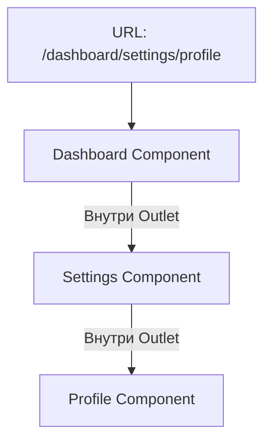

# Nested Routes (Вложенные маршруты)

## Что это и какую боль решаем?
UI современных приложений часто имеет иерархическую структуру. Например, на странице настроек пользователя есть боковое меню, которое должно оставаться на месте при переходе между разделами ("Профиль", "Безопасность", "Уведомления"). Вложенные маршруты позволяют привязать сегменты URL к вложенным UI-компонентам. Это избавляет от необходимости дублировать общие элементы интерфейса на каждой странице и предотвращает их лишний перерендер.

## Как это работает
Роутер сопоставляет URL по частям. Если URL `/dashboard/settings/profile`, роутер сначала рендерит компонент для `/dashboard`, внутри него — специальный плейсхолдер (Outlet), куда вставляет компонент для `settings`, и так далее до `profile`.



## Показательные примеры

**Паттерн: Использование Outlet (React Router)**
```javascript
// Родительский компонент
function DashboardLayout() {
  return (
    <div className="flex">
      <Sidebar /> {/* Остается статичным */}
      <main className="content">
        <Outlet /> {/* Сюда динамически монтируются дочерние роуты */}
      </main>
    </div>
  );
}

// Конфиг
const routes = [
  {
    path: "/dashboard",
    element: <DashboardLayout />,
    children: [
      { path: "settings", element: <Settings /> }, // /dashboard/settings
      { path: "stats", element: <Stats /> }        // /dashboard/stats
    ]
  }
];
```

**Антипаттерн: Дублирование Layout**
```javascript
// Плохо: Отсутствие вложенных маршрутов заставляет дублировать Sidebar
function SettingsPage() {
  return <><Sidebar /><Settings /></>;
}
function StatsPage() {
  return <><Sidebar /><Stats /></>;
}
// При навигации Sidebar будет демонтироваться и монтироваться заново!
```

## Неочевидные нюансы
1. **Data Fetching Waterfalls (Каскадная загрузка данных)**: Если `DashboardLayout` запрашивает данные при `useEffect`, а внутри `Outlet` рендерится `Settings`, который тоже запрашивает данные в `useEffect`, загрузка будет последовательной (каскад). *Решение*: Современные роутеры (React Router v6.4+, Remix) загружают данные параллельно для всех сегментов до начала рендера.
2. **Относительные пути (Relative Paths)**: Написание ссылок внутри вложенных роутов может запутать. Переход на `../` может означать поднятие на уровень выше по иерархии URL, но если есть pathless-layout маршруты, это может привести к неочевидному поведению.
3. **Глубина вложенности**: Чрезмерная вложенность UI-компонентов может усложнить передачу состояния. Приходится использовать React Context или стейт-менеджеры, так как прокидывать пропсы через `Outlet` неудобно (используется `useOutletContext`).
