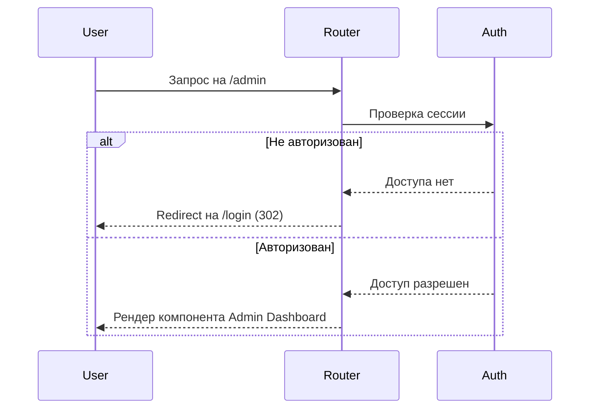

# Redirects (Перенаправления)

## Инженерная история
Когда приложение развивается, меняются URL-структуры, или возникает необходимость проверять доступ пользователя (авторизация/права). Чтобы не ломать старые закладки пользователей и направлять их в нужное место, используются редиректы. Боль: как увести пользователя с устаревшего или закрытого URL так, чтобы это было быстро, прозрачно и правильно обрабатывалось поисковиками.

## Визуализация


## Пример кода
**Реализация в React Router v6:**
```tsx
import { Navigate, Route } from "react-router-dom";

// Декларативный редирект для защиты маршрутов
const ProtectedRoute = ({ isAuth, children }) => {
  if (!isAuth) {
    return <Navigate to="/login" replace />; // replace предотвращает возврат назад
  }
  return children;
};
```

**Next.js (Server-side редирект в middleware):**
```ts
import { NextResponse } from 'next/server'
import type { NextRequest } from 'next/server'

export function middleware(request: NextRequest) {
  if (!request.cookies.has('session')) {
    return NextResponse.redirect(new URL('/login', request.url))
  }
}
```

## Неочевидные нюансы
- **History Stack:** При редиректах на клиенте всегда используйте флаг `replace`, чтобы не засорять историю браузера (иначе кнопка "Назад" вернет юзера на редирект, который снова его перебросит вперед).
- **SEO (301 vs 302/307/308):** На клиенте статус-коды не важны (браузер просто меняет URL). При SSR редирект *обязан* возвращать правильный HTTP-статус. 301 (Permanent) кэшируется браузерами навсегда, поэтому используйте его только если маршрут изменился навсегда. 302/307 (Temporary) безопаснее для авторизации.
- **Редирект-лупы:** Извечная проблема сложной логики (например: юзер без профиля редиректится на `/onboarding`, который проверяет что юзер не авторизован и редиректит на `/login`, который после логина кидает на `/onboarding`... и так по кругу).
