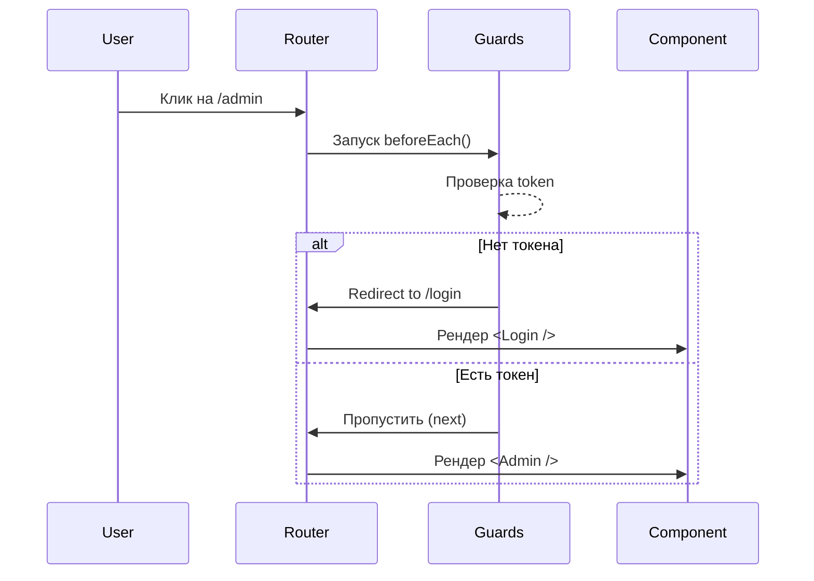

# Маршрутные стражи (Route Guards)

## Инженерная история
**Route Guards** (или навигационные хуки/middleware) — это механизм перехвата перехода между страницами до того, как они будут отрендерены.
**Какую боль решаем:** Нельзя показывать закрытый контент неавторизованным пользователям. Если проверять права внутри самого компонента при маунте, UI будет "мигать" (flashing of unauthenticated state), отрисовывая скелетоны или приватные данные до того, как сработает редирект.
**Как работает:** Роутер предоставляет хуки жизненного цикла (например, `beforeEach`). В них выполняется логика проверки стейта/токенов. Если проверка не пройдена — переход отменяется или перенаправляется.

**Где применимо:** Авторизация, проверка ролей (RBAC), предотвращение ухода со страницы с несохраненными данными (dirty state).
**Где ломается:** Зависание навигации, если guard делает долгие синхронные сетевые запросы. Иллюзия безопасности (frontend-гварды не защищают данные, только UI).

## Визуализация



## Примеры кода

**Паттерн: Vue Router (Глобальные гварды)**
```javascript
router.beforeEach(async (to, from, next) => {
  if (to.meta.requiresAuth && !authStore.isAuthenticated) {
    // Редирект на логин, сохраняя целевой URL
    next({ name: 'Login', query: { redirect: to.fullPath } })
  } else {
    next() // Разрешить переход
  }
})
```

**Паттерн: React Router v6 (через Loaders)**
```tsx
async function adminLoader() {
  const user = await getUser();
  if (!user.isAdmin) {
    return redirect("/unauthorized");
  }
  return null;
}
<Route path="/admin" loader={adminLoader} element={<Admin />} />
```

## Неочевидные нюансы (Трейдоффы)
1. **Frontend Guards != Security:** Гварды лишь скрывают UI. Злоумышленник может модифицировать JS и обойти гвард. Настоящая безопасность обеспечивается проверкой токенов на Backend API.
2. **Race conditions при проверке авторизации:** Если при загрузке приложения стейт авторизации еще не известен (идет запрос к `/me`), гвард может ошибочно выкинуть пользователя на логин. Требуется состояние `isLoadingAuth`.
3. **Блокировка UI:** Асинхронные гварды блокируют рендер новой страницы. Без индикатора загрузки (progress bar наверху) приложение кажется зависшим.
