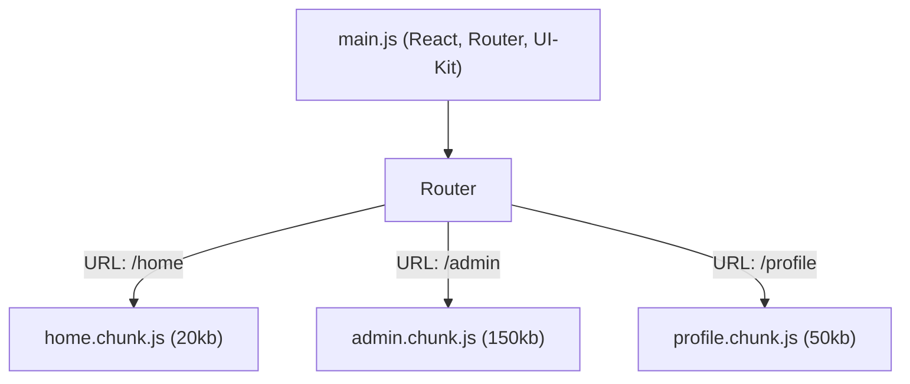

# Разделение кода по маршрутам (Route Level Code Splitting)

## Инженерная история
Раньше весь JS-код приложения упаковывался в один огромный файл `bundle.js`. 
**Какую боль решаем:** По мере роста SPA размер бандла достигал мегабайт. Пользователь загружал код админки, корзины и профиля, находясь только на главной странице. Это катастрофически убивало Time to Interactive (TTI).
**Как работает:** **Route Level Code Splitting** использует динамические импорты `import()`. Бандлеры (Webpack, Vite, Rollup) видят их и разбивают код на чанки (chunks). Роутер подгружает JS-файл конкретного маршрута только тогда, когда пользователь на него переходит.

**Где применимо:** Повсеместно во всех средних и крупных SPA. Обязательный стандарт оптимизации.
**Где ломается:** Избыточное дробление (слишком много мелких файлов создают оверхед на сеть в HTTP/1.1). Дублирование общих зависимостей в разных чанках при неверной настройке бандлера.

## Визуализация



## Примеры кода

**Паттерн: React.lazy + Suspense**
```tsx
import { lazy, Suspense } from 'react';
import { BrowserRouter, Routes, Route } from 'react-router-dom';

// Код этих компонентов не попадет в main.js
const Home = lazy(() => import('./Home'));
const Admin = lazy(() => import('./Admin'));

function App() {
  return (
    <Suspense fallback={<Spinner />}>
      <Routes>
        <Route path="/" element={<Home />} />
        <Route path="/admin" element={<Admin />} />
      </Routes>
    </Suspense>
  );
}
```

**Антипаттерн: Разделение слишком мелких компонентов**
```tsx
// Нет смысла сплитить маленькую кнопку. Задержка сети превысит пользу.
const Button = lazy(() => import('./Button')); 
```

## Неочевидные нюансы (Трейдоффы)
1. **Network Waterfall на клиенте:** При переходе на новый роут пользователь ждет сначала загрузки JS-чанка, а потом этот JS-чанк запускает загрузку данных (API). Итог — двойная задержка.
2. **Prefetching:** Чтобы скрыть сетевую задержку загрузки JS, применяется префетчинг. При наведении мыши (hover) на ссылку `<a>` можно триггерить загрузку чанка заранее. Webpack поддерживает магические комментарии: `import(/* webpackPrefetch: true */ './Admin')`.
3. **Обновления приложения:** Если пользователь долго сидит в SPA, а вы выкатили новую версию, старые чанки могут удалиться с сервера (CDN). При клике на роут произойдет ошибка загрузки чанка. Нужно перехватывать ошибки `lazy` и форсировать перезагрузку страницы (`window.location.reload()`).
