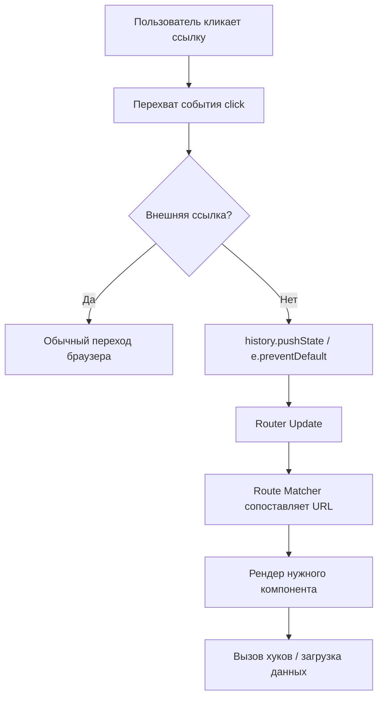

# Архитектура роутинга

## Что это и какую боль решаем?
Во времена классических MPA (Multi-Page Applications) каждый переход по ссылке означал полный запрос к серверу и перезагрузку страницы. Это давало ощущение "моргания" и сбрасывало состояние клиента. С приходом SPA (Single Page Applications) появилась потребность менять UI в зависимости от URL **без перезагрузки страницы**. Роутинг в браузере решает именно эту задачу: он перехватывает изменения URL (через History API) и синхронизирует состояние приложения, подставляя нужное дерево компонентов. 

## Как это работает
В основе современного клиентского роутинга лежит `window.history` API (`pushState`, `replaceState`) и событие `popstate`. Роутер слушает изменения адреса, сопоставляет текущий URL с заранее известной картой маршрутов (Route Matching), извлекает параметры и рендерит соответствующий компонент.



## Показательные примеры

**Антипаттерн: Ручное управление состоянием URL без History API**
```javascript
// Плохо: хранение "текущей страницы" в стейте без привязки к URL
// Пользователь не сможет поделиться ссылкой или использовать кнопку "Назад"
const [page, setPage] = useState('home');
return page === 'home' ? <Home /> : <About />;
```

**Паттерн: Простой кастомный роутер на History API**
```javascript
// Минимальная иллюстрация того, как роутер работает под капотом
function navigate(url) {
  window.history.pushState({}, '', url);
  const navEvent = new PopStateEvent('popstate');
  window.dispatchEvent(navEvent);
}

window.addEventListener('popstate', () => {
  renderComponentBasedOnUrl(window.location.pathname);
});
```

## Неочевидные нюансы
1. **Scroll Restoration (Восстановление скролла)**: Браузер по умолчанию восстанавливает скролл при навигации назад. SPA ломают это поведение, так как контент рендерится асинхронно. Хороший роутер должен брать восстановление скролла на себя.
2. **Утечки памяти в слушателях**: Если вы пишете свой роутер или подписываетесь на `popstate`, не забывайте отписываться при демонтировании компонентов.
3. **Гонка данных (Race Conditions)**: При быстром переключении маршрутов старый запрос данных может резолвиться позже нового, перетирая актуальное состояние. Роутер должен уметь отменять (abort) переходы и запросы.
