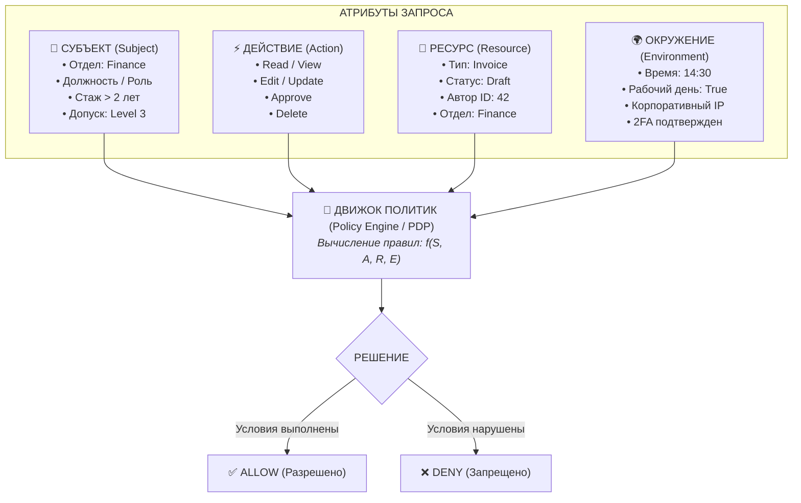
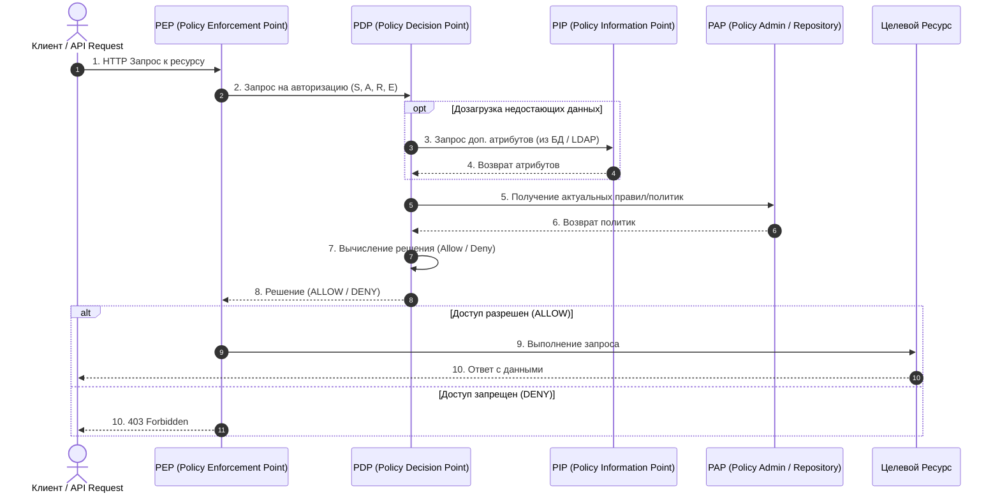

# ABAC (Attribute-Based Access Control)

**ABAC (Управление доступом на основе атрибутов)** — это передовая модель авторизации (стандарт NIST SP 800-162), в которой решение о предоставлении доступа принимается динамически на основе политик, анализирующих **атрибуты** субъекта, целевого ресурса, запрашиваемого действия и контекста окружения.

---

## 1. Ключевая формула ABAC

В ABAC доступ разрешается, если выполняется логическое выражение:

$$\text{Decision} = f(\text{Subject Attributes}, \text{Resource Attributes}, \text{Action Attributes}, \text{Environment Attributes})$$



---

## 2. 4 категории атрибутов

| Категория | Вопрос | Примеры атрибутов |
| :--- | :--- | :--- |
| **1. Субъект (Subject)** | *Кто запрашивает?* | `userId`, `roles`, `department: "finance"`, `clearanceLevel: 3`, `isContractor: false` |
| **2. Ресурс (Resource)** | *К чему обращаются?* | `resourceType: "report"`, `ownerId: 42`, `classification: "confidential"`, `status: "draft"` |
| **3. Действие (Action)** | *Что хотят сделать?* | `read`, `write`, `delete`, `export_csv`, `transfer_funds` |
| **4. Окружение (Environment)** | *В каком контексте?* | `currentTime: "14:30"`, `isWorkingHours: true`, `clientIp: "10.0.4.1"`, `isMfaVerified: true` |

---

## 3. Архитектура XACML / ABAC

Стандартная архитектура ABAC состоит из 4 взаимодействующих компонентов:



1. **PEP (Policy Enforcement Point)**: Перехватчик запроса (API Gateway, HTTP Middleware, Route Guard). Задает вопрос PDP: *"Можно ли пустить?"*.
2. **PDP (Policy Decision Point)**: Мозг системы (движок правил, например **Open Policy Agent — OPA**). Вычисляет результат (Allow/Deny).
3. **PAP (Policy Administration Point)**: Хранилище политик и правил (файлы `.rego`, JSON/YAML базы политик).
4. **PIP (Policy Information Point)**: Источник дополнительных данных (запрашивает недостающие данные из БД, LDAP, Redis).

---

## 4. Сравнение RBAC vs ABAC

| Критерий | RBAC | ABAC |
| :--- | :--- | :--- |
| **Основной фактор** | Имя роли (`user.role === 'admin'`) | Множество динамических атрибутов |
| **Гибкость** | Ограниченная | Экстремально высокая |
| **Контекст окружения** | Не поддерживает (статичен) | Поддерживает (время, IP, геолокация, устройство) |
| **Владение ресурсом** | Требует хаков / дописывания условий в коде | Естественно: `subject.id == resource.authorId` |
| **Сложность внедрения** | Низкая | Высокая (требуется PDP / движок политик) |
| **Производительность** | Очень быстрая (O(1)) | Зависит от сложности политик и PIP запросов |

---

## 5. Практический пример политики (TypeScript & JSON)

### Бизнес-правило:
> *"Врач может просматривать и редактировать медицинскую карту пациента только в рабочие часы, если пациент прикреплен к его отделению."*

```typescript
interface AccessRequest {
  subject: { id: string; role: string; department: string };
  resource: { type: string; patientDepartment: string; isArchived: boolean };
  action: 'read' | 'update' | 'delete';
  environment: { currentHour: number; isWeekend: boolean };
}

// PDP: Движок вычисления политики
export function evaluateMedicalRecordPolicy(req: AccessRequest): boolean {
  const { subject, resource, action, environment } = req;

  // 1. Главврач имеет полный доступ всегда
  if (subject.role === 'chief_doctor') return true;

  // 2. Обычный врач: проверка условий ABAC
  if (subject.role === 'doctor') {
    const isSameDepartment = subject.department === resource.patientDepartment;
    const isWorkingHours = !environment.isWeekend && environment.currentHour >= 8 && environment.currentHour < 18;
    const isAllowedAction = action === 'read' || (action === 'update' && !resource.isArchived);

    return isSameDepartment && isWorkingHours && isAllowedAction;
  }

  return false; // По умолчанию запрещено (Deny by default)
}
```

---

## 6. Связанные заметки
- [[RBAC]] — ролевая модель доступа.
- [[Авторизация: роли и permissions]] — сравнение подходов и концепции безопасности.
- [[Route Guards и авторизация]] — интеграция проверок доступа во фронтенд-маршрутизацию.
