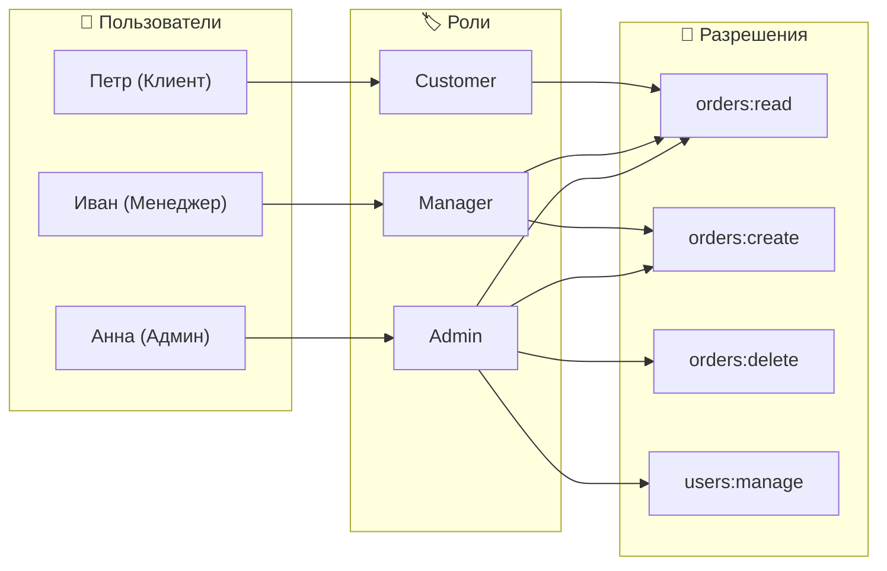
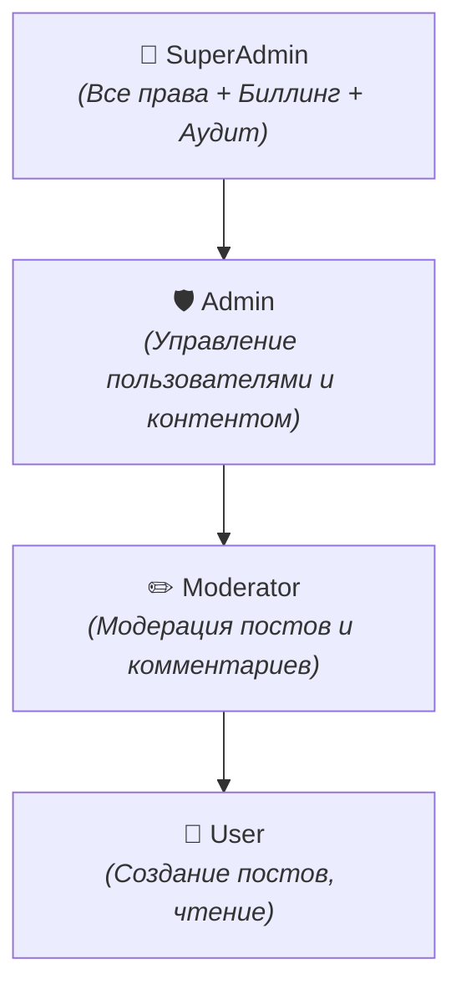
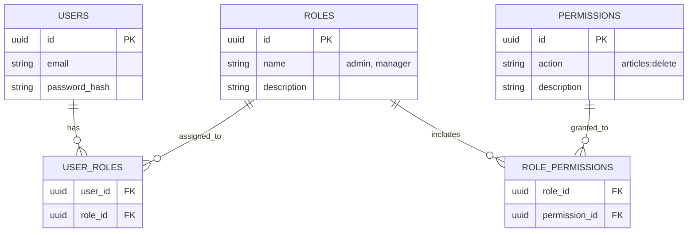

# RBAC (Role-Based Access Control)

**RBAC (Управление доступом на основе ролей)** — это классическая модель разграничения доступа, при которой права назначаются не отдельным пользователям, а **ролям**. Пользователи привязываются к одной или нескольким ролям и получают все связанные с ними привилегии.

---

## 1. Базовый принцип RBAC



---

## 2. Уровни стандарта NIST RBAC

Стандарт NIST (Национальный институт стандартов и технологий США) определяет 4 уровня зрелости RBAC:

### 2.1. Flat RBAC (Базовый / Core RBAC)
- Пользователи привязываются к ролям, роли — к разрешениям.
- Нет наследования и взаимных ограничений.

### 2.2. Hierarchical RBAC (Иерархический RBAC)
- Роли поддерживают древовидное наследование.
- Дочерняя роль автоматически получает все разрешения родительских ролей:
  $$\text{SuperAdmin} \supset \text{Admin} \supset \text{Moderator} \supset \text{User}$$



### 2.3. Constrained RBAC (RBAC с разделением обязанностей — SoD)
- **Static Separation of Duties (SSD)**: Пользователю запрещено иметь две конфликтующие роли одновременно (например, `Accountant` и `Auditor`).
- **Dynamic Separation of Duties (DSD)**: Пользователь может иметь обе роли, но не может активировать их в рамках одной сессии.

---

## 3. Схема базы данных (ERD)

Для реализации классического гибкого RBAC используется нормализованная схема со связями "многие-ко-многим":



---

## 4. Пример реализации на TypeScript

```typescript
// Определение типов разрешений и иерархии
type Permission = 
  | 'articles:read'
  | 'articles:create'
  | 'articles:edit'
  | 'articles:delete'
  | 'users:ban';

type Role = 'guest' | 'author' | 'moderator' | 'admin';

const ROLE_PERMISSIONS: Record<Role, Permission[]> = {
  guest: ['articles:read'],
  author: ['articles:read', 'articles:create', 'articles:edit'],
  moderator: ['articles:read', 'articles:edit', 'articles:delete'],
  admin: [
    'articles:read',
    'articles:create',
    'articles:edit',
    'articles:delete',
    'users:ban',
  ],
};

// Функция проверки прав
export function hasPermission(
  userRoles: Role[],
  requiredPermission: Permission
): boolean {
  return userRoles.some((role) =>
    ROLE_PERMISSIONS[role]?.includes(requiredPermission)
  );
}

// Пример Middleware для Express
export function requirePermission(permission: Permission) {
  return (req: any, res: any, next: any) => {
    const user = req.user;
    if (!user || !hasPermission(user.roles, permission)) {
      return res.status(403).json({ error: 'Доступ запрещен: недостаточно прав' });
    }
    next();
  };
}
```

---

## 5. Преимущества и недостатки RBAC

### Плюсы:
- 🟢 **Простота понимания и аудита**: Легко понять, кто и к чему имеет доступ в компании.
- 🟢 **Централизованное управление**: Изменение прав роли моментально применяется ко всем пользователям с этой ролью.
- 🟢 **Производительность**: Проверка роли или списка прав в JWT/Redis выполняется практически мгновенно.

### Минусы и ограничения:
- 🔴 **Проблема "Взрыва ролей" (Role Explosion)**: При попытке учесть контекст количество ролей разрастается лавинообразно (`Editor_Department_A_Morning_Shift`, `Editor_Department_B_Night_Shift`).
- 🔴 **Отсутствие контекста**: RBAC не умеет учитывать динамические факторы: время суток, геолокацию, принадлежность ресурса (например: *"пользователь может редактировать только СВОЮ статью"*).
- 👉 *Для решения этих ограничений применяется [[ABAC]]*.

---

## 6. Связанные заметки
- [[Авторизация: роли и permissions]] — общие концепции и термины авторизации.
- [[ABAC]] — атрибутивная модель доступа для сложных контекстных правил.
- [[Route Guards и авторизация]] — применение ролей и permissions в роутинге веб-приложений.
