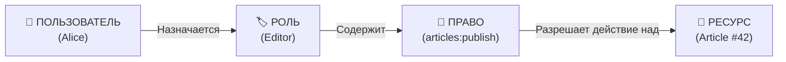
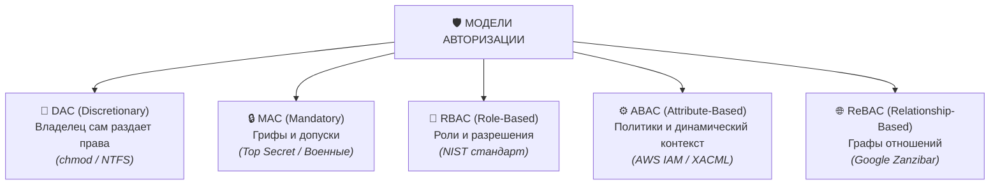

# Авторизация: Роли, Permissions и Модели доступа

**Авторизация (Authorization)** — процесс определения прав субъекта (пользователя, сервиса) на выполнение определенных действий над конкретными ресурсами в системе.

---

## 1. Фундаментальные понятия



1. **Permission (Разрешение / Право / Privilege)**:
   - Атомарное правило доступа вида `сущность:действие` (например, `users:create`, `billing:read`, `reports:export`).
   - На уровне системы права неизменны и привязаны к бизнес-логике.

2. **Role (Роль)**:
   - Именованный контейнер для набора permissions (например, `Admin`, `Moderator`, `Viewer`, `BillingManager`).
   - Пользователю назначается роль, а не сотни отдельных прав вручную.

3. **Scope (Область действия / Скоуп)**:
   - Концепция из OAuth 2.0. Ограничивает права, которые *клиентское приложение* может использовать от лица пользователя (например, Google Drive запрашивает scope `drive.readonly`).

4. **Policy (Политика)**:
   - Логическое условие или функция, принимающая решение: разрешить (`ALLOW`) или запретить (`DENY`).

---

## 2. Антипаттерн "Role Check" vs "Permission Check"

### ❌ Плохо: Проверка ролей в бизнес-коде (Role-Based Checks)
```typescript
// ХРУПКИЙ КОД: Любое изменение ролей потребует рефакторинга десятков файлов
function deleteArticle(user: User, article: Article) {
  if (user.role === 'admin' || user.role === 'super_moderator') {
    return database.delete(article.id);
  }
  throw new ForbiddenError();
}
```
*Если в компании появится новая роль `ContentLead` с правом удаления, придется искать и переписывать все проверки `user.role === '...'` по всему проекту.*

---

### ✅ Хорошо: Проверка гранулярных прав (Permission-Based Checks)
```typescript
// ГИБКИЙ КОД: Код зависит от неизменных permissions, а состав ролей настраивается в БД
function deleteArticle(user: User, article: Article) {
  if (user.hasPermission('articles:delete')) {
    return database.delete(article.id);
  }
  throw new ForbiddenError();
}
```

---

## 3. Обзор моделей управления доступом



| Модель | Принцип принятия решения | Типичный пример |
| :--- | :--- | :--- |
| **DAC** *(Discretionary)* | Владелец файла сам решает, кому дать доступ | Права доступа в файловой системе Linux (`chmod 777`) |
| **MAC** *(Mandatory)* | Система сопоставляет уровень допуска пользователя и гриф документа | Военные и государственные системы (Top Secret, Confidential) |
| **RBAC** *(Role-Based)* | Права зависят от должности/роли пользователя в системе | Корпоративные CRM/ERP системы, админ-панели |
| **ABAC** *(Attribute-Based)* | Права вычисляются на основе атрибутов субъекта, ресурса и контекста окружения | AWS IAM, FinTech (время суток, геолокация, сумма сделки) |
| **ReBAC** *(Relationship-Based)* | Права определяются отношениями в графе связей | Google Drive (расшаривание папок), соцсети (друзья друзей) |

---

## 4. Пример архитектуры прав на клиенте и сервере (CASL / TypeScript)

Библиотека **CASL** позволяет использовать единое декларативное описание прав как на фронтенде (для скрытия кнопок/навигации), так и на бэкенде (для валидации API).

```typescript
import { AbilityBuilder, createMongoAbility } from '@casl/ability';

type Actions = 'manage' | 'create' | 'read' | 'update' | 'delete';
type Subjects = 'Article' | 'Comment' | 'User' | 'all';

export function defineRulesFor(user: User) {
  const { can, cannot, build } = new AbilityBuilder(createMongoAbility);

  if (user.role === 'admin') {
    can('manage', 'all'); // Полный доступ ко всему
  } else if (user.role === 'editor') {
    can('read', 'all');
    can('create', 'Article');
    // Пользователь может редактировать только свои статьи
    can('update', 'Article', { authorId: user.id });
    cannot('delete', 'Article');
  } else {
    can('read', 'Article', { published: true });
  }

  return build();
}

// Использование в коде:
const ability = defineRulesFor(currentUser);

if (ability.can('update', currentArticle)) {
  showEditButton();
}
```

---

## 5. Связанные заметки
- [[RBAC]] — ролевая модель доступа и иерархии ролей.
- [[ABAC]] — атрибутивная модель доступа и политики XACML.
- [[Route Guards и авторизация]] — защита клиентских и серверных маршрутов.
- [[Термины: identity, authentication, authorization]] — разница между AuthN и AuthZ.
