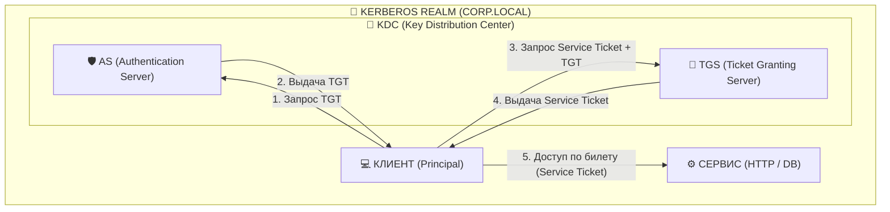
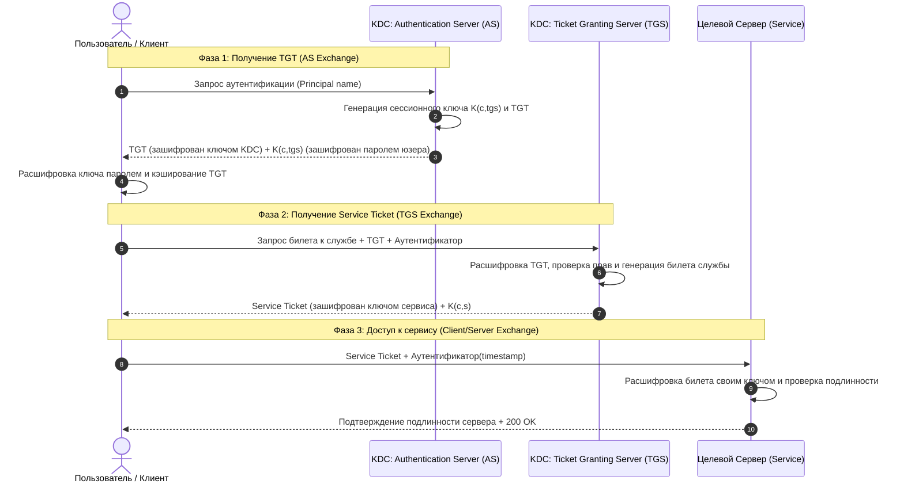

# Kerberos

**Kerberos** — это сетевой протокол взаимной аутентификации, разработанный в MIT, который позволяет клиентам и сервисам безопасно подтверждать свою подлинность в незащищенных сетях с помощью **билетов (Tickets)** и симметричного шифрования через доверенную третью сторону — **KDC (Key Distribution Center)**.

---

## 1. Ключевые понятия Kerberos



1. **Principal (Принципал)**: Уникальный идентификатор сущности в Kerberos (пользователь или служба):
   - Пользователь: `alice@CORP.EXAMPLE.COM`
   - Сервис: `HTTP/webserver.corp.example.com@CORP.EXAMPLE.COM`
2. **Realm (Реалм / Область)**: Доменная зона управления (обычно пишется ЗАГЛАВНЫМИ буквами, например `CORP.COMPANY.COM`).
3. **KDC (Key Distribution Center — Центр распределения ключей)**: Центральный доверенный сервер, состоящий из двух компонентов:
   - **AS (Authentication Server)** — проверяет логин/пароль и выдает первичный билет **TGT**.
   - **TGS (Ticket Granting Server)** — принимает TGT и выдает **Service Ticket** для конкретной службы.
4. **TGT (Ticket Granting Ticket)**: Временный пропуск, позволяющий запрашивать билеты к службам без повторного ввода пароля.
5. **Service Ticket (Билет службы)**: Зашифрованный билет для предъявления целевому серверу (например, корпоративному веб-серверу или БД).

---

## 2. Пошаговый процесс аутентификации (3 фазы)



### Детали фаз:
1. **Фаза 1 (AS Exchange)**: Клиент подтверждает свою личность и получает TGT на срок 8–10 часов. Пароль не передается по сети (он используется как ключ для локальной расшифровки).
2. **Фаза 2 (TGS Exchange)**: Клиент предъявляет TGT и запрашивает билет к конкретной службе (`HTTP/intranet.corp.com`).
3. **Фаза 3 (Client/Server Exchange)**: Клиент отправляет билет целевому сервису. Происходит взаимная аутентификация.

---

## 3. Kerberos в вебе: SPNEGO и заголовок `WWW-Authenticate: Negotiate`

В корпоративных браузерах (Chrome, Edge, Firefox) Kerberos используется для бесшовного входа на внутренние сайты без ввода логина/пароля:

```http
1. Клиент делает запрос:
GET /dashboard HTTP/1.1
Host: intranet.company.com

2. Сервер требует аутентификацию Kerberos:
HTTP/1.1 401 Unauthorized
WWW-Authenticate: Negotiate

3. Браузер берет билет Kerberos из ОС (Windows/Linux) и повторяет запрос:
GET /dashboard HTTP/1.1
Host: intranet.company.com
Authorization: Negotiate YIIHYgYGKwYBBQUCoIIHVjCCB1KgDzAN... (билет SPNEGO)

4. Сервер проверяет билет и пускает пользователя:
HTTP/1.1 200 OK
```

---

## 4. Преимущества и недостатки Kerberos

| Преимущества | Недостатки |
| :--- | :--- |
| 🟢 **Пароль никогда не передается по сети** (только билеты и хэши) | 🔴 **Единая точка отказа (SPOF)**: падение KDC парализует аутентификацию |
| 🟢 **Взаимная аутентификация**: клиент уверен в подлинности сервера, а сервер — клиента | 🔴 **Строгие требования к синхронизации времени**: рассинхронизация NTP > 5 минут ломает аутентификацию (защита от Replay атак) |
| 🟢 **Защита от Replay-атак** благодаря одноразовым таймштампам | 🔴 **Сложность настройки** за пределами локальной корпоративной сети (плохо подходит для открытого интернета) |
| 🟢 **Основа Windows Active Directory** и Enterprise SSO | 🔴 Не поддерживается мобильными клиентами напрямую без сложных прокси |

---

## 5. Связанные заметки
- [[LDAP]] — протокол каталогов, часто работающий в связке с Kerberos в Active Directory.
- [[SSO]] — концепция единого входа в корпоративных системах.
- [[SAML]] — протокол федерации для веб-приложений через браузер.
- [[Basic Authentication]] и [[Digest Authentication]] — базовые HTTP-методы аутентификации.