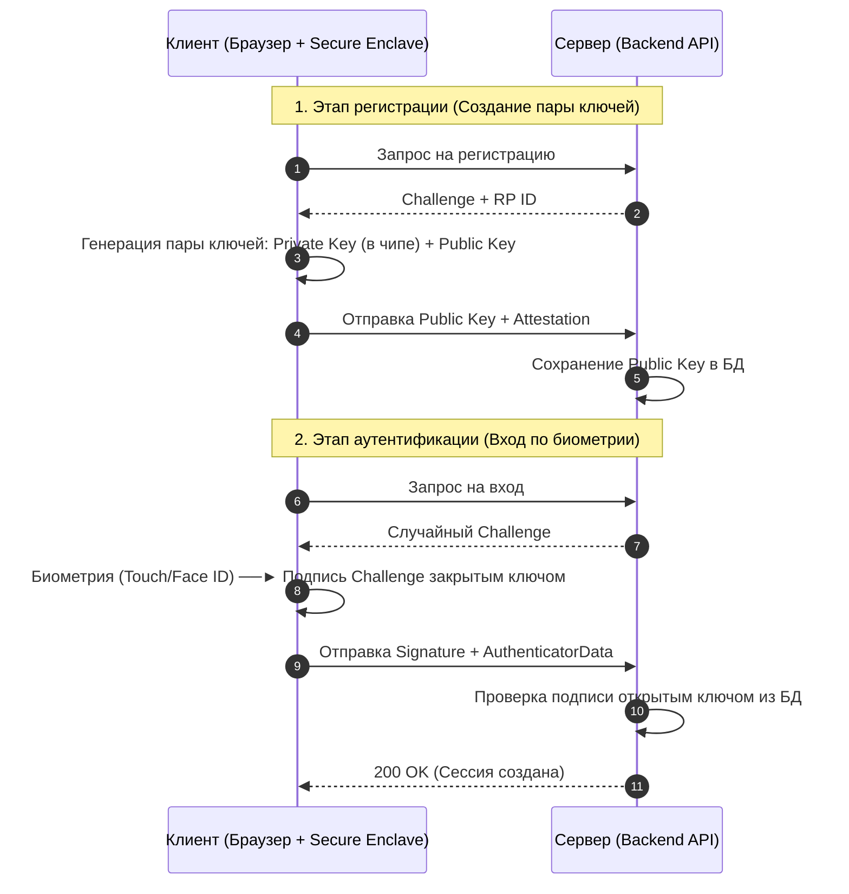

# WebAuthn и Passkeys

## 1. Проблема традиционных паролей и приход беспарольного будущего

Пароли — самое слабое звено безопасности в вебе. Пользователи создают простые пароли, используют их на разных сайтах, а фишинговые страницы легко выманивают их. Даже двухфакторная аутентификация (2FA) через SMS или TOTP-коды подвержена фишингу и перехвату.

**WebAuthn (Web Authentication API)** и технология **Passkeys (Ключи доступа)** решают эту проблему радикально, переводя веб на криптографическую беспарольную авторизацию на основе асимметричного шифрования и биометрии (Touch ID, Face ID, Windows Hello или YubiKey).

---

## 2. Разница между WebAuthn и Passkeys

*   **WebAuthn:** Это базовый W3C стандарт и браузерный API, который позволяет сайтам взаимодействовать с аутентификаторами. Изначально он создавал ключи, привязанные к одному физическому чипу (Device-bound credentials). Потеря телефона означала потерю доступа.
*   **Passkeys (Ключи доступа):** Это коммерческое название ключей WebAuthn нового поколения. Главное отличие — они **синхронизируются между устройствами** пользователя через облачные менеджеры паролей (Apple iCloud Keychain, Google Password Manager, 1Password). Если вы создали Passkey на iPhone, вы сможете войти с его помощью на MacBook или Android-планшете, так как ключ синхронизирован.

---

## 3. Криптографическая основа безопасности

WebAuthn полностью исключает фишинг благодаря использованию криптографии с открытым ключом:



### Защита от фишинга на уровне протокола
Браузер при генерации ключа жестко привязывает его к текущему домену (origin). Если пользователь находится на фишинговом сайте `paypa1.com`, браузер откажется использовать ключ, созданный для оригинального `paypal.com`. Перехватить ключ или подпись невозможно, так как она уникальна для каждого входа.

---

## 4. Жизненный цикл WebAuthn API

Интеграция состоит из двух этапов: Регистрация (создание ключа) и Аутентификация (вход).

### 4.1. Этап 1: Регистрация (Создание Passkey)
1.  Клиент запрашивает параметры регистрации у бэкенда.
2.  Бэкенд присылает параметры и уникальный случайный **`challenge`** (защита от повторных атак записи).
3.  Клиент вызывает браузерный метод `navigator.credentials.create()`.

```javascript
// Пример параметров, полученных от бэкенда
const createOptions = {
  publicKey: {
    challenge: Uint8Array.from('random-server-challenge-string', c => c.charCodeAt(0)),
    rp: { name: "My App", id: "myapp.com" }, // Данные Relying Party (сайта)
    user: {
      id: Uint8Array.from('user-id-123', c => c.charCodeAt(0)),
      name: "alex@example.com",
      displayName: "Алексей"
    },
    pubKeyCredParams: [{ alg: -7, type: "public-key" }], // Алгоритм шифрования (например, ES256)
    authenticatorSelection: {
      authenticatorAttachment: "platform", // Использовать встроенную биометрию (FaceID/TouchID)
      userVerification: "required" // Требовать сканирование биометрии
    },
    timeout: 60000
  }
};

// Запуск системного окна биометрии
const credential = await navigator.credentials.create(createOptions);

// credential.response содержит:
// - clientDataJSON (данные клиента, домен)
// - attestationObject (открытый ключ и метаданные аутентификатора)
// Отправляем эти данные на сервер для сохранения открытого ключа
```

---

### 4.2. Этап 2: Аутентификация (Вход по Passkey)
1.  Клиент запрашивает вызов аутентификации. Бэкенд генерирует новый `challenge`.
2.  Клиент вызывает метод `navigator.credentials.get()`.
3.  Пользователь прикладывает палец / сканирует лицо.
4.  Закрытый ключ подписывает `challenge`, и подпись отправляется на сервер для верификации.

```javascript
const getOptions = {
  publicKey: {
    challenge: Uint8Array.from('new-random-server-challenge', c => c.charCodeAt(0)),
    rpId: "myapp.com",
    userVerification: "required"
  }
};

// Запуск системного окна входа
const assertion = await navigator.credentials.get(getOptions);

// assertion.response содержит:
// - authenticatorData (флаги статуса)
// - signature (криптографическая подпись, сгенерированная закрытым ключом)
// Отправляем подпись на сервер. Сервер верифицирует её с помощью ранее сохраненного открытого ключа.
```

---

## 5. Важные UX-аспекты внедрения Passkeys

*   **Гибридный вход (Cross-Device Authentication):** Если пользователь пытается войти на ПК (где нет сканера отпечатков), браузер покажет QR-код. Пользователь может отсканировать его своим телефоном, подтвердить личность по FaceID на телефоне, и авторизоваться на ПК через Bluetooth-канал (FIDO Cross-Device protocol).
*   **Резервные каналы:** Passkeys — это отлично, но у пользователя всегда должна оставаться альтернатива (например, вход по одноразовой ссылке на email), на случай если он решит войти на чужом устройстве без своего телефона.
*   **Автозаполнение (Conditional UI):** Современные браузеры позволяют интегрировать Passkeys в менеджер автозаполнения. Когда пользователь кликает на поле "Логин", браузер сразу предлагает войти с помощью сохраненного Passkey в один клик.
