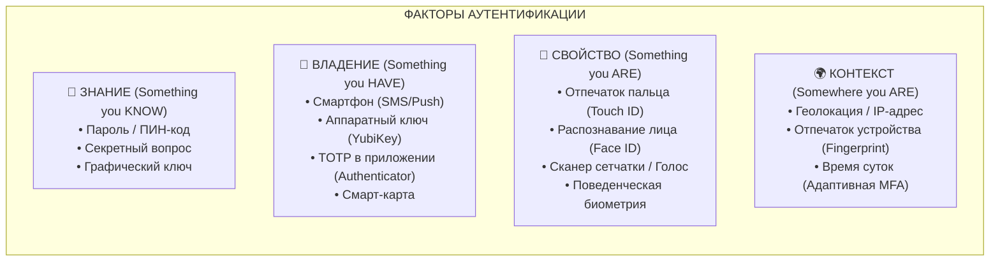
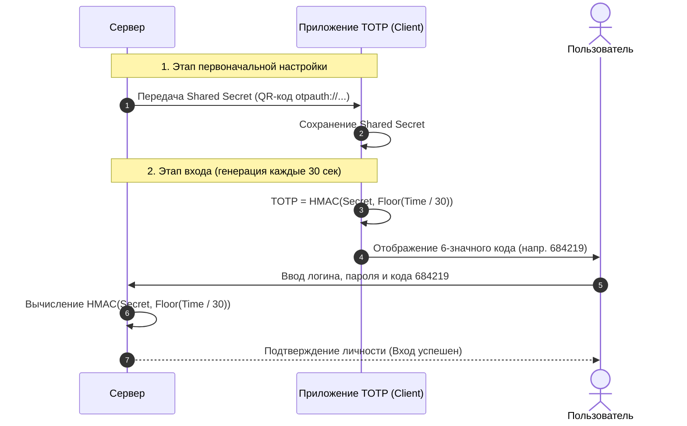
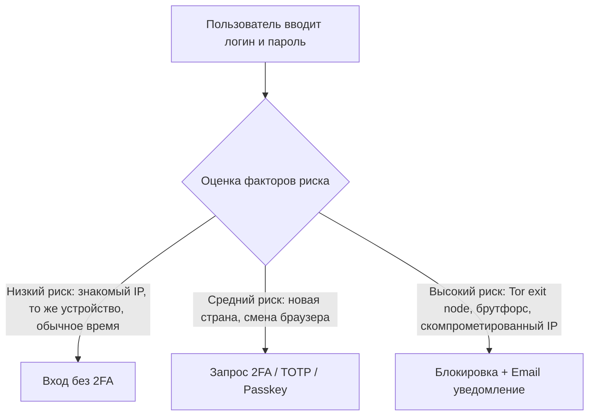

# Многофакторная аутентификация (MFA)

**Многофакторная аутентификация (MFA / 2FA)** — это метод контроля доступа, при котором пользователю для подтверждения личности необходимо успешно предоставить как минимум два независимых фактора проверки.

---

## 1. Зачем нужна MFA?

Традиционная однофакторная аутентификация (только логин и пароль) крайне уязвима:
- **Утечки баз данных (Data Breaches)** — миллионы хэшей паролей регулярно попадают в сеть.
- **Credential Stuffing** — использование украденных пар логин/пароль на других сервисах.
- **Фишинг (Phishing)** — поддельные страницы крадут введенные учетные данные.
- **Слабые пароли и человеческий фактор** — повторное использование простых паролей.

> [!important]
> Добавление второго фактора блокирует более 99% автоматизированных атак на учетные записи, даже если пароль пользователя скомпрометирован.

---

## 2. Классические факторы аутентификации

Для истинной мультифакторности доказательства должны принадлежать к **разным категориям**:

> [!warning]
> Ввод пароля и ответ на секретный вопрос — это **два доказательства одного фактора** (Знание), а не 2FA.

---

## 3. Методы реализации второго фактора

### 3.1. TOTP (Time-based One-Time Password, RFC 6238)
Самый распространенный и универсальный метод (Google Authenticator, Authy, 1Password).

**Как устроен TOTP:**
1. При настройке сервер генерирует секретный ключ (`Shared Secret`) и передает его клиенту (обычно в виде QR-кода `otpauth://totp/...`).
2. Приложение и сервер вычисляют 6-значный код на основе секрета и текущего времени:
   $$\text{Counter} = \lfloor \frac{\text{Current Timestamp}}{\text{Time Step (обычно 30 сек)}} \rfloor$$
   $$\text{TOTP} = \text{Truncate}(\text{HMAC-SHA1}(\text{Secret}, \text{Counter})) \pmod{10^6}$$
3. Срок жизни кода — 30 секунд. Сервер валидирует код с учетом окна дрейфа времени ($\pm 1$ шаг).

* **Плюсы**: Работает офлайн, не зависит от операторов связи, открытый стандарт.
* **Минусы**: Уязвим к онлайн-фишингу в реальном времени (Reverse Proxy / AitM фишинг).

---

### 3.2. FIDO2 / WebAuthn / Аппаратные ключи (Passkeys & YubiKey)
Самый безопасный метод, аппаратно защищенный от фишинга.

* Использует **асимметричную криптографию**: закрытый ключ хранится в чипе безопасности (Secure Enclave / TPM / YubiKey) и никогда не покидает его.
* Браузер подписывает вызов сервера (`challenge`) с жесткой привязкой к доменному имени (`Origin Binding`).
* Фишинговый сайт `paypa1.com` физически не может получить подпись для `paypal.com`.

> Подробнее см. [[WebAuthn и Passkeys]].

---

### 3.3. SMS и Email коды
* **SMS OTP**: Сервер отправляет одноразовый код в SMS.
  * *Уязвимости*: перехват через уязвимости протокола SS7, атаки клонирования SIM-карт (SIM Swapping), перехват вредоносными приложениями на смартфоне.
* **Email OTP**: Код или ссылка подтверждения на почту.
  * *Уязвимости*: если почта взломана, атакующий получает доступ ко всем связанным аккаунтам.

---

### 3.4. Push-уведомления (Out-of-band)
Приложение на смартфоне (например, Duo Mobile, Microsoft Authenticator) показывает всплывающее окно: *"Вы входите в систему? [Да / Нет]"* или просит сопоставить число на экране.

* **Уязвимость (MFA Fatigue / Push Bombing)**: Злоумышленник, зная пароль, спамит сотнями push-уведомлений среди ночи, пока уставший пользователь случайно не нажмет "Да".
* **Защита (Number Matching)**: Пользователь должен ввести на телефоне число, показанное на экране компьютера.

---

### 3.5. Резервные коды (Backup Codes)
Набор одноразовых кодов (обычно 8–10 штук), которые генерируются при настройке 2FA.
* Хранятся на сервере в **хэшированном виде** (как пароли).
* Необходимы для восстановления доступа при утере смартфона / ключа.

---

## 4. Сравнение методов MFA

| Метод | Устойчивость к фишингу | Удобство пользователя | Зависимость от сети | Стоимость внедрения |
| :--- | :---: | :---: | :---: | :---: |
| **FIDO2 / WebAuthn / Passkeys** | 🟢 Абсолютная | 🟢 Высокое (Touch/Face ID) | 🟢 Офлайн | 🟢 Бесплатно (Passkeys) / Покупка ключей |
| **TOTP (Authenticator App)** | 🟡 Средняя | 🟡 Среднее (перепечатывание) | 🟢 Офлайн | 🟢 Бесплатно |
| **Push + Number Matching** | 🟡 Средняя+ | 🟢 Высокое (в один клик) | 🔴 Нужен интернет | 🟡 Платные сервисы (Duo/Okta) |
| **SMS OTP** | 🔴 Низкая | 🟢 Высокое | 🔴 Нужна сотовая связь | 🔴 Оплата SMS-шлюза |
| **Email OTP** | 🔴 Низкая | 🟡 Среднее | 🔴 Нужен интернет | 🟢 Дешево |

---

## 5. Адаптивная (Risk-Based) MFA

Современные системы IAM (Identity & Access Management) не запрашивают 2FA при каждом действии, а оценивают **контекст риска**:

**Факторы анализа:**
1. **Device Fingerprint** (новое устройство / браузер).
2. **Геолокация и "Impossible Travel"** (вход из Москвы, а через 10 минут из Нью-Йорка).
3. **Репутация IP** (Tor, VPN, ботнет-подсети).
4. **Чувствительность операции** (просмотр профиля vs смена пароля / перевод средств).

---

## 6. Связанные заметки
- [[WebAuthn и Passkeys]] — современный криптографический стандарт беспарольного входа и фишинг-устойчивого MFA.
- [[Термины: identity, authentication, authorization]] — базовые концепции безопасности.
- [[SSO]] — единый вход и интеграция MFA на уровне центрального Identity Provider.
