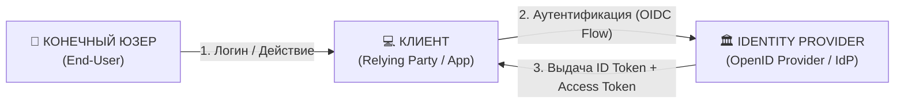
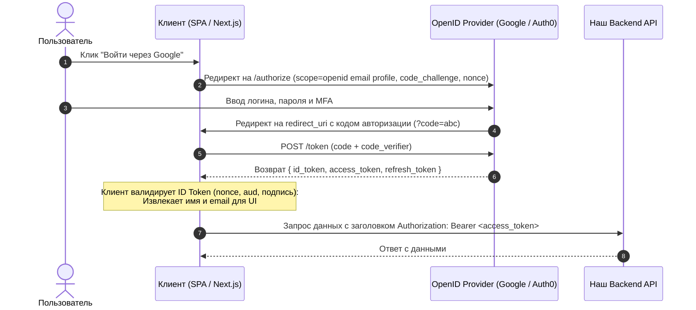

# OpenID Connect (OIDC)

**OpenID Connect (OIDC)** — это открытый стандарт и протокол **федеративной аутентификации**, построенный поверх фреймворка авторизации [[OAuth 2.0]]. Он позволяет клиентам (веб-сайтам, мобильным и SPA-приложениям) подтверждать личность пользователя на основе аутентификации, выполненной **Identity Provider (IdP)**, а также получать базовую профильную информацию о пользователе.

> [!important]
> **Ключевая формула:**
> $$\text{OpenID Connect} = \text{OAuth 2.0} + \text{ID Token (JWT)} + \text{UserInfo Endpoint} + \text{Discovery}$$

---

## 1. Зачем понадобился OIDC?

Протокол [[OAuth 2.0]] создавался исключительно для **делегирования доступа (авторизации)** к API: он дает клиенту `Access Token`, но ничего не говорит о самом пользователе. 

До появления OIDC каждый сервис (Facebook, Twitter, GitHub) изобретал свои проприетарные костыли для авторизации через "Войти с помощью...". OIDC стандартизировал этот процесс для всей индустрии (Google, Apple, Microsoft, Keycloak, Auth0, Okta).

---

## 2. Ключевые сущности OIDC



1. **EU (End-User)**: Пользователь, который входит в систему.
2. **RP (Relying Party / Client)**: Приложение, которому требуется аутентифицировать пользователя.
3. **OP (OpenID Provider / IdP)**: Сервер аутентификации, способный подтвердить личность пользователя и выдать ID Token.

---

## 3. Ключевые стандарты и артефакты OIDC

### 3.1. Обязательный Scope `openid`
Чтобы активировать режим OIDC в запросе OAuth 2.0, клиент обязан передать `scope=openid`:
```http
GET /authorize?
  response_type=code
  &client_id=my-web-app
  &redirect_uri=https://app.com/callback
  &scope=openid%20profile%20email
  &state=xyz123
  &nonce=n-0S6_WzA2Mj
```

### 3.2. ID Token (Идентификационный токен)
Подписанный в формате [[JWT]] токен, содержащий утверждения (**Claims**) об аутентификации:
- `iss` (Issuer) — URL выдавшего провайдера.
- `sub` (Subject) — уникальный неизменяемый ID пользователя в системе провайдера.
- `aud` (Audience) — `client_id` вашего приложения (защита от подделки).
- `exp` / `iat` — время истечения и создания токена.
- `auth_time` — время, когда пользователь фактически ввел пароль/биометрию.
- `nonce` — случайная строка клиента для защиты от Replay-атак.

### 3.3. Эндпоинт UserInfo (`/userinfo`)
Защищенный REST API эндпоинт провайдера. Клиент отправляет полученный `Access Token` в заголовке `Authorization: Bearer <token>` и получает расширенный JSON-профиль пользователя (`name`, `email`, `locale`, `picture`).

### 3.4. Discovery Document (`/.well-known/openid-configuration`)
Публичный JSON-файл, содержащий конфигурацию сервера OIDC:
- Адреса эндпоинтов (`authorization_endpoint`, `token_endpoint`, `userinfo_endpoint`).
- Поддерживаемые алгоритмы подписи (`id_token_signing_alg_values_supported`).
- Ссылка на **JWKS** (`jwks_uri`) с открытыми ключами провайдера для локальной валидации подписи ID Token без лишних HTTP-запросов.

---

## 4. Пошаговый сценарий (Authorization Code Flow + PKCE)



---

## 5. Сравнение OAuth 2.0 vs OpenID Connect

| Параметр | OAuth 2.0 | OpenID Connect (OIDC) |
| :--- | :--- | :--- |
| **Основная роль** | **Авторизация (Authorization)**: Делегирование прав доступа к ресурсам | **Аутентификация (Authentication)**: Проверка личности пользователя + SSO |
| **Что возвращает** | `Access Token` (для обращения к API) | `ID Token` (для клиента) + `Access Token` |
| **Формат токена** | Не регламентирован (любой, в т.ч. Opaque) | Строго регламентирован: **JWT** |
| **Интероперабельность** | Требует ручной настройки каждого API | Полная стандартизация (Discovery `.well-known`, UserInfo) |
| **Аналогия** | **Ключ-карта от гостиничного номера** (открывает дверь, но на ней не написано имя) | **Паспорт гражданина** (удостоверяет личность, содержит имя, фото и кем выдан) |

---

## 6. Связанные заметки
- [[OAuth 2.0]] — базовый протокол авторизации, на котором строится OIDC.
- [[Access Token vs ID Token]] — подробное сравнение двух типов токенов.
- [[SSO]] — единый вход в экосистемах приложений.
- [[JWT]] — формат хранения и передачи ID токена.
- [[SAML]] — XML-аналог OIDC в традиционном Enterprise-секторе.
