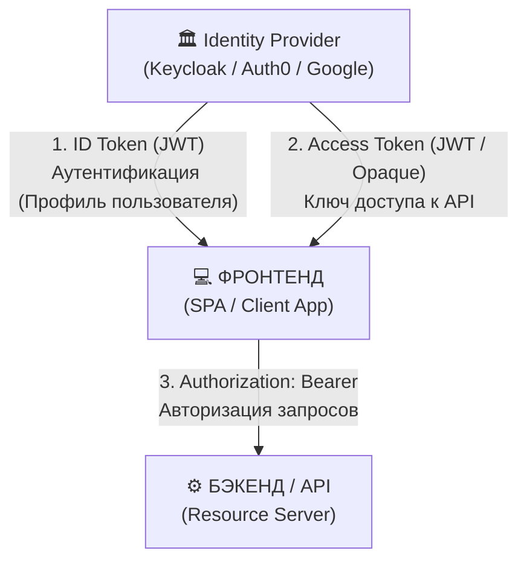
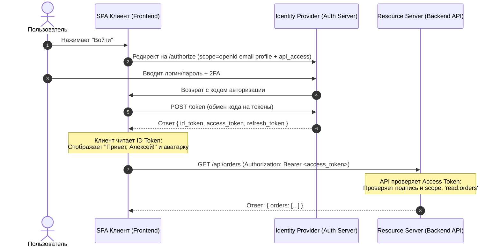

# Access Token vs ID Token

В современных протоколах безопасности (**OAuth 2.0** и **OpenID Connect**) четко разделены две разные задачи: **авторизация** (доступ к ресурсам) и **аутентификация** (идентификация пользователя). Для каждой из этих задач предназначен свой токен.

> [!important]
> - **Access Token** отвечает на вопрос: *"Имеет ли клиент право выполнить это действие на API?"* (**Авторизация**).
> - **ID Token** отвечает на вопрос: *"Кто этот пользователь и как он вошел?"* (**Аутентификация**).

---

## 1. Сравнительный анализ



| Характеристика | Access Token (OAuth 2.0) | ID Token (OpenID Connect) |
| :--- | :--- | :--- |
| **Главная цель** | **Авторизация**: предоставление доступа к API | **Аутентификация**: передача профиля пользователя клиенту |
| **Целевой получатель (Audience, `aud`)** | **Resource Server (API)** | **Client Application (Frontend / SPA / Мобилка)** |
| **Кем читается** | Бэкенд-сервером API для проверки прав | Клиентским приложением для отрисовки UI |
| **Формат** | Не регламентирован стандартом (бывает **JWT** или **Opaque token** — случайная строка) | **Строго JWT** (подписан приватным ключом IdP) |
| **Передача в запросах** | В заголовке `Authorization: Bearer <token>` при каждом вызове API | **Никогда не отправляется к API** в качестве Bearer токена |
| **Типичные Claims** | `scope`, `client_id`, `sub` (userId), `permissions`, `exp` | `sub`, `email`, `name`, `picture`, `iss`, `aud`, `auth_time`, `nonce` |
| **Срок жизни** | Короткий (обычно 5–30 минут) | Короткий (обычно 5–60 минут) |

---

## 2. Access Token детально

**Access Token** предназначен исключительно для **Resource Server (API)**.
- Клиент (SPA или приложение) рассматривает Access Token как *«черный ящик»* (opaque string) и просто передает его в заголовке `Authorization: Bearer <access_token>`.
- API валидирует подпись токена или проверяет его через интроспекцию (`/oauth/introspect`) и читает разрешения (`scopes` / `roles`), чтобы решить, отдавать ли данные.

### Пример Payload (Access Token JWT):
```json
{
  "iss": "https://auth.example.com/",
  "sub": "usr_9482910",
  "aud": "https://api.example.com/v1",
  "scope": "read:profile write:orders",
  "roles": ["user", "manager"],
  "iat": 1718000000,
  "exp": 1718001800
}
```

---

## 3. ID Token детально

**ID Token** — это цифровой "паспорт" пользователя, созданный специально для **клиентского приложения (Frontend)**.
- Клиент декодирует ID Token, проверяет его подпись и использует поля (`claims`) для отображения профиля: имени, email, аватара.
- Содержит параметр `nonce` для защиты от атак повторного воспроизведения (Replay Attacks).

### Пример Payload (ID Token JWT):
```json
{
  "iss": "https://auth.example.com/",
  "sub": "usr_9482910",
  "aud": "my-spa-client-id-123",
  "name": "Алексей Смирнов",
  "email": "alex@example.com",
  "email_verified": true,
  "picture": "https://example.com/avatars/alex.jpg",
  "auth_time": 1718000000,
  "iat": 1718000000,
  "exp": 1718003600,
  "nonce": "random-secure-nonce-string"
}
```

---

## 4. Главные антипаттерны и ошибки безопасности

### ❌ Ошибка 1: Отправка ID Token на бэкенд API для авторизации запросов
- **Проблема**: `aud` (audience) в ID Token равен `client_id` фронтенда, а не адресу API. Бэкенд API не должен доверять токену, выписанному не для него.
- **Правило**: К API отправляется **только Access Token**.

### ❌ Ошибка 2: Использование Access Token для получения данных пользователя на клиенте
- **Проблема**: Access Token может быть Opaque-токеном (без полезной нагрузки) или зашифрован ключом API. Фронтенд не должен парсить Access Token вручную.
- **Правило**: Информацию о пользователе клиент берет из **ID Token** или запрашивает через эндпоинт **`/userinfo`**.

### ❌ Ошибка 3: Пропуск проверки `aud` и `iss`
- **Проблема**: Злоумышленник может использовать валидный ID Token от другого приложения того же провайдера аутентификации.
- **Правило**: Всегда проверять, что `aud === YOUR_CLIENT_ID` и `iss === EXPECTED_ISSUER`.

---

## 5. Сводная схема потока (OIDC / OAuth 2.0)



---

## 6. Связанные заметки
- [[OAuth 2.0]] — протокол авторизации и выдачи Access Token.
- [[OpenID Connect]] — расширение OAuth 2.0 для аутентификации и выпуска ID Token.
- [[JWT]] — структура и подпись токенов.
- [[Refresh Tokens]] — механизм обновления пары токенов.
