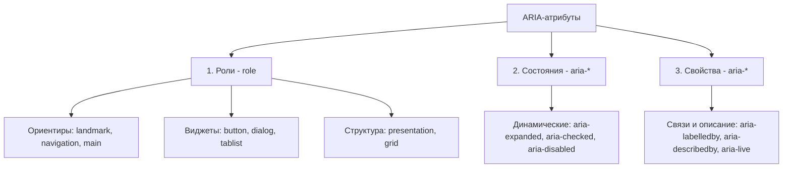

# WAI-ARIA (Web Accessibility Initiative — Accessible Rich Internet Applications)

## 1. Введение: Что такое ARIA и золотое правило
**WAI-ARIA** — это спецификация консорциума W3C, которая предоставляет набор атрибутов для HTML-элементов, позволяющий передавать вспомогательным технологиям (например, скринридерам) информацию о структуре, состоянии и интерактивности веб-страниц, особенно там, где стандартных тегов HTML недостаточно.

> [!IMPORTANT]
> **Первое правило ARIA:**
> Если вы можете решить задачу с помощью стандартных HTML-элементов или атрибутов, имеющих встроенную семантику и поведение, **сделайте это вместо использования ARIA**.
> *Плохо:* `<div role="button" onclick="...">Купить</div>`
> *Хорошо:* `<button onclick="...">Купить</button>`

### Зачем нужно ARIA?
Когда браузер парсит HTML, он создает не только DOM-дерево (Document Object Model), но и **Accessibility Tree (Дерево доступности)**. Скринридеры читают именно Accessibility Tree.
Стандартные теги (`<button>`, `<input>`, `<nav>`) попадают туда автоматически с правильными ролями и свойствами. Но если мы строим сложный кастомный интерфейс (например, вкладки, автокомплиты, древовидные списки), браузер без ARIA-атрибутов не сможет объяснить скринридеру, что этот набор `<div>` и `<span>` на самом деле является интерактивным виджетом.

---

## 2. Анатомия ARIA: Роли, Свойства и Состояния

ARIA-атрибуты делятся на три основные категории:



### 2.1. Роли (Roles)
Указывают, **чем является** элемент. Роль задается через атрибут `role="..."`. Будучи установленной, роль не должна меняться динамически в процессе работы страницы. Если роль элемента меняется, лучше скрыть старый элемент и показать новый.

Основные типы ролей:
1. **Landmarks (Ориентиры):** Помогают пользователям скринридеров быстро перемещаться по основным разделам страницы.
   - `role="main"` (аналог `<main>`)
   - `role="navigation"` (аналог `<nav>`)
   - `role="banner"` (аналог `<header>`)
   - `role="contentinfo"` (аналог `<footer>`)
2. **Widgets (Интерактивные виджеты):** Описывают элементы интерфейса.
   - `role="button"`, `role="checkbox"`, `role="dialog"` (модалка), `role="tablist"`, `role="tab"`, `role="tabpanel"`.
3. **Презентационные (presentation / none):** Снимают семантику с элемента. Используются, чтобы скрыть тег от скринридера, оставив только его текстовое содержимое (например, декоративная таблица для верстки).

### 2.2. Состояния (States)
Описывают **текущее состояние** элемента, которое обычно меняется с помощью JavaScript при взаимодействии с пользователем.
- `aria-expanded="true/false"` — раскрыт ли элемент (меню, аккордеон).
- `aria-checked="true/false/mixed"` — выбран ли чекбокс/радиокнопка.
- `aria-disabled="true/false"` — заблокирован ли элемент для взаимодействия (в отличие от HTML-атрибута `disabled`, элемент с `aria-disabled` остается фокусируемым, что важно для доступности форм).
- `aria-invalid="true/false"` — содержит ли поле ввода ошибку валидации.

### 2.3. Свойства (Properties)
Определяют **сущность и связи** элемента, которые обычно более стабильны, чем состояния, но могут обновляться.
- `aria-labelledby="[id-другого-элемента]"` — связывает текущий элемент с элементом-заголовком, который его описывает.
- `aria-describedby="[id-другого-элемента]"` — связывает элемент с дополнительным описанием (например, подсказкой к полю ввода или текстом ошибки).
- `aria-live="polite/assertive"` — указывает, что область страницы будет динамически обновляться (объявления об ошибках, уведомления), и скринридер должен зачитать изменения.
- `aria-haspopup="dialog/menu/listbox"` — сигнализирует, что активация элемента вызывает появление всплывающего окна/меню.

---

## 3. Практические кейсы с кодом

### Кейс №1: Кастомная кнопка (Когда семантический `<button>` использовать невозможно)
Если вам *пришлось* верстать кнопку через `<div>`:

```html
<div 
  role="button" 
  tabindex="0" 
  aria-label="Закрыть модальное окно"
  class="custom-close-btn"
>
  ×
</div>
```

**Обязательные требования для JS:**
1. Нужно обрабатывать не только клик мыши, но и нажатие клавиш **Space (Пробел)** и **Enter**.
2. Класс `.custom-close-btn` должен иметь понятные стили фокуса (`:focus-visible`).

### Кейс №2: Компонент Вкладки (Tabs)
Сложная структура, где ARIA связывает кнопки переключения с панелями контента.

```html
<!-- Контейнер для вкладок -->
<div role="tablist" aria-label="Настройки профиля">
  <button 
    role="tab" 
    aria-selected="true" 
    aria-controls="personal-panel" 
    id="personal-tab"
    tabindex="0"
  >
    Личные данные
  </button>
  <button 
    role="tab" 
    aria-selected="false" 
    aria-controls="security-panel" 
    id="security-tab"
    tabindex="-1" 
  >
    Безопасность
  </button>
</div>

<!-- Панели контента -->
<div 
  role="tabpanel" 
  id="personal-panel" 
  aria-labelledby="personal-tab"
>
  <h3>Личные данные пользователя...</h3>
</div>

<div 
  role="tabpanel" 
  id="security-panel" 
  aria-labelledby="security-tab"
  hidden
>
  <h3>Настройки безопасности...</h3>
</div>
```
*Ключевые моменты:*
- `tabindex="-1"` у неактивной вкладки убирает её из последовательного фокуса (пользователь перемещается между ними стрелками клавиатуры, что реализуется на JS).
- `aria-controls` связывает вкладку с ее панелью.
- `aria-labelledby` дает панели имя на основе текста кнопки вкладки.

---

## 4. Как это видит Accessibility Tree
Когда мы пишем правильный ARIA-код, браузер транслирует его в структуру данных. 

Например, для вкладки выше:
```text
Role: TabList
  ├── Role: Tab, Name: "Личные данные", Selected: True, Focusable: True
  └── Role: Tab, Name: "Безопасность", Selected: False, Focusable: False (tabindex -1)
Role: TabPanel, Name: "Личные данные" (связано через aria-labelledby)
```
Скринридер использует эту схему, сообщая пользователю: *"Вкладка, Личные данные, один из двух, выбрано"*.

---

## 5. Типичные антипаттерны и ошибки

1. **Дублирование встроенной семантики:**
   - `<button role="button">` — избыточно и бессмысленно.
2. **Потеря фокуса:**
   - Забывают добавить `tabindex="0"` кастомным интерактивным элементам. Элемент становится невидим для тех, кто пользуется только клавиатурой.
3. **Использование скрытых элементов для связей:**
   - Указание `aria-labelledby` на элемент с `display: none` работает, но использование `aria-describedby` на несуществующие `id` сломает навигацию.
4. **Неправильное использование `aria-live="assertive"`:**
   - Прерывает чтение скринридера прямо посреди предложения. Используйте только для критически важных ошибок. Для обычных уведомлений (например, "Товар добавлен в корзину") всегда используйте `aria-live="polite"`.
5. **Отсутствие визуального фокуса:**
   - `outline: none` без альтернативного `:focus-visible` — злейший враг клавиатурной доступности.
