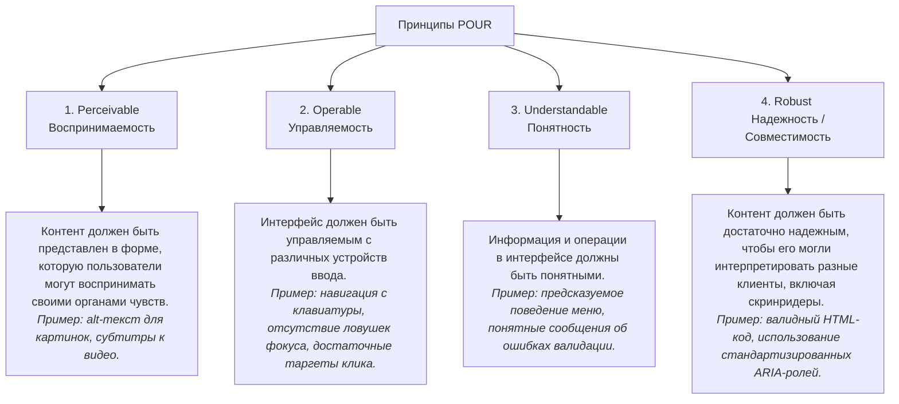

# WCAG (Принципы, контрастность, таргеты)

## 1. Что такое WCAG?
**WCAG (Web Content Accessibility Guidelines)** — это международный стандарт по обеспечению доступности веб-контента, разрабатываемый консорциумом W3C. На сегодняшний день актуальными версиями являются **WCAG 2.1** и **WCAG 2.2** (вышедшая в октябре 2023 г.).

WCAG служит основой для законодательных требований в разных странах (например, Section 508 в США, European Accessibility Act в ЕС).

---

## 2. Четыре принципа доступности (POUR)

Все рекомендации WCAG строятся вокруг четырех фундаментальных принципов (акроним **POUR**):



---

## 3. Уровни соответствия (Compliance Levels)

В WCAG критерии разделены на три уровня строгости:

1.  **Уровень A (Минимальный):** Устраняет самые критические барьеры. Без соответствия этому уровню доступность сайта для людей с ограниченными возможностями практически невозможна.
2.  **Уровень AA (Средний / Стандарт):** **Индустриальный стандарт** для большинства коммерческих и государственных сайтов. Направлен на устранение барьеров для подавляющего большинства пользователей.
3.  **Уровень AAA (Высокий):** Максимально доступный интерфейс. Достичь полного соответствия AAA для всего сайта крайне сложно (и часто не требуется), но отдельные критерии AAA полезно внедрять.

---

## 4. Контрастность (Color Contrast)

Слабая контрастность текста мешает читать людям с нарушениями зрения (дальнозоркость, катаракта, цветовая слепота), а также всем пользователям на мобильных устройствах при ярком солнечном свете.

### 4.1. Требования WCAG 2.x (Минимальный контраст)
Контрастность измеряется как отношение яркости самого светлого цвета к самому темному (от 1:1 до 21:1).

| Уровень | Обычный текст (< 18pt / 24px) | Крупный текст (≥ 18pt или ≥ 14pt bold) | Графика и элементы UI |
| :--- | :--- | :--- | :--- |
| **Уровень AA** | **4.5:1** | **3.0:1** | **3.0:1** (иконки, границы инпутов) |
| **Уровень AAA** | **7.0:1** | **4.5:1** | Нет строгих требований |

> [!NOTE]
> Крупным текстом считается шрифт размером от **24px** (обычный) или от **18.5px** (полужирный).

### 4.2. Перспектива: Алгоритм APCA (Advanced Perceptual Contrast Algorithm)
В будущем стандарте **WCAG 3.0** на смену фиксированным коэффициентам придет алгоритм APCA. Он учитывает:
*   Особенности восприятия человеческим глазом (светлый текст на темном фоне читается иначе, чем темный на светлом).
*   Толщину (насыщенность) шрифта и его размер.
APCA выдает оценку Lc (Lightness Contrast). Например, для чтения основного текста рекомендуется Lc ≥ 75.

---

## 5. Размер интерактивных областей (Click / Touch Targets)

Людям с тремором рук, артритом, а также пользователям мобильных устройств с тачскринами трудно попадать по мелким элементам.

### 5.1. Критерии WCAG
*   **WCAG 2.1 (Уровень AAA):** Размер интерактивной области должен быть не менее **44 × 44 CSS-пикселей**.
*   **WCAG 2.2 (Уровень AA - Критерий 2.5.8):** Область взаимодействия должна быть не менее **24 × 24 CSS-пикселей**. Если элемент меньше, его область взаимодействия должна быть расширена за счет свободного пространства (отступов) вокруг него до тех пор, пока общая зона не достигнет 24px.

### 5.2. Секреты верстки: Увеличение области без изменения дизайна
Часто дизайнеры рисуют иконки размером 16x16px вплотную друг к другу. Мы можем расширить область клика с помощью псевдоэлементов, не меняя визуальный размер иконки:

```css
.small-icon-button {
  position: relative;
  width: 16px;
  height: 16px;
  background: none;
  border: none;
  cursor: pointer;
}

/* Создаем невидимую область 44x44px вокруг иконки */
.small-icon-button::after {
  content: '';
  position: absolute;
  top: 50%;
  left: 50%;
  transform: translate(-50%, -50%);
  width: 44px;
  height: 44px;
  /* background: rgba(255, 0, 0, 0.2); // Раскомментируйте для дебага */
}
```
