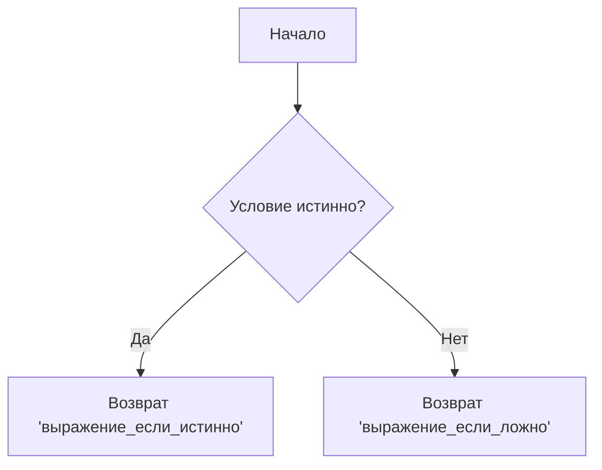

# Условный (тернарный) оператор

Условный оператор (`? :`) является единственным **тернарным** оператором в JavaScript (то есть он принимает три операнда). Он часто используется как более короткая альтернатива инструкции `if...else`.

## Синтаксис

```javascript
условие ? выражение_если_истинно : выражение_если_ложно
```

1. **`условие`**: Выражение, которое вычисляется как логическое значение (`truthy` или `falsy`).
2. **`выражение_если_истинно`**: Значение, которое возвращается, если условие истинно.
3. **`выражение_если_ложно`**: Значение, которое возвращается, если условие ложно.

## Примеры использования

### Базовый пример

```javascript
let age = 18;
let message = age >= 18 ? "Adult" : "Minor";

console.log(message); // "Adult"
```

### Множественные тернарные операторы (цепочки)

Тернарный оператор можно использовать в виде цепочки для проверки нескольких условий (аналог `if...else if...else`). Однако, злоупотребление этим подходом ухудшает читаемость кода.

```javascript
let speed = 90;
let warning = speed > 120 ? "Слишком быстро!" 
            : speed > 60  ? "Нормальная скорость" 
            : "Слишком медленно!";

console.log(warning); // "Нормальная скорость"
```

### Визуализация логики работы



## Советы и антипаттерны

> [!TIP]
> Тернарный оператор отлично подходит для простого присваивания значений переменным на основе условия.

> [!WARNING]
> Не используйте тернарный оператор для выполнения независимых действий (вызова функций), которые ничего не возвращают, просто ради экономии места. В таких случаях классический `if` намного понятнее.

```javascript
// Плохо:
isLoggedIn ? showDashboard() : showLoginScreen();

// Хорошо:
if (isLoggedIn) {
  showDashboard();
} else {
  showLoginScreen();
}
```