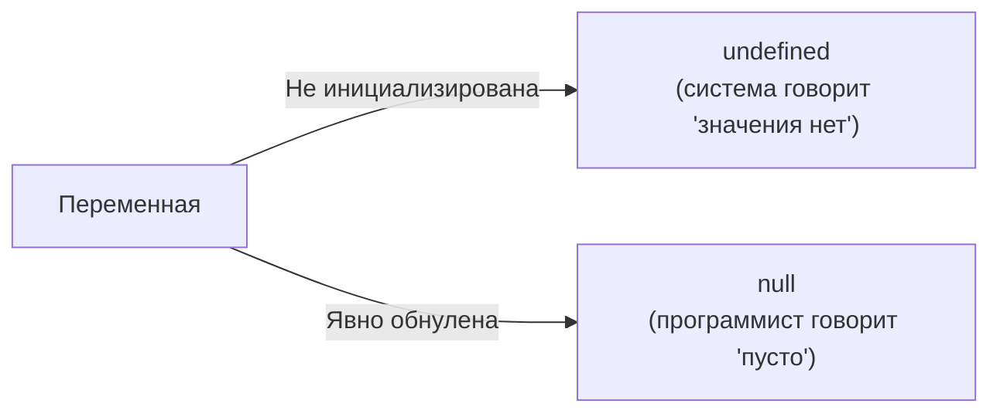

# Null и Undefined

В JavaScript существует два специальных примитивных типа данных, которые обозначают отсутствие значения: `null` и `undefined`. Несмотря на схожий смысл, они имеют важное семантическое различие.

## Undefined (Неопределенность)

`undefined` означает, что переменная была объявлена, но ей еще не было присвоено никакого значения. Это значение по умолчанию для неинициализированных переменных, отсутствующих аргументов функций и несуществующих свойств объектов.

```javascript
let name;
console.log(name); // undefined

function greet(person) {
  console.log(person);
}
greet(); // undefined (аргумент не передан)

const obj = { age: 25 };
console.log(obj.city); // undefined (свойства не существует)
```

## Null (Пустота)

`null` означает намеренное отсутствие какого-либо объектного значения. Это присваиваемое значение, которое говорит: "здесь ничего нет" или "значение неизвестно".

```javascript
let selectedItem = null; // Мы намеренно указываем, что ничего не выбрано

// Логически null — это указатель на пустой объект.
// Из-за исторической ошибки в JavaScript, typeof возвращает "object":
console.log(typeof null); // "object"
```

## Сравнение null и undefined

При нестрогом равенстве (`==`) `null` и `undefined` равны друг другу, но не равны никаким другим значениям. При строгом равенстве (`===`) они не равны, так как у них разные типы.

```javascript
console.log(null == undefined);  // true
console.log(null === undefined); // false
```

## Различия в использовании (Математика)

Важное отличие проявляется при попытке использовать их в математических операциях:

- `null` приводится к `0`.
- `undefined` приводится к `NaN` (Not a Number).

```javascript
console.log(10 + null);      // 10 (так как null преобразуется в 0)
console.log(10 + undefined); // NaN
```

## Визуальное сравнение


